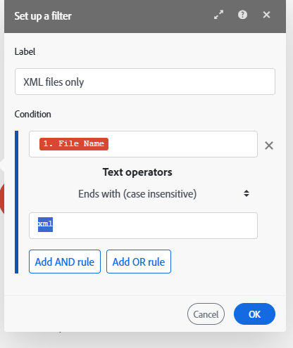

# 將篩選器新增至案例

在某些情況下，您只需要使用符合特定條件的組合。 篩選可讓您選取這些組合。

例如，您可以為[!DNL Workfront]建立具有[!UICONTROL Watch records]觸發器的情境，以僅擷取指派給特定使用者的任務。

您可以在兩個模組之間新增篩選器，並檢查從先前模組收到的套件組合是否符合特定的篩選條件：

* 如果是，套件組合會傳遞至案例中的下一個模組。
* 如果沒有，則會終止束的處理。

## 存取需求

+++ 展開以檢視本文中功能的存取需求。

您必須具有下列存取權才能使用本文中的功能：

<table style="table-layout:auto">
 <col> 
 <col> 
 <tbody> 
  <tr> 
   <td role="rowheader">[!DNL Adobe Workfront] 封裝</td> 
   <td> 
任何
 </td> 
  </tr> 
  <tr data-mc-conditions=""> 
   <td role="rowheader">[!DNL Adobe Workfront] 授權</td> 
   <td> 
新增： [!UICONTROL Standard]

或

目前： [!UICONTROL Work]或更高
 </td> 
  </tr> 
  <tr> 
   <td role="rowheader">[!DNL Adobe Workfront Fusion] 授權**</td> 
   <td>
   
目前：無[!DNL Workfront Fusion]授權需求。

   
或

   
舊版：任何 

   </td> 
  </tr> 
  <tr> 
   <td role="rowheader">產品</td> 
   <td>
   
新增：
 <ul><li>[!UICONTROL Select] 或[!UICONTROL Prime] [!DNL Workfront]計畫：您的組織必須購買[!DNL Adobe Workfront Fusion]。</li><li>[!UICONTROL Ultimate] [!DNL Workfront] 計畫： [!DNL Workfront Fusion]已包括在內。</li></ul>
   
或

   
目前：您的組織必須購買[!DNL Adobe Workfront Fusion]。

   </td> 
  </tr>
 </tbody> 
</table>

如需此表格中資訊的詳細資訊，請參閱檔案](/help/workfront-fusion/references/licenses-and-roles/access-level-requirements-in-documentation.md)中的[存取需求。

如需[!DNL Adobe Workfront Fusion]授權的相關資訊，請參閱[[!DNL Adobe Workfront Fusion] 授權](/help/workfront-fusion/set-up-and-manage-workfront-fusion/licensing-operations-overview/license-automation-vs-integration.md)。

+++

## 先決條件

您必須先將兩個模組新增至情境，才能在它們之間新增篩選器。

## 在兩個模組之間新增篩選器：

1. 按一下左側面板中的&#x200B;**[!UICONTROL Scenarios]**&#x200B;索引標籤。
1. 選取您要新增篩選的案例。
1. 按一下情境上的任何位置，以輸入情境編輯器。
1. 按一下您想要新增篩選的模組之間的扳手圖示，然後選取&#x200B;**設定篩選**。
1. 在顯示的方塊中，輸入篩選的&#x200B;**[!UICONTROL Label]**。
1. 定義篩選器&#x200B;**[!UICONTROL Condition]**。

   在第一個欄位中輸入您要篩選的欄位、運運算元，以及（如有必要）您要比較欄位的值。

   >[!TIP]
   >
   >您可以從對應面板在篩選欄位中輸入值
   >如需對應的詳細資訊，請參閱[從一個模組對應到另一個模組的資訊](/help/workfront-fusion/create-scenarios/map-data/map-data-from-one-to-another.md)。

   例如，如果您希望篩選器以XML結尾的[!DNL Adobe Workfront]傳遞檔案，您應在第一個方塊中輸入&#x200B;**[!UICONTROL File name]**&#x200B;並。第二個方塊中的&#x200B;**[!UICONTROL xml]**。 在它們之間的下拉式功能表中，您可以選取&#x200B;**[!UICONTROL Ends with (case insensitive)]**。 此篩選器將套用至來自第一個模組(Workfront)的傳入組合。 只有包含XML檔案的套件組合會傳遞至下一個模組。

   

1. 按一下&#x200B;**[!DNL OK]**。

## 複製篩選器

目前，案例編輯器不包含複製篩選器的功能。

>[!NOTE]
>
>如果您複製篩選器兩側的模組，也會複製篩選器。
>
>如需複製模組的詳細資訊，請參閱[複製 [!DNL Adobe Workfront Fusion]](/help/workfront-fusion/create-scenarios/add-modules/copy-modules-or-scenarios.md)中的模組或案例。

若要複製篩選器而不複製模組，您可以使用Fusion DevTool

1. 按一下左側面板中的&#x200B;**[!UICONTROL Scenarios]**&#x200B;索引標籤。
1. 選取您要新增篩選的案例。
1. 按一下情境上的任何位置，以輸入情境編輯器。
1. 按一下熒幕底部附近的DevTool圖示，開啟Fusion DevTool。

   如果您沒有看到DevTool圖示，請參閱[偵錯案例](/help/workfront-fusion/manage-scenarios/debug-a-scenario.md)以取得開啟DevTool的說明。

1. 按一下左側列中的&#x200B;**[!UICONTROL Tools]**&#x200B;圖示。

1. 按一下「**[!UICONTROL Copy Filter]**」，然後在右側面板中設定「**[!UICONTROL Copy Filter]**」工具：

   1. 將&#x200B;**[!UICONTROL Source Module]**&#x200B;直接設定為您要複製的篩選器之後的模組。
   1. 將&#x200B;**[!UICONTROL Target Module]**&#x200B;設定為您要直接在後面放置篩選器的模組。

1. 按一下&#x200B;**[!UICONTROL Run]**。
