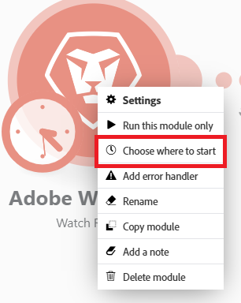

# 選擇觸發程序模組在哪裡啟動

有些觸發程式模組可讓您選取要開始擷取套件的第一個套裝。

您也可以指定要在特定日期之後擷取所有套裝，還是隻擷取套裝。

如需有關觸發模組的詳細資訊，請參閱文章模組概觀中的[觸發模組](/help/workfront-fusion/get-started-with-fusion/understand-fusion/module-overview.md#trigger-modules)一節。

## 存取權要求

+++ 展開以檢視這篇文章中所述功能的存取權要求。

<table style="table-layout:auto">
 <col> 
 <col> 
 <tbody> 
  <tr> 
   <td role="rowheader">Adobe Workfront 封裝</td> 
   <td> 
任何 Adobe Workfront Workflow 封裝及任何 Adobe Workfront Automation and Integration 封裝

Workfront Ultimate

Workfront Prime 和 Select 封裝，以及額外購買的 Workfront Fusion。
 </td> 
  </tr> 
  <tr data-mc-conditions=""> 
   <td role="rowheader">Adobe Workfront 授權</td> 
   <td> 
標準

工作或更高層級
 </td> 
  </tr> 
  <tr> 
   <td role="rowheader">產品</td> 
   <td>
   
如果您的組織擁有 Select 或 Prime Workfront 封裝，但不包括 Workfront Automation and Integration，則您的組織必須購買 Adobe Workfront Fusion。</li></ul>
   </td> 
  </tr>
 </tbody> 
</table>

若要詳細了解此表格中的資訊，請參閱](/help/workfront-fusion/references/licenses-and-roles/access-level-requirements-in-documentation.md)文件中的存取權要求[。

+++

## 選擇觸發程序模組在哪裡啟動

1. 按一下左側面板中的&#x200B;**[!UICONTROL 案例]**&#x200B;索引標籤。
1. 選取您要選擇觸發器開始位置的案例。
1. 按一下情境上的任何位置，以輸入情境編輯器。
1. 設定並儲存觸發程式模組。

   或

   以滑鼠右鍵按一下觸發程式模組的圖示，然後選取&#x200B;**選擇開始位置**。

   

1. 在出現的&#x200B;**[!UICONTROL 選擇開始位置]**&#x200B;方塊中選取選項。

   顯示的選項視特定服務的可能性而定。 其中可能包括：

   <table style="table-layout:auto">
    <col> 
    <col> 
    <tbody>
    <tr>
    <td>[！UICONTROL從現在起] （預設）</td>
    <td>擷取選取此選項後新增或更新的所有組合（視設定而定）</td>
    </tr>
     <tr>
    <td>[！UICONTROL從特定日期起]</td>
    <td>擷取在指定日期和時間之後新增或更新的所有組合（視設定而定）</td>
      </tr>
      <tr>
    <td>[！UICONTROL All]</td>
    <td>擷取所有可用的組合</td>
     </tr>
      <tr>
    <td>[！UICONTROL手動選擇]</td>
    <td>可讓您選取要開始擷取束的第一個束</td>
     </tr>
     </tbody>
   </table>
