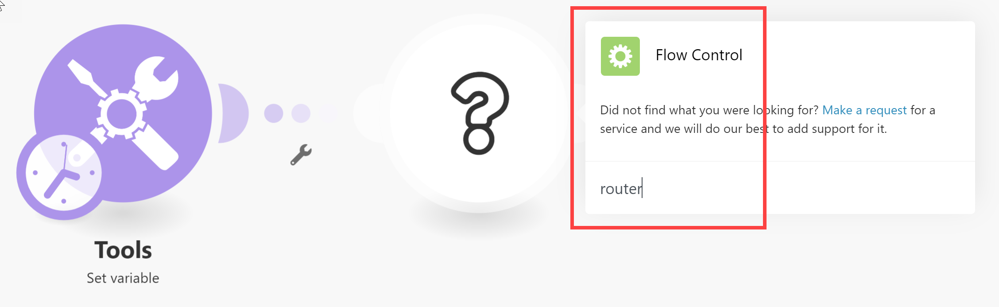
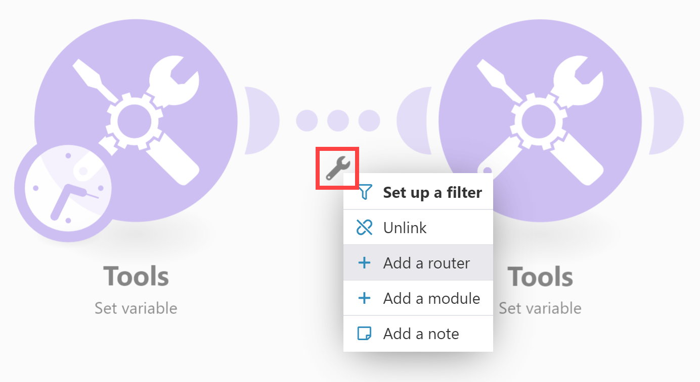
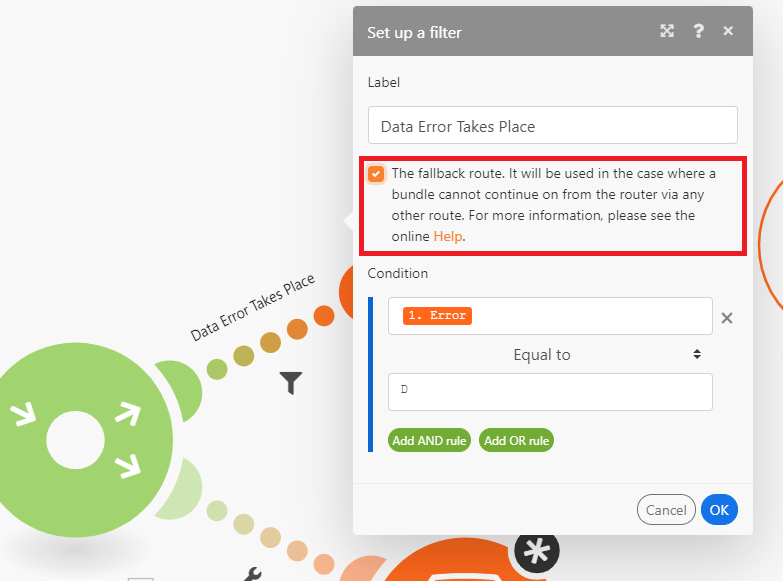
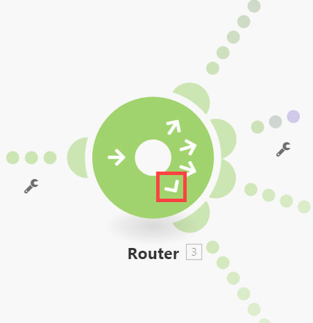
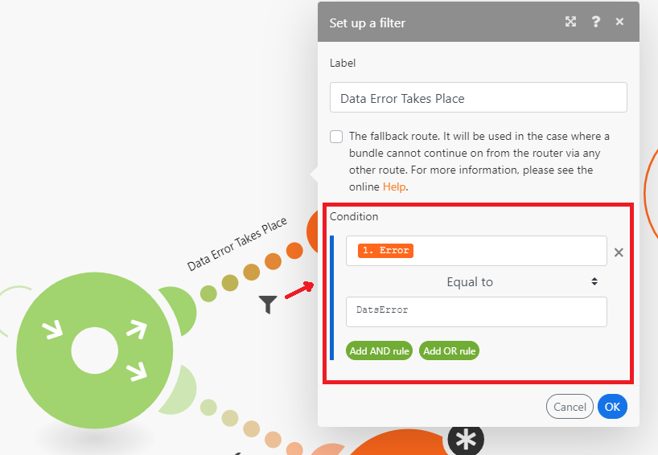
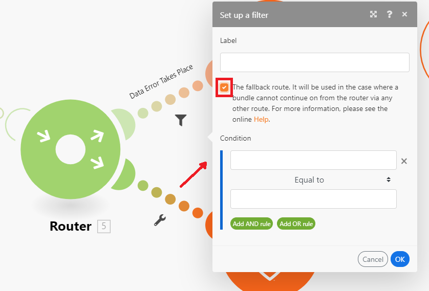

# 新增路由器模組並設定路由

「路由器」模組可讓您將情境分支為數個路由，並以不同方式處理每個路由中的資料。 路由器模組收到束時，會依照路由連線到路由器模組的順序，將其轉送到每個連線的路由。

路由會循序處理，而非並行處理。 直到前一個路由完全處理完後，才會將束傳送到下一個路由。

## 存取需求

+++ 展開以檢視本文中功能的存取需求。

您必須具有下列存取權才能使用本文中的功能：

<table style="table-layout:auto">
 <col> 
 <col> 
 <tbody> 
  <tr> 
   <td role="rowheader">[!DNL Adobe Workfront] 封裝</td> 
   <td> 
任何
 </td> 
  </tr> 
  <tr data-mc-conditions=""> 
   <td role="rowheader">[!DNL Adobe Workfront] 授權</td> 
   <td> 
新增：[！UICONTROL Standard]

或

目前： [！UICONTROL Work]或更高版本
 </td> 
  </tr> 
  <tr> 
   <td role="rowheader">[!DNL Adobe Workfront Fusion] 授權**</td> 
   <td>
   
目前：無[!DNL Workfront Fusion]授權需求。

   
或

   
舊版：任何 

   </td> 
  </tr> 
  <tr> 
   <td role="rowheader">產品</td> 
   <td>
   
新增：
 <ul><li>[！UICONTROL Select]或[！UICONTROL Prime] [!DNL Workfront]計畫：您的組織必須購買[!DNL Adobe Workfront Fusion]。</li><li>已包含[！UICONTROL Ultimate] [!DNL Workfront]計畫： [!DNL Workfront Fusion]。</li></ul>
   
或

   
目前：您的組織必須購買[!DNL Adobe Workfront Fusion]。

   </td> 
  </tr>
 </tbody> 
</table>

如需此表格中資訊的詳細資訊，請參閱檔案](/help/workfront-fusion/references/licenses-and-roles/access-level-requirements-in-documentation.md)中的[存取需求。

如需[!DNL Adobe Workfront Fusion]授權的相關資訊，請參閱[[!DNL Adobe Workfront Fusion] 授權](/help/workfront-fusion/set-up-and-manage-workfront-fusion/licensing-operations-overview/license-automation-vs-integration.md)。

+++

## 將路由器模組新增至情境

您必須先新增路由器模組，才能設定路由。

1. 按一下左側面板中的&#x200B;**[!UICONTROL 案例]**&#x200B;索引標籤。
1. 選取您要新增路由器的案例。
1. 按一下情境上的任何位置，以輸入情境編輯器。
1. 在情境編輯器中，按一下要在其後新增路由器的模組右側控制代碼。
1. 在顯示的模組清單中選取&#x200B;**[!UICONTROL 流量控制]** > **路由器**。

   

   或

   若要在兩個模組之間插入路由器模組，請按一下連線兩個模組的路由下方的扳手圖示，然後從功能表中選取&#x200B;**[!UICONTROL 新增路由器]**。

   
1. 按一下路由器右邊的控點並新增模組（類似於新增任何模組），即可新增第一條路由至路由器。
1. 若要新增其他路由，請按一下路由器模組。 路由隨即出現。 視需要新增模組至此路由。

   您可以新增任意數目的路由。

1. 若要驗證路由的順序，請按一下「自動對齊」圖示。

   路由會依其執行順序排列。 最上層路由會先執行。

1. （選擇性）若要變更路由順序，請在路由器模組上按一下滑鼠右鍵，然後選取&#x200B;**排序路由**&#x200B;以您希望路由執行的順序拖放路由。 路由會標示在路由器之後的第一個模組（路由的第一個模組）。

1. 繼續[新增篩選器至路由](#add-a-filter-to-a-route)。

## 新增篩選器至路由

您可以在路由器模組後方的路由上放置篩選器，以篩選組合。 路由上的模組只會處理通過篩選器的組合。

如果資料經過一個以上路由的篩選，資料會由兩個路由處理。 頂端路由會先處理資料。

1. 按一下左側面板中的&#x200B;**[!UICONTROL 案例]**&#x200B;索引標籤。
1. 選取您要新增篩選的案例。
1. 按一下情境上的任何位置，以輸入情境編輯器。
1. 在您要設定篩選的路徑上按一下扳手圖示。 這是路由器模組與路由的第一個模組之間的路徑。
1. 選取&#x200B;**設定篩選器。**
1. 在顯示的面板的標籤欄位中，新增標籤。 此標籤會顯示在情境中。
1. 設定篩選條件。

   如需詳細資訊，請參閱[將篩選器新增至案例](/help/workfront-fusion/create-scenarios/add-modules/add-a-filter-to-a-scenario.md)。

1. 按一下&#x200B;**[!UICONTROL 確定]**&#x200B;以儲存篩選器設定。

1. 繼續[設定遞補路由](#configure-a-fallback-route)。

## 設定遞補路由

遞補路由是在未傳遞任何篩選器至其他路由的任何組合上執行的路由。

您可以在篩選面板中啟用遞補路由。

1. 按一下左側面板中的&#x200B;**[!UICONTROL 案例]**&#x200B;索引標籤。
1. 選取您要新增遞補路由的案例。
1. 按一下情境上的任何位置，以輸入情境編輯器。
1. 在您要設定篩選的路徑上按一下扳手圖示。 這是路由器模組與路由的第一個模組之間的路徑。
1. 選取&#x200B;**設定篩選器。**
1. 在顯示的面板的標籤欄位中，新增標籤。 此標籤會顯示在情境中。
1. 啟用遞補路由核取方塊。

   

1. 按一下&#x200B;**[!UICONTROL 確定]**&#x200B;以儲存篩選器設定。

備援路由在路由器模組中標示為不同的箭頭：

## 範例： `if/else`使用案例

>[!BEGINSHADEBOX]

遞補路由的典型使用案例是，如果符合條件，則使用一條路由繼續流程，如果不符合，則使用另一條路由。 與下列步驟相同：

在此範例中，第一個路由設定了篩選器。 這代表`if`元件。

中設定篩選器

第二個路由設定為遞補路由。 這代表`else`元件。

>[!ENDSHADEBOX]
