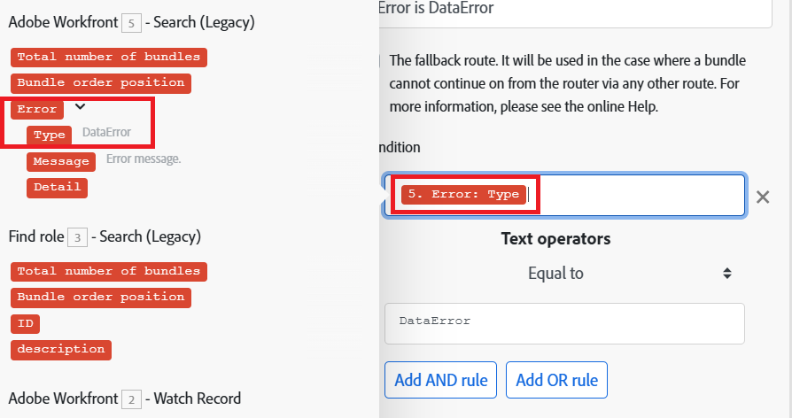
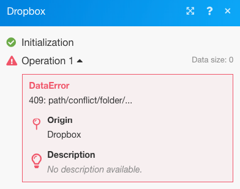
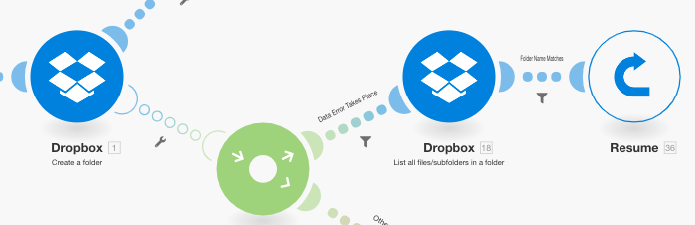
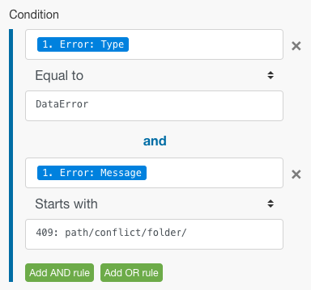
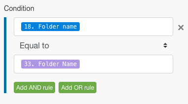
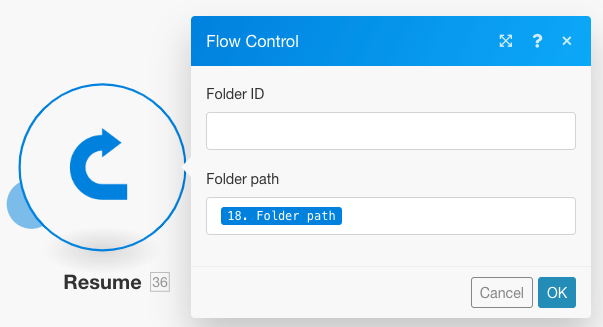
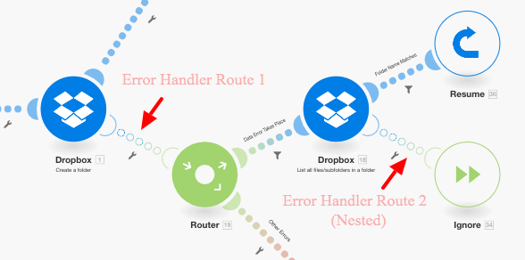

# 新增篩選和巢狀至錯誤處理路由

您可以透過包含篩選和巢狀結構，將進階錯誤處理技術加入錯誤處理路由中。

## 存取需求

+++ 展開以檢視本文中功能的存取需求。

您必須具有下列存取權才能使用本文中的功能：

<table style="table-layout:auto">
 <col> 
 <col> 
 <tbody> 
  <tr> 
   <td role="rowheader">Adobe Workfront套件 
   <td> 
任何
 </td> 
  </tr> 
  <tr data-mc-conditions=""> 
   <td role="rowheader">Adobe Workfront授權</td> 
   <td> 
新增：標準

或

目前：工作或以上
 </td> 
  </tr> 
  <tr> 
   <td role="rowheader">Adobe Workfront Fusion授權**</td> 
   <td>
   
目前：無Workfront Fusion授權需求。

   
或

   
舊版：任何 

   </td> 
  </tr> 
  <tr> 
   <td role="rowheader">產品</td> 
   <td>
   
新增：
 <ul><li>選取或Prime Workfront計畫：您的組織必須購買Adobe Workfront Fusion。</li><li>Ultimate Workfront計畫：包含Workfront Fusion。</li></ul>
   
或

   
目前：您的組織必須購買Adobe Workfront Fusion。

   </td> 
  </tr>
 </tbody> 
</table>

如需此表格中資訊的詳細資訊，請參閱檔案](/help/workfront-fusion/references/licenses-and-roles/access-level-requirements-in-documentation.md)中的[存取需求。

如需Adobe Workfront Fusion授權的相關資訊，請參閱[Adobe Workfront Fusion授權](/help/workfront-fusion/set-up-and-manage-workfront-fusion/licensing-operations-overview/license-automation-vs-integration.md)。

+++

## 正在篩選

錯誤處理常式路由中可能會進行兩種篩選。

* [新增篩選器至錯誤處理常式路由](#add-a-filter-to-the-error-handler-route)
* [新增路由器，接著新增篩選器至錯誤處理常式路由](#add-a-router-followed-by-filters-to-the-error-handler)

### 新增篩選器至錯誤處理常式路由

您可以使用篩選器來控制錯誤處理常式路由處理哪些錯誤。 這可讓您僅處理特定型別的錯誤。 如果錯誤未通過篩選器，則會將其視為沒有為給定模組定義錯誤處理常式路由。

這些篩選器的設定方式與Fusion中的任何其他篩選器相同。 如需指示，請參閱[將篩選器新增至案例](/help/workfront-fusion/create-scenarios/add-modules/add-a-filter-to-a-scenario.md)。

### 新增路由器，接著新增篩選器至錯誤處理常式

將路由器新增至錯誤處理路由，可讓您針對不同型別的錯誤設定不同的路由。

例如，若要設定當錯誤為DataError時要執行的一個路由，您可以設定一個篩選器，讓資料在對應的錯誤型別等於DataError時通過。

如需Fusion如何評估及處理各種資料型別的詳細資訊，請參閱[錯誤型別](/help/workfront-fusion/references/errors/error-processing.md)。

### 範例：使用篩選器處理錯誤

>[!BEGINSHADEBOX]

此範例案例顯示這些篩選器如何處理錯誤。

如果您使用「Dropbox>建立資料夾模組」，且已存在同名的資料夾，則模組會擲回DataError：

完整案例的功能如下：

1. 「工具」>「設定變數」模組包含資料夾名稱
1. 「HTTP >取得檔案」模組會擷取需要上傳至資料夾的檔案
1. 如果檔案夾已存在且名稱與模組中所對應檔案夾名稱相同的檔案夾，則Dropbox>建立檔案夾模組會擲回錯誤
1. 錯誤處理常式路由（透明泡泡）包含用於篩選錯誤的路由器
第一個路由是針對名為`DataError`的指定錯誤型別。

   1. 如果發生`DataError`，且錯誤詳細資料通過篩選器，則Dropbox>列出資料夾模組中的所有檔案/子資料夾會列出Dropbox中的所有資料夾。
   1. 後續篩選會比對資料夾名稱。
   1. **Resume**&#x200B;指示詞指定了現有資料夾的資料夾識別碼和資料夾路徑，而案例執行從Dropbox>建立資料夾模組繼續。 不過，Fusion不會建立新資料夾，而是會使用Resume指示詞中的值來移至下一個模組，並將檔案上傳至現有資料夾。

1. 第二個路由適用於所有其他錯誤，並以Rollback指示詞結束，這會導致立即停止該案例

以下是DataError路由的詳細說明。

若要在後續模組（例如上傳檔案）中使用現有資料夾，您必須新增錯誤處理常式路由至模組，並擷取要對應至繼續指示模組的資料夾路徑，如下所示：

第一個路由上的篩選器設定為只處理當同名資料夾已存在時所顯示的特定錯誤(DataError)：

「Dropbox>列出資料夾模組中的所有檔案」設定為傳回目標資料夾中的所有資料夾。 下列篩選條件只會在我們最初嘗試建立的篩選條件上通過。 (資料夾名稱儲存在33中。 資料夾名稱專案。)

然後Resume指令會提供資料夾路徑作為失敗模組的輸出。 請注意，資料夾ID已保留為空白，因為上傳檔案模組不需要它。

>[!ENDSHADEBOX]

## 巢狀

錯誤處理常式路由可在所有模組（路由器除外）上建立及設定。 因此，您可以為已經是現有錯誤處理常式路由一部分的模組建立錯誤處理常式路由。

>[!BEGINSHADEBOX]

範例：

含有篩選器的巢狀錯誤處理常式路由：

在此案例中，第二個錯誤處理常式路由是巢狀位於第一個錯誤處理常式路由下。

如果「Dropbox>建立資料夾模組」發生錯誤，則執行會移至第一個路由。 如果傳遞了`DataError Takes Place`篩選器，下一個模組將執行，如果Dropbox>列出資料夾模組中的所有檔案/子資料夾中未發生錯誤，則後續會執行Resume指示詞模組。

不過，如果「Dropbox>列出資料夾模組中的所有檔案/子資料夾」中發生錯誤，則執行會移至「錯誤處理常式路由2」，並以[!UICONTROL Ignore]指示詞結束。 在此情況下不會執行[!UICONTROL Resume directive]模組。

>[!ENDSHADEBOX]
