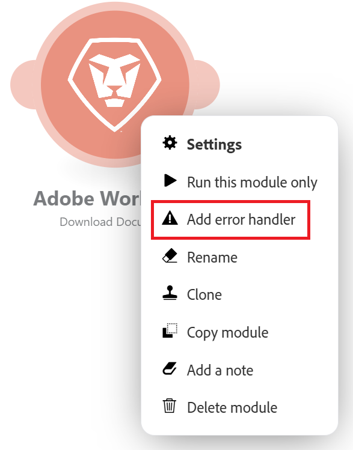
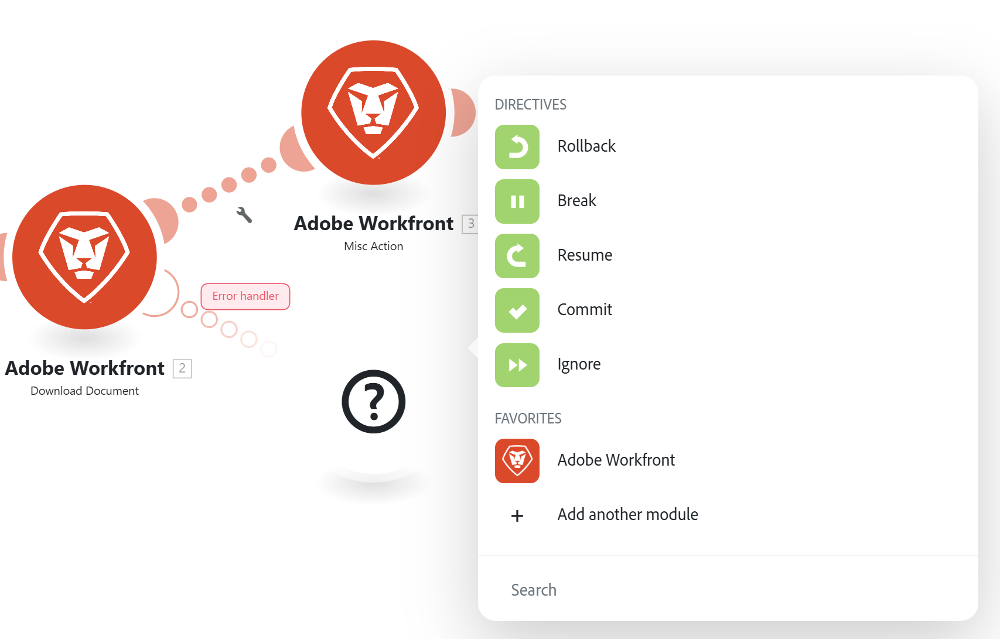

# 新增錯誤處理

執行情境期間可能會發生錯誤。

例如，發生錯誤的可能原因如下：

* 服務因失敗而無法使用
* 服務以非預期的資料回應
* 驗證輸入資料失敗
* 其他原因

如果模組在案例執行期間遇到錯誤，並且沒有附加到模組的錯誤處理路由，則預設錯誤處理邏輯會執行。

透過將錯誤處理常式路由新增至模組，您可以將預設的錯誤處理邏輯取代為您自己的邏輯。 Adobe Workfront Fusion提供五種不同的指令，可在錯誤處理常式路由的結尾插入。

如需預設錯誤處理的詳細資訊，請參閱[錯誤型別](/help/workfront-fusion/references/errors/error-processing.md)。

如需錯誤處理指示的詳細資訊，請參閱錯誤處理[的](/help/workfront-fusion/references/errors/directives-for-error-handling.md)指示。

## 存取需求

+++ 展開以檢視本文中功能的存取需求。

<table style="table-layout:auto">
 <col> 
 <col> 
 <tbody> 
  <tr> 
   <td role="rowheader">Adobe Workfront套件</td> 
   <td> 
任何Adobe Workfront Workflow套件和任何Adobe Workfront自動化與整合套件

Workfront Ultimate

Workfront Prime和Select套件，以及額外購買的Workfront Fusion。
 </td> 
  </tr> 
  <tr data-mc-conditions=""> 
   <td role="rowheader">Adobe Workfront授權</td> 
   <td> 
標準

工作或更高
 </td> 
  </tr> 
  <tr> 
   <td role="rowheader">產品</td> 
   <td>
   
如果您的組織有Select或Prime Workfront套件，但不包含Workfront Automation和Integration，則您的組織必須購買Adobe Workfront Fusion。</li></ul>
   </td> 
  </tr>
 </tbody> 
</table>

如需此表格中資訊的詳細資訊，請參閱檔案[中的](/help/workfront-fusion/references/licenses-and-roles/access-level-requirements-in-documentation.md)存取需求。

+++

## 新增錯誤處理常式

若要將錯誤處理常式新增至模組：

1. 按一下左側面板中的&#x200B;**[!UICONTROL 案例]**&#x200B;索引標籤。
1. 選取您要新增錯誤處理路由的案例。
1. 按一下情境上的任何位置，以輸入情境編輯器。
1. 用滑鼠右鍵按一下要在其後新增錯誤處理常式路由的模組，然後選取&#x200B;**[!UICONTROL 新增錯誤處理常式]**：

   

   錯誤處理常式路由已新增至模組。 如果模組是路由中的最後一個模組，則錯誤處理常式會直接依照該模組執行。 如果模組之後有更多模組，則會新增個別的錯誤處理常式路由。

   錯誤處理模組會顯示指令清單，以及在您的情境中使用的應用程式。

   

1. 選取其中一個指令。

   或

   新增一或多個模組至錯誤處理常式路由。

   如果您將更多模組加入路由，則預設會套用「忽略」指令。 如果出現錯誤，則會處理該路由上的後續模組。

   如需指令的詳細資訊，請參閱本文中的[處理指令時發生錯誤](#error-handling-directives)。

1. （可選）將篩選器新增至錯誤處理路由。 如需指示，請參閱[新增篩選和巢狀至錯誤處理路由](/help/workfront-fusion/create-scenarios/config-error-handling/advanced-error-handling.md)。

>[!NOTE]
>
>請注意，錯誤處理常式路由是由透明圓組成，而一般路由是由實心圓組成。

## 處理指示時發生錯誤

這些指示詞會簡要說明如下。 如需詳細資訊，請參閱錯誤處理[的](/help/workfront-fusion/references/errors/directives-for-error-handling.md)指示。

有五個指令，可根據錯誤後案例執行是否繼續分組為下列類別。

下列指令可確保案例執行繼續進行：

* **[!UICONTROL 繼續]**：可讓您指定發生錯誤的模組替代輸出。 案例執行狀態會標籤為成功。
* **[!UICONTROL 忽略]**：忽略錯誤。 案例執行狀態會標籤為成功。
* **[!UICONTROL 中斷]**：將輸入儲存到未完成執行的佇列。 案例執行狀態會標示為警告。

  如需詳細資訊，請參閱[檢視並解決不完整的執行](/help/workfront-fusion/manage-scenarios/view-and-resolve-incomplete-executions.md)。

如果發生錯誤時，案例執行應該停止，請使用以下指令之一：

* **[!UICONTROL 回覆]**：立即停止案例執行並標示其狀態為錯誤。
* **[!UICONTROL 認可]**：立即停止案例執行並將其狀態標籤為成功。

## 資源

如需錯誤處理的詳細資訊，請參閱：

* [Adobe Workfront Fusion中錯誤處理的指示](/help/workfront-fusion/references/errors/directives-for-error-handling.md)
* [新增篩選和巢狀至錯誤處理路由](/help/workfront-fusion/create-scenarios/config-error-handling/advanced-error-handling.md)
