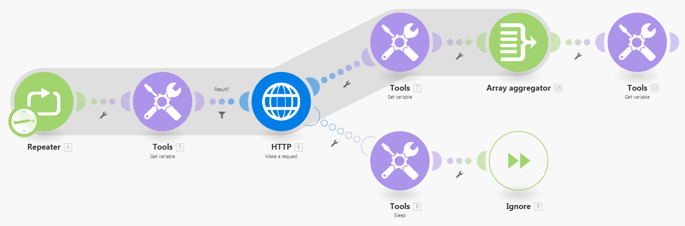

# 設定`retry`錯誤處理因應措施

有時候，如果故障原因可能很快解決，則重新執行失敗的模組會很有用。

Adobe Workfront Fusion目前不提供`retry`錯誤處理指示詞，但有兩個因應措施可用來模擬`retry`功能。

## 存取需求

+++ 展開以檢視本文中功能的存取需求。

您必須具有下列存取權才能使用本文中的功能：

<table style="table-layout:auto">
 <col> 
 <col> 
 <tbody> 
  <tr> 
   <td role="rowheader">Adobe Workfront套件 
   <td> 
任何
 </td> 
  </tr> 
  <tr data-mc-conditions=""> 
   <td role="rowheader">Adobe Workfront授權</td> 
   <td> 
新增：標準

或

目前：工作或以上
 </td> 
  </tr> 
  <tr> 
   <td role="rowheader">Adobe Workfront Fusion授權**</td> 
   <td>
   
目前：無Workfront Fusion授權需求。

   
或

   
舊版：任何 

   </td> 
  </tr> 
  <tr> 
   <td role="rowheader">產品</td> 
   <td>
   
新增：
 <ul><li>選取或Prime Workfront計畫：您的組織必須購買Adobe Workfront Fusion。</li><li>Ultimate Workfront計畫：包含Workfront Fusion。</li></ul>
   
或

   
目前：您的組織必須購買Adobe Workfront Fusion。

   </td> 
  </tr>
 </tbody> 
</table>

如需此表格中資訊的詳細資訊，請參閱檔案](/help/workfront-fusion/references/licenses-and-roles/access-level-requirements-in-documentation.md)中的[存取需求。

如需Adobe Workfront Fusion授權的相關資訊，請參閱[Adobe Workfront Fusion授權](/help/workfront-fusion/set-up-and-manage-workfront-fusion/licensing-operations-overview/license-automation-vs-integration.md)。

+++

## [!UICONTROL Retry]錯誤處理指示詞的因應措施

Workfront Fusion目前不提供`retry`錯誤處理指示詞。 使用下列其中一種變通辦法來模擬重試功能。

如需指示，請參閱錯誤處理](/help/workfront-fusion/references/errors/directives-for-error-handling.md)的[指示。

* [使用Break指令](#use-the-break-directive)
* [使用中繼器模組](#use-the-repeater-module)

### 使用Break指令

當Break指令執行時，案例執行的狀態會儲存在未完成執行的佇列中。 如果發生這種情況，您可以然後手動解決不完整的執行。

如需指示，請參閱[解決Break指示詞處理的錯誤](/help/workfront-fusion/create-scenarios/config-error-handling/resolve-error-from-break-directive.md)

如需解決未完成執行的指示，請參閱[檢視並解決未完成的執行](/help/workfront-fusion/manage-scenarios/view-and-resolve-incomplete-executions.md)。

#### 缺點

* 最小重試間隔為一分鐘。
* 如果模組正在處理多個套件組合且套件組合處理失敗，部分執行（僅限導致錯誤的套件）會移至不完整執行資料夾，並根據[!UICONTROL Break]指示詞設定排程重試。 但是，目前執行會繼續進行，而模組會繼續處理後續的套件組合。

  若要在成功解析儲存在「未完成執行」資料夾中的執行之前，防止案例再次執行，請在[!UICONTROL Scenario settings]中啟用「[!UICONTROL Sequential processing]」選項。

如需不完整執行的詳細資訊，請參閱[檢視並解決不完整的執行](/help/workfront-fusion/manage-scenarios/view-and-resolve-incomplete-executions.md)。

### 使用中繼器模組

中繼器模組的因應措施較複雜，但較可自訂。

#### 設定錯誤處理常式路由

1. 按一下左側面板中的&#x200B;**[!UICONTROL Scenarios]**&#x200B;索引標籤。
1. 選取您要新增因應措施的案例。
1. 按一下情境上的任何位置，以輸入情境編輯器。
1. 按一下&#x200B;**流量控制**&#x200B;圖示，然後選取&#x200B;**中繼器**。
1. 在「中繼器」模組中，將&#x200B;**[!UICONTROL Repeats]**&#x200B;欄位設定為您希望情境重試的最大次數。
1. 在&#x200B;**[!UICONTROL Repeater]**&#x200B;模組之後附加可能失敗的模組。
1. 將錯誤處理常式路由附加到可能失敗的模組。

   如需指示，請參閱[新增錯誤處理](/help/workfront-fusion/create-scenarios/config-error-handling/error-handling.md)。
1. 將&#x200B;**[!UICONTROL Tools]>[!UICONTROL Sleep]**&#x200B;模組新增至錯誤處理常式路由，並將其&#x200B;**[!UICONTROL Delay]**&#x200B;欄位設定為重試嘗試之間的秒數。

1. 在&#x200B;**[!UICONTROL Tools]>[!UICONTROL Sleep]**&#x200B;模組之後新增&#x200B;**[!UICONTROL Ignore]**&#x200B;指示詞。
1. 繼續[設定預設路由](#configure-the-default-route)。

#### 設定預設路由

1. 在可能失敗的模組之後，將&#x200B;**[!UICONTROL Tools]>[!UICONTROL Set variable]**&#x200B;模組新增至單獨的（非錯誤處理常式）路由，並將它設定成將模組的結果儲存在名為的變數中，例如`Result`。

1. 在&#x200B;**[!UICONTROL Tools]>[!UICONTROL Set variable]**&#x200B;之後新增&#x200B;**[!UICONTROL Array aggregator]**&#x200B;模組，並在其Source模組欄位中選取&#x200B;**[!DNL Repeater]**&#x200B;模組。

1. 在&#x200B;**[!UICONTROL Array aggregator]**&#x200B;模組之後新增&#x200B;**[!UICONTROL Tools]>[!UICONTROL Get variable]**&#x200B;模組，並將`Result`變數的值對應至該模組。

1. 在&#x200B;**[!UICONTROL Repeater]**&#x200B;模組與可能失敗的模組之間插入&#x200B;**[!UICONTROL Tools]>[!UICONTROL Get variable]**&#x200B;模組，並將`Result`變數的值對應到它。

1. 在此&#x200B;**[!UICONTROL Tools]>[!UICONTROL Get variable]**&#x200B;模組與可能失敗的模組之間插入篩選器，只有在`Result`變數不存在時才能繼續。

>[!BEGINSHADEBOX]

**範例：**

在此範例案例中，[!UICONTROL HTTP] > [!UICONTROL Make a request]模組代表可能失敗的模組：

>[!ENDSHADEBOX]

如果可能失敗的模組結果太複雜，無法儲存在簡單變數中，您可以使用資料存放區來儲存和擷取結果。 資料存放區將只包含一個記錄。 例如，記錄的索引鍵可以是`Result`。

如需資料存放區的詳細資訊，請參閱[資料存放區](/help/workfront-fusion/create-scenarios/map-data/data-stores.md)。

#### 缺點

* 此因應措施較複雜。
* 此因應措施會使用更多作業。

## 資源

* 如需中繼器模組和中斷指示詞的詳細資訊，請參閱[流程控制項](/help/workfront-fusion/references/apps-and-modules/tools-and-transformers/flow-control.md)。
* 如需取得變數模組的詳細資訊，請參閱[工具](/help/workfront-fusion/references/apps-and-modules/tools-and-transformers/tools-modules.md)。
