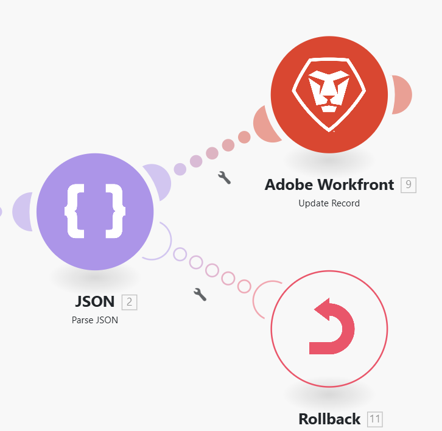

# 設定`throw`錯誤因應措施

在某些情況下，您可能會想要強制停止案例執行，然後是「復原」或「認可」階段，或者停止路由處理，並選擇性地將其儲存在未完成執行的佇列中。

目前，錯誤處理指示詞不能用於錯誤處理常式路由的範圍之外，而且Adobe Workfront Fusion不提供可讓您輕鬆有條件產生（擲回）錯誤的模組。

您可以使用下列因應措施，來模擬`throw`錯誤功能。

如需有關未完成執行的資訊，請參閱[在Adobe Workfront Fusion中檢視及解決未完成的執行](/help/workfront-fusion/manage-scenarios/view-and-resolve-incomplete-executions.md)。

如需有關錯誤處理指示的資訊，請參閱[在Adobe Workfront Fusion中錯誤處理的指示](/help/workfront-fusion/references/errors/directives-for-error-handling.md)。

## 存取需求

+++ 展開以檢視本文中功能的存取需求。

<table style="table-layout:auto">
 <col> 
 <col> 
 <tbody> 
  <tr> 
   <td role="rowheader">Adobe Workfront套件</td> 
   <td> 
任何Adobe Workfront Workflow套件和任何Adobe Workfront自動化與整合套件

Workfront Ultimate

Workfront Prime和Select套件，以及額外購買的Workfront Fusion。
 </td> 
  </tr> 
  <tr data-mc-conditions=""> 
   <td role="rowheader">Adobe Workfront授權</td> 
   <td> 
標準

工作或更高
 </td> 
  </tr> 
  <tr> 
   <td role="rowheader">產品</td> 
   <td>
   
如果您的組織有Select或Prime Workfront套件，但不包含Workfront Automation和Integration，則您的組織必須購買Adobe Workfront Fusion。</li></ul>
   </td> 
  </tr>
 </tbody> 
</table>

如需此表格中資訊的詳細資訊，請參閱檔案[中的](/help/workfront-fusion/references/licenses-and-roles/access-level-requirements-in-documentation.md)存取需求。

+++

## `throw`的因應措施

若要有條件地擲回錯誤，您可以設定模組，使其在操作期間故意失敗。 一種可能是採用[!UICONTROL JSON] > [!UICONTROL 剖析JSON]模組，該模組設定為選擇性擲回錯誤（在此情況下為`BundleValidationError`）：

然後，您可以將其中一個錯誤處理指示附加至錯誤處理路由：

* **回覆**：強制案例執行停止並執行回覆階段。
* **認可**：強制案例執行停止並執行認可階段。
* **忽略**：停止處理路由。
* **中斷**：停止處理路由，並將其儲存在未完成執行的佇列資料夾中。

下列範例顯示[!DNL Rollback]指示詞的使用：

