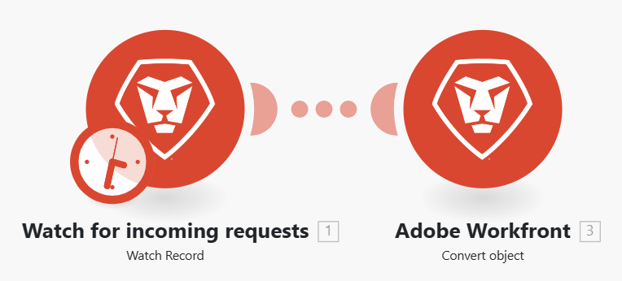

# 設定案例設定

您可以在「情境設定」面板中設定情境的特定設定。

## 存取需求

+++ 展開以檢視本文中功能的存取需求。

<table style="table-layout:auto">
 <col> 
 <col> 
 <tbody> 
  <tr> 
   <td role="rowheader">Adobe Workfront套件</td> 
   <td> 
任何Adobe Workfront Workflow套件和任何Adobe Workfront自動化與整合套件

Workfront Ultimate

Workfront Prime和Select套件，以及額外購買的Workfront Fusion。
 </td> 
  </tr> 
  <tr data-mc-conditions=""> 
   <td role="rowheader">Adobe Workfront授權</td> 
   <td> 
標準

工作或更高
 </td> 
  </tr> 
  <tr> 
   <td role="rowheader">產品</td> 
   <td>
   
如果您的組織有Select或Prime Workfront套件，但不包含Workfront Automation和Integration，則您的組織必須購買Adobe Workfront Fusion。</li></ul>
   </td> 
  </tr>
 </tbody> 
</table>

如需此表格中資訊的詳細資訊，請參閱檔案[中的](/help/workfront-fusion/references/licenses-and-roles/access-level-requirements-in-documentation.md)存取需求。

+++

## 開啟案例設定

1. 按一下左側面板中的&#x200B;**情境**。
1. 尋找您想要的情境，然後按一下名稱。
1. 按一下情境上的任何位置以輸入情境編輯器。
1. 按一下頁面左下角附近的齒輪圖示。

   

   在顯示的[!UICONTROL 情境設定]面板中，您可以設定情境的各種進階設定。
1. 視需要啟用或停用案例設定。 請參閱下方的[案例設定選項](#scenario-settings-options)。

## 案例設定選項

### [!UICONTROL 循序處理]

此選項會強制所有執行按順序進行，並且主要與Webhook和未完成執行相關。

啟用循序處理時，將停用案例的平行執行。

**即時Webhook**：如果將Webhook觸發程式設定為`instant`且已啟用「循序處理」，則所有即時Webhook裝載都會依其到達的順序排入佇列並進行處理。 以精確順序處理來自外部系統的事件時，這會很有用。

>[!NOTE]
>
>在下一個裝載開始之前，每個裝載都會經過處理，因此會有自動處理延遲。

**未完成的執行**：如果同時啟用「未完成的執行」，如果案例執行期間發生錯誤，則案例會暫停。 接著會發生下列其中一項：

* 如果「循序處理」選項為&#x200B;**已啟用**，Workfront Fusion會停止處理預先存在的序列，直到解決所有未完成的執行為止。
* 如果循序處理選項為&#x200B;**已停用**，則情境會根據其排程繼續執行，並伴隨重複嘗試重新執行未完成的執行。

  如需不完整執行的詳細資訊，請參閱[檢視並解決不完整的執行](/help/workfront-fusion/manage-scenarios/view-and-resolve-incomplete-executions.md)。

  >[!NOTE]
  >
  >循序處理可能會導致案例的執行延遲。 如果在即時案例觸發或排程案例設定為執行時，佇列中仍有未完成的執行，則該案例將在佇列中的所有執行完成後執行。
  >
  >如果您的案例不需要循序處理，建議您停用循序處理選項。

  如需排程的詳細資訊，請參閱[排程情境](/help/workfront-fusion/create-scenarios/config-scenarios-settings/schedule-a-scenario.md)。

### 資料是機密的

執行案例後，您可以預設顯示案例中模組處理哪些資料的相關資訊。 如果您不想儲存此資訊，請啟用[!UICONTROL 資料是機密的]選項。

>[!IMPORTANT]
>
>如果啟用此選項，可能很難解決執行案例期間可能發生的錯誤。

### [!UICONTROL 允許儲存未完成的執行]

此選項可決定Adobe Workfront Fusion在執行案例期間發生錯誤時的執行方式。 啟用此選項後，情境會暫停並移至不完整的執行資料夾。 這可讓您修正問題，並從情景停止的地方繼續執行。 如果停用此選項，案例執行會停止並開始倒回階段。

如需不完整執行的詳細資訊，請參閱[檢視並解決不完整的執行](/help/workfront-fusion/manage-scenarios/view-and-resolve-incomplete-executions.md)。

### 啟用資料遺失

此選項與在Workfront Fusion無法將套件儲存至未完成執行佇列（例如，由於缺少可用空間）時啟用資料遺失有關。 啟用此選項後，資料會遺失，以防止整體案例執行中斷。 當最高優先順序為連續執行，而傳入的錯誤資料並非很重要時，這個用法很有用。

除此之外，在執行案例時，模組有時可能會遇到大於最大允許大小的檔案。 在此情況下，Workfront Fusion會根據[!UICONTROL 啟用資料遺失]選項的設定進行，並顯示警告訊息。

如需不完整執行的詳細資訊，請參閱[檢視並解決不完整的執行](/help/workfront-fusion/manage-scenarios/view-and-resolve-incomplete-executions.md)。

如需檔案大小上限的詳細資訊，請參閱[Fusion效能護欄](/help/workfront-fusion/references/scenarios/fusion-performance-guardrails.md#files)。

如需有關警告的詳細資訊，請參閱[錯誤型別](/help/workfront-fusion/references/errors/error-processing.md)。

### [!UICONTROL 自動認可]

[!UICONTROL 自動認可]設定會套用至交易，並定義處理案例的方式。 如果開啟自動認可選項，每個模組上的認可階段會在完成作業階段後立即開始。 停用「自動提交」選項時，在所有模組執行作業之前，不會發生任何提交（這是預設模式）。

### 最大週期數

>[!NOTE]
>
>您必須啟用&#x200B;**顯示進階設定**&#x200B;核取方塊才能檢視此選項。

如果您想要避免與協力廠商服務的連線中斷，並確保所有記錄都會在單一案例執行內處理，設定更多週期可能相當實用。

* 如果案例以輪詢觸發器開始，設定會定義案例執行期間允許的最大週期數。

  如需輪詢觸發器的詳細資訊，請參閱文章模組概觀中的[輪詢觸發器](/help/workfront-fusion/get-started-with-fusion/understand-fusion/module-overview.md#polling-triggers)。

* 如果案例從立即觸發器開始，設定會被忽略，並且在單一案例執行期間處理所有待處理事件，每個週期一個事件。

  如需即時觸發器的詳細資訊，請參閱文章模組概觀中的[即時觸發器](/help/workfront-fusion/get-started-with-fusion/understand-fusion/module-overview.md#instant-triggers)。

* 如果案例不是以觸發器（即時/輪詢）開始，則一律執行指定的最大週期數。

>[!BEGINSHADEBOX]

**範例：** Workfront > [!UICONTROL 觀看記錄]觀看新問題，而Workfront >[!UICONTROL 轉換物件]會將新要求轉換為專案，並指派適當的範本。

[!UICONTROL 更多週期]設定只會在您排程情境執行時套用。 當您使用[!UICONTROL 執行一次]按鈕時，會考慮循環設定。

#### 最大循環數設為1 （預設）

Workfront >監看記錄模組中的最大週期數設為`10`。
如果向Workfront提交100個請求，且「最大週期數」欄位設為10，則在執行一個案例後會有90個檔案未處理。 接下來10個檔案會在下一個排程案例執行中處理。

#### 最大循環數設為10

Workfront >監看記錄模組中的最大週期數設為`10`。

如果將100個檔案新增到Dropbox資料夾，且「最大循環數」選項設為10，則會在第一個週期內處理10個檔案、在第二個週期內處理下一個10個檔案、在第三個週期內處理下一個10個檔案，以此類推，直到處理完所有檔案為止。

所有檔案會在1個案例執行內處理。

您可以在案例詳細資訊中檢視已執行的週期：

如需此頁面的詳細資訊，請參閱[案例詳細資料](/help/workfront-fusion/get-started-with-fusion/navigate-fusion/scenario-details.md)。

>[!ENDSHADEBOX]

### 連續錯誤數

定義停用情境執行之前的連續執行嘗試次數上限（不包括`DataError`、`DuplicateDataError`、`ModuleTimeoutError`和`ConnectionError`）。

如需錯誤的詳細資訊，請參閱[錯誤型別](/help/workfront-fusion/references/errors/error-processing.md)。

>[!NOTE]
>
>如果案例以立即觸發器開始，則會忽略設定，並在發生第一個錯誤後立即停用案例。

### 工作者集區

>[!NOTE]
>
>只有在符合下列兩個條件時，才會顯示此設定：
>
>* 您是組織管理員或擁有者
>* 有一個以上的工作者集區與您的組織相關聯。

此設定會將案例指派給與您的組織相關聯的特定工作者集區，讓您將資源專用於高優先順序案例。
