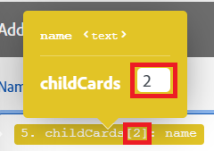

# 對應陣列或陣列元素

陣列是可以包含下列專案的組合專案：

* 相同型別（簡單陣列）的一或多個值
* 相同型別（複雜陣列）的一或多個集合

>[!BEGINSHADEBOX]

**範例：**

* **複雜陣列**： [!UICONTROL 觀看電子郵件]模組傳回每個電子郵件的附件陣列。 每個附件代表一個集合，其中可能包含名稱、內容、大小等。

>[!ENDSHADEBOX]

## 存取需求

+++ 展開以檢視本文中功能的存取需求。

您必須具有下列存取權才能使用本文中的功能：

<table style="table-layout:auto">
 <col> 
 <col> 
 <tbody> 
  <tr> 
   <td role="rowheader">Adobe Workfront套件</td> 
   <td> 
任何
 </td> 
  </tr> 
  <tr data-mc-conditions=""> 
   <td role="rowheader">Adobe Workfront授權</td> 
   <td> 
新增：標準

或

目前： [!UICONTROL Work]或更高版本
 </td> 
  </tr> 
  <tr> 
   <td role="rowheader">Adobe Workfront Fusion授權**</td> 
   <td>
   
目前：無Workfront Fusion授權需求。

   
或

   
舊版：任何 

   </td> 
  </tr> 
  <tr> 
   <td role="rowheader">產品</td> 
   <td>
   
新增:
 <ul><li>[!UICONTROL Select]或[!UICONTROL Prime] Workfront計畫：您的組織必須購買Adobe Workfront Fusion。</li><li>[!UICONTROL Ultimate] Workfront計畫：包含Workfront Fusion。</li></ul>
   
或

   
目前：您的組織必須購買Adobe Workfront Fusion。

   </td> 
  </tr>
 </tbody> 
</table>

如需此表格中資訊的詳細資訊，請參閱檔案[中的](/help/workfront-fusion/references/licenses-and-roles/access-level-requirements-in-documentation.md)存取需求。

如需Adobe Workfront Fusion授權的相關資訊，請參閱[Adobe Workfront Fusion授權](/help/workfront-fusion/set-up-and-manage-workfront-fusion/licensing-operations-overview/license-automation-vs-integration.md)。

+++

## 對應整個陣列

1. 按一下左側面板中的&#x200B;**[!UICONTROL 案例]**&#x200B;索引標籤。
1. 選取您要對應陣列的情境。
1. 按一下情境上的任何位置，以輸入情境編輯器。
1. 在您要對應陣列的模組中，按一下您要對應陣列的欄位。 這是陣列對應的欄位。

1. 在顯示的方塊中，對應專案。

   面板可讓您以與其他任何型別專案相同的方式對應欄位。 如果您不想分別填入每個專案，但想將另一個陣列對應到目標欄位，請使用[!UICONTROL 對應]按鈕。 在此情況下，請確定兩個陣列（來源陣列和目標陣列）具有相同的結構。

   您可以新增任意數量的專案至陣列。

您可以使用疊代器將陣列分割成個別的組合。 如需詳細資訊，請參閱Adobe Workfront Fusion[[!UICONTROL 中的]迭代器](/help/workfront-fusion/references/modules/iterator-module.md)模組。

## 將專案對應至新陣列

Workfront Fusion中的某些欄位可讓您將元素對應至陣列。 例如，您可以在「Workfront面板>新增檢查清單專案模組」中建立一系列檢查清單專案。 執行模組時，所有檢查清單專案都會新增至卡片。

任何顯示「新增專案」的模組欄位都會建立陣列。

若要將元素新增至陣列：

1. 按一下&#x200B;**新增專案**
1. 在開啟的面板中，輸入有關專案的詳細資訊。
1. 按一下&#x200B;**新增**。
1. （選擇性）針對您想要新增至陣列的每個元素，重複步驟1至3。

## 對應陣列元素

### 依數字對應陣列元素

陣列元素會在陣列名稱后方括弧中顯示為數字。 您可以使用此索引編號將陣列的個別元素對應到欄位中。

>[!NOTE]
>
>Workfront Fusion中的陣列索引從1開始。

若要對應陣列元素：

1. 按一下您要對應元素的欄位。

   對應面板隨即開啟。

1. 找到包含您要對應的元素的陣列。
1. 按一下陣列旁的下拉箭頭。
1. 按一下您要對應的元素。

   元素會進行對應，索引為1。 這會對映陣列中的第一個元素。

1. 若要對應陣列的不同元素，請按一下[1]並輸入您要對應的陣列元素的索引編號。

   

### 使用指定索引鍵對應陣列的元素

某些陣列包含具有索引鍵值專案（例如中繼資料、屬性等）的集合。 若要使用其中一個值，您可以依照元素指定的索引鍵值來查詢元素，並從值專案中取得對應的值。 我們建議使用採用`map()`與`get()`函式組合的公式。

>[!BEGINSHADEBOX]

下列範例顯示[!DNL Jira]應用程式的輸出。

此範例會針對識別碼為10108的特定附件，從附件的陣列取得檔案名稱。

此範例會產生下列輸出：

公式的說明如下：

* `map`

   1. `map()`函式的第一個引數是整個陣列專案。
   1. 第二個引數是值專案的原始名稱。 若要取得原始名稱，請將游標停留在[!UICONTROL 對應]面板中的專案上：

      

      >[!NOTE]
      >
      >所有引數都區分大小寫。 即使在此特定範例中，專案的標籤與其原始名稱不同（僅在大寫中），但必須使用原始名稱。

   1. 第三個引數是關鍵專案的原始名稱：

      

   1. 第四個引數是指定的機碼值。

  由於`map()`函式傳回陣列（因為可能有更多具有指定索引鍵值的元素），所以必須套用`get()`函式才能取得其第一個元素：

* `get`

   1. `get()`函式的第一個引數是`map()`函式的結果。

   1. 第二個引數是元素的索引。 在此範例中，索引為`1`。

此範例會產生下列輸出：

>[!ENDSHADEBOX]

如需`map()`函式的詳細資訊，請參閱[陣列函式](/help/workfront-fusion/references/mapping-panel/functions/array-functions.md)。

如需`get()`函式的詳細資訊，請參閱[一般函式](/help/workfront-fusion/references/mapping-panel/functions/general-functions.md)。

## 將陣列元素轉換為一系列組合

可以使用[!UICONTROL 疊代器]模組將陣列轉換為一系列組合。 如需詳細資訊，請參閱[[!UICONTROL 迭代器]模組](/help/workfront-fusion/references/modules/iterator-module.md)。

