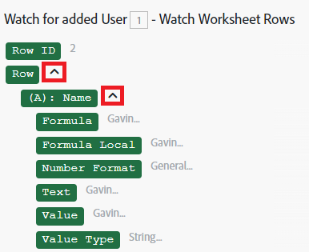

# 將資訊從一個模組對應至另一個模組

對應是將模組的輸出指派給其他模組的輸入欄位的程式。

當您按一下欄位，可在其中插入從情境中的前一個模組輸出的值時，對應面板隨即顯示。

您也可以使用對應面板中函式和對應專案的任意組合，以及您鍵入的靜態文字，來建立公式。 這些元素可以彼此巢狀內嵌。

## 存取需求

+++ 展開以檢視本文中功能的存取需求。

您必須具有下列存取權才能使用本文中的功能：

<table style="table-layout:auto">
 <col> 
 <col> 
 <tbody> 
  <tr> 
   <td role="rowheader">[!DNL Adobe Workfront] 封裝</td> 
   <td> 
任何
 </td> 
  </tr> 
  <tr data-mc-conditions=""> 
   <td role="rowheader">[!DNL Adobe Workfront] 授權</td> 
   <td> 
新增： [!UICONTROL Standard]

或

目前： [!UICONTROL Work]或更高
 </td> 
  </tr> 
  <tr> 
   <td role="rowheader">[!DNL Adobe Workfront Fusion] 授權**</td> 
   <td>
   
目前：無[!DNL Workfront Fusion]授權需求。

   
或

   
舊版：任何 

   </td> 
  </tr> 
  <tr> 
   <td role="rowheader">產品</td> 
   <td>
   
新增：
 <ul><li>[!UICONTROL Select] 或[!UICONTROL Prime] [!DNL Workfront]計畫：您的組織必須購買[!DNL Adobe Workfront Fusion]。</li><li>[!UICONTROL Ultimate] [!DNL Workfront] 計畫： [!DNL Workfront Fusion]已包括在內。</li></ul>
   
或

   
目前：您的組織必須購買[!DNL Adobe Workfront Fusion]。

   </td> 
  </tr>
 </tbody> 
</table>

如需此表格中資訊的詳細資訊，請參閱檔案[&#128279;](/help/workfront-fusion/references/licenses-and-roles/access-level-requirements-in-documentation.md)中的存取需求。

如需[!DNL Adobe Workfront Fusion]授權的相關資訊，請參閱[[!DNL Adobe Workfront Fusion] 授權](/help/workfront-fusion/set-up-and-manage-workfront-fusion/licensing-operations-overview/license-automation-vs-integration.md)。

+++

## 對應專案

當您連結兩個或多個模組來建立一系列模組後，每個模組都可以處理其前面的模組所輸出的專案值。

若要將輸出專案指派給模組的輸入欄位：

1. 按一下左側面板中的&#x200B;**[!UICONTROL Scenarios]**&#x200B;索引標籤。
1. 選取您要對應資料的情境。
1. 按一下情境上的任何位置，以輸入情境編輯器。
1. 按一下應處理先前一個或多個模組輸出的模組。
1. 在顯示的「模組設定」面板中，按一下您要使用先前模組輸出之專案值的欄位。

   對應面板隨即開啟。

1. （可選）若要搜尋對應面板中的特定欄位，請按一下對應面板搜尋列，然後輸入您要搜尋的字詞。 當欄位出現在清單中時，按一下該欄位。

   搜尋結果包含搜尋字詞，且不區分大小寫。
1. 若要選取作為收集要素的值，請按一下該收集旁的箭頭，然後在元素出現時選取元素。

   

1. 按一下對應面板中的專案以將其插入欄位中。

如需詳細資訊，請參閱[設定模組](/help/workfront-fusion/create-scenarios/add-modules/configure-a-modules-settings.md)。

## 疑難排解

### 問題：對應面板中缺少專案

對應面板會顯示先前模組的輸出專案。 有時，此面板中可能會遺漏某些專案。 您可以在情境編輯器中執行缺少輸出的模組，然後對應面板可以在後續模組中包含這些專案。 確切的程式會依模組的型別而有所不同

* [即時觸發](#instant-trigger)
* [輪詢觸發程式](#polling-trigger)
* [其他模組](#other-modules)

#### 即時觸發

1. 以滑鼠右鍵按一下模組，然後在顯示的功能表中按一下&#x200B;**[!UICONTROL Run this module only]**。

   因為這是立即的觸發程式，所以會開始監視事件。

1. 建立模組正在觀看的事件。

   例如，如果模組是Workfront >監視事件模組，正在監視任務指派，請登入Workfront （以不是Fusion連線使用的使用者身分）並指派任務。

1. 當模組完成執行時，按一下模組上方的泡泡圖示，以探索其完整輸出。

   後續模組的對應面板現在包含模組輸出中的所有專案。

#### 輪詢觸發程式

1. 以滑鼠右鍵按一下模組，然後在顯示的功能表中按一下&#x200B;**[!UICONTROL Run this module only]**。
1. 如果沒有輸出，請按一下&#x200B;**[!UICONTROL Choose where to start]**&#x200B;並調整設定。
1. （視條件而定）如果沒有要處理的事件，請建立模組要監視的事件，並重複步驟2。

   例如，如果模組是監視任務指派的Workfront >觀看記錄模組，請登入Workfront （以不是Fusion連線使用的使用者身分）並指派任務，然後再次執行模組。

1. 當模組完成執行時，按一下模組上方的泡泡圖示，以探索其完整輸出。

   後續模組的對應面板現在包含模組輸出中的所有專案。

#### 其他模組

您可以選擇執行：

* 整個情境（或僅包含模組的部分）
* 單一模組

若要執行單一模組：

1. 以滑鼠右鍵按一下模組，然後在顯示的功能表中按一下&#x200B;**[!UICONTROL Run this module only]**。
1. 提供輸入專案的範例值，然後按一下&#x200B;**[!UICONTROL OK]** 。
1. 當模組完成執行時，按一下模組上方的泡泡圖示，以探索其完整輸出。

   後續模組的對應面板現在包含模組輸出中的所有專案。
