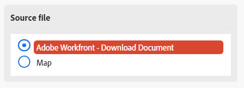

# 在模組之間對應檔案

有些模組可以處理檔案。 這些模組可以傳回要傳送以供進一步處理的輸出檔案，或要求將檔案傳遞給它們以供處理。 檔案可以對映，以便一個模組的檔案輸出可以由另一個模組處理。

## 存取權要求

+++ 展開以檢視這篇文章中所述功能的存取權要求。

<table style="table-layout:auto">
 <col> 
 <col> 
 <tbody> 
  <tr> 
   <td role="rowheader">Adobe Workfront 封裝</td> 
   <td> 
任何 Adobe Workfront Workflow 封裝及任何 Adobe Workfront Automation and Integration 封裝

Workfront Ultimate

Workfront Prime 和 Select 封裝，以及額外購買的 Workfront Fusion。
 </td> 
  </tr> 
  <tr data-mc-conditions=""> 
   <td role="rowheader">Adobe Workfront 授權</td> 
   <td> 
標準

工作或更高層級
 </td> 
  </tr> 
  <tr> 
   <td role="rowheader">產品</td> 
   <td>
   
如果您的組織擁有 Select 或 Prime Workfront 封裝，但不包括 Workfront Automation and Integration，則您的組織必須購買 Adobe Workfront Fusion。</li></ul>
   </td> 
  </tr>
 </tbody> 
</table>

若要詳細了解此表格中的資訊，請參閱[&#128279;](/help/workfront-fusion/references/licenses-and-roles/access-level-requirements-in-documentation.md)文件中的存取權要求。

+++

## 將檔案從來源模組對應至目標模組

處理檔案的模組需要兩項資訊：

* 檔案名稱
* 檔案內容（資料）

如果之前有任何模組輸出檔案，您可以選取來源模組，而該模組輸出的檔案名稱和資料會對應至目標模組。

您也可以手動輸入此名稱與資料，或從先前的模組進行對應。 例如，在重新命名檔案時，這可能很方便。

>[!NOTE]
>
>如果您需要處理來自URL的檔案，我們建議使用`HTTP > Get a File`模組從URL下載檔案，然後將檔案從`HTTP > Get a File`模組對應到您案例中所需模組的欄位。
>
>

若要對應檔案：

1. 按一下左側面板中的&#x200B;**[!UICONTROL 案例]**&#x200B;索引標籤。
1. 選取您要對應檔案的案例。
1. 按一下情境上的任何位置，以輸入情境編輯器。
1. 在目標模組（您對應到的目標）中，找出&#x200B;**Source檔案**&#x200B;區域。
1. 若要對應上一個模組的檔案輸出，請選取輸出檔案的模組。

   

1. 若要手動對應名稱和資料，請選取「對應」，然後輸入或對應檔案的名稱和資料。

   

1. 繼續設定模組，或按一下[確定]。**&#x200B;**
