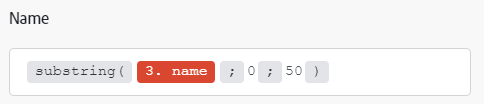
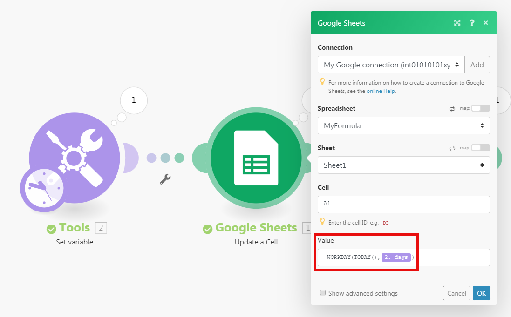
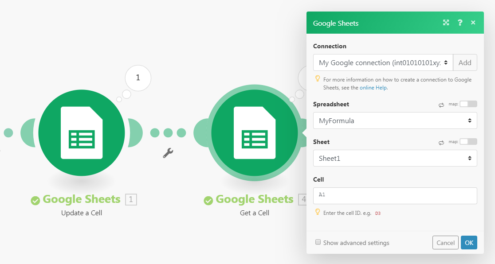

# 使用內建函式對應專案

Workfront Fusion包含內建函式，可讓您建立簡單或複雜的公式。 這些函式涵蓋各種使用案例，包括陣列、字串、數字及先前模組資料的函式。

此外，您可以建立自訂函式，情境可隨後使用這些函式來轉換和處理資料。

如需自訂函式的資訊與指示，請參閱[使用自訂函式對應資料](/help/workfront-fusion/create-scenarios/map-data/map-using-custom-functions.md)。

## 存取權要求

+++ 展開以檢視這篇文章中所述功能的存取權要求。

<table style="table-layout:auto">
 <col> 
 <col> 
 <tbody> 
  <tr> 
   <td role="rowheader">Adobe Workfront 封裝</td> 
   <td> 
任何 Adobe Workfront Workflow 封裝及任何 Adobe Workfront Automation and Integration 封裝

Workfront Ultimate

Workfront Prime 和 Select 封裝，以及額外購買的 Workfront Fusion。
 </td> 
  </tr> 
  <tr data-mc-conditions=""> 
   <td role="rowheader">Adobe Workfront 授權</td> 
   <td> 
標準

工作或更高層級
 </td> 
  </tr> 
  <tr> 
   <td role="rowheader">產品</td> 
   <td>
   
<ul><li>如果您的組織擁有 Select 或 Prime Workfront 封裝，但不包括 Workfront Automation and Integration，則您的組織必須購買 Adobe Workfront Fusion。</li><li>您必須擁有Adobe App Builder授權才能使用自訂函式。</ul>
   </td> 
  </tr>
 </tbody> 
</table>

若要詳細了解此表格中的資訊，請參閱](/help/workfront-fusion/references/licenses-and-roles/access-level-requirements-in-documentation.md)文件中的存取權要求[。

+++

## 使用內建函式對應資料

對應項目時，您可以使用函式來建立簡單或複雜的公式。可用的函式與 Excel 和一些程式語言中的函式類似：

* 這些函式會評估一般邏輯、數學、文本、日期和陣列。
* 您可以利用函式來執行條件邏輯和項目值轉換，例如將文字轉換為大寫、修剪文本、轉換不同的日期格式等。

### 將函式插入欄位

若要將函式插入欄位：

1. 按一下左側面板中的&#x200B;**[!UICONTROL 案例]**&#x200B;索引標籤。
1. 選取您要對應資料的情境。
1. 按一下情境上的任何位置，以輸入情境編輯器。
1. 按一下您要插入函式的欄位。
1. 在包含要插入的函式的對映面板中選取索引標籤。

   如需對應面板標籤的相關資訊，請參閱[函式概述](/help/workfront-fusion/get-started-with-fusion/understand-fusion/function-overview.md)
   1. 按一下函式名稱。

      或

      將函式拖曳至欄位。
1. 設定函式引數。

   如需函式引數的說明，請將游標停留在對應面板中的函式上。

   如需函式及其引數的詳細資訊，請參閱[函式參考下的文章：文章索引](/help/workfront-fusion/references/mapping-panel/functions/functions-toc.md)。

1. 繼續設定模組，或按一下[確定]。****

>[!TIP]
>
>當您建立要在其他欄位中重複使用的複雜公式時，可以按一下包含組合的欄位，使用Cmd-A或Ctrl-A來選取它，然後將其複製並貼到其他欄位中。

>[!BEGINSHADEBOX]

**範例：**&#x200B;有些資料型別會防止使用者輸入超過特定數目的字元。 您可以使用子字串函式將值限製為特定字元數。

在此範例中，子字串函式將專案名稱限製為50個字元。

>[!ENDSHADEBOX]

### 巢狀函式

您可以巢狀內嵌函式。

>[!BEGINSHADEBOX]

**範例：**

在此範例中，子字串函式將修剪的專案名稱限製為50個字元。

>[!ENDSHADEBOX]

若要巢狀內嵌函式：

1. 按一下您要建立公式的欄位。

   這會開啟對應面板。

1. 按一下您要新增的第一個函式。 這是外部的函式。 如果下列範例，則為`substring`函式。
1. 在該函式中，按一下要巢狀函式移至何處。 在此範例中，巢狀函式會取代第一個引數。
1. 在對映面板中，按一下巢狀函式。 在此範例中，這是`trim`函式。
1. 繼續視需要設定函式。
1. 繼續設定模組，或按一下[確定]。****

### 使用[!DNL Google Sheets]函式

如果Workfront Fusion不提供您想使用的功能，但由[!DNL Google Sheets]提供，您可以依照下列步驟使用：

1. 在[!DNL Google Sheets]中建立新的空白試算表。
1. 在Workfront Fusion中，開啟您的情境。
1. 將&#x200B;**[!DNL Google Sheets]** >**[!UICONTROL 更新儲存格]**&#x200B;模組至情境。

1. 設定模組：

   1. 在&#x200B;**[!UICONTROL 試算表]**&#x200B;欄位中選擇新建立的試算表。
   1. 將包含[!DNL Google Sheets]函式的公式插入&#x200B;**[!UICONTROL 值]**&#x200B;欄位。

      您可以照常使用先前模組的輸出。

      

1. 插入&#x200B;**[!UICONTROL Google工作表] >[!UICONTROL 取得儲存格]**&#x200B;模組以取得計算結果。
1. 使用您在步驟4中使用的相同儲存格ID來設定模組。

   
