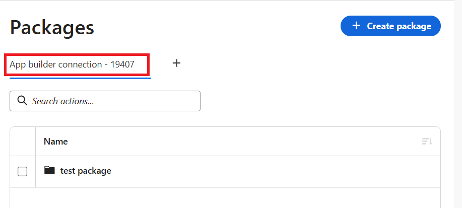

# 使用自訂函式套件

套件可讓您在Adobe Workfront Fusion中建置並執行自己的自訂邏輯，而不需離開Fusion介面。 當標準模組無法完全依照您的需求執行時，您可以使用函式來轉換資料、執行計算、呼叫外部服務，或包裝要重複使用的常式。 然後，您可以對其進行測試、使其上線，並在場景中使用它。

複雜的函式可能需要變數等資源以及程式庫等相依性。 對於這些函式，您可以建立包含函式及其資源的套件。

套件可以包括：

* **函式**：在案例執行期間執行的邏輯。
* **變數**：封裝中的函式所使用的可重複使用的值，例如基底URL或API金鑰。
* **相依性**：您的功能可能依賴的外部程式庫。
* **History**：每個函式的舊版（自動儲存），可供您參考。

## 存取權要求

+++ 展開以檢視這篇文章中所述功能的存取權要求。

<table style="table-layout:auto">
 <col> 
 <col> 
 <tbody> 
  <tr> 
   <td role="rowheader">Adobe Workfront 封裝</td> 
   <td> 
任何 Adobe Workfront Workflow 封裝及任何 Adobe Workfront Automation and Integration 封裝

Workfront Ultimate

Workfront Prime 和 Select 封裝，以及額外購買的 Workfront Fusion。
 </td> 
  </tr> 
  <tr data-mc-conditions=""> 
   <td role="rowheader">Adobe Workfront 授權</td> 
   <td> 
標準

工作或更高層級
 </td> 
  </tr> 
  <tr> 
   <td role="rowheader">產品</td> 
   <td>
   
<ul><li>如果您的組織擁有 Select 或 Prime Workfront 封裝，但不包括 Workfront Automation and Integration，則您的組織必須購買 Adobe Workfront Fusion。</li><li>您必須擁有Adobe App Builder授權才能使用自訂函式。</ul>
   </td> 
  </tr>
 </tbody> 
</table>

若要詳細了解此表格中的資訊，請參閱](/help/workfront-fusion/references/licenses-and-roles/access-level-requirements-in-documentation.md)文件中的存取權要求[。

+++

## 設定執行階段環境連線

>[!NOTE]
>
>此為一次性設定。

您的團隊第一次使用此功能時，您必須設定執行功能的環境。 每個團隊只能執行一次此操作。

1. 按一下左側導覽面板中的&#x200B;**封裝** 索引標籤。

   如果環境尚未設定，則會顯示&#x200B;**未設定執行階段環境**&#x200B;畫面。

1. 按一下&#x200B;**初始化執行階段**。

1. 若要輸入預設名稱以外的名稱，請在&#x200B;**連線名稱**&#x200B;欄位中輸入名稱。

1. 選取此封裝將屬於的Adobe App Builder專案：

   * 若要選取現有專案，請開始輸入專案名稱，然後在其出現時選取它。
   * 若要建立新專案，請輸入不存在的名稱，然後按一下[新建] ****。
   * 如果您將此保留為空白，Fusion會使用預設專案。

1. 選取「**繼續**」。

   Fusion完成設定，您就可以建立套件了。

   您的環境會在頁面頂端顯示為連線標籤。

   

1. （視條件而定）若要新增其他環境，請按一下加號圖示，然後依照本節中的指示進行。

1. （視條件而定）若要移除現有環境，請將滑鼠游標移至環境連線標籤上，並在出現&#x200B;**X**&#x200B;時按一下。

   >[!WARNING]
   >
   >移除連線會中斷Fusion與該環境的連線。 透過該連線，Fusion中不再提供其中的套件。

## 建立並開啟套件

1. 按一下左側導覽面板中的&#x200B;**封裝** 索引標籤。

1. 選取您想要使用的連線標籤。

1. 按一下&#x200B;**建立封裝**。

1. 輸入名稱並選取&#x200B;**建立**。

   套件會自動開啟。

1. 若要稍後重新開啟封裝，請從[封裝]清單中選取它，然後選取[檢視]。****
1. 若要刪除封裝，請從[封裝]清單中選取它，然後選擇[刪除]。****

   >[!WARNING]
   >
   >刪除套件將會永久移除該套件及其中的所有內容。

## 管理套件

一個開啟的套件分成四個區域：

* **函式**：建立、測試及發佈函式。
* **變數**：設定函式的變數。
* **相依性**：安裝此函式的相依性，例如外部程式庫。
* **History**：檢視每個函式的舊版。

除了這四個區域以外，頂端的儲存計量器會顯示您的空間使用量。 每個封裝的總大小限製為&#x200B;**21 MB**。 這包括函式、變數和相依性，包括儲存的版本。

如果空間不足，建議移除未使用的相依性、變數或較舊版本，以釋出一些空間。

若要返回封裝清單，請選取封裝名稱旁的「上一步」箭頭。

<!--Create toc here-->

### 函式

**函式**&#x200B;區域會顯示封裝中的函式清單，包括函式名稱、狀態、大小以及預期的輸入數目。

若要篩選函式清單：

1. 按一下&#x200B;**全部**、**草稿**&#x200B;或&#x200B;**已發佈**，依狀態篩選。
1. 使用搜尋列來搜尋特定功能。

#### 功能狀態

函式可以具有草稿或已發佈狀態。

* **草稿**：處於草稿狀態的函式正在進行中。 您可以自由編輯和測試，而不會影響即時資料。
* **已發佈**：已發佈的版本已上線。 您的案例會執行已發佈的函式版本。

使用草稿可讓您安全地進行變更。 您可以精簡草稿、測試草稿，然後在滿意時發佈。

| 狀態 | 其含義 |
|---|---|
| **已發佈** | 已有即時版本存在。 |
| **草稿** | 函式仍在進行中，或即時函式有您尚未發佈的變更。 |

#### 在封裝區域中建立或編輯函式

1. 按一下左側導覽面板中的&#x200B;**封裝** 索引標籤。
1. 在&#x200B;**函式**&#x200B;區域中，選取&#x200B;**建立函式**。

   或

   按一下現有函式旁的核取方塊，然後在頁面底部的動作列中選取&#x200B;**編輯**。

1. （條件式）如果您要建立新函式，請在&#x200B;**新函式**&#x200B;欄位中輸入函式名稱。

1. （選擇性和條件式）若要重新命名現有函式，請按一下函式名稱旁的「編輯」圖示，然後輸入新名稱。

1. 在&#x200B;**代碼**&#x200B;標籤上，輸入函式邏輯。

   建立函式時，請考量下列事項：

   * 函式必須在JavaScript中撰寫。
   * 您可以讀取您定義的輸入、重複使用變數，以及呼叫其他函式。
   * 當您輸入時，建議隨即顯示。

1. 若要清除功能格式，請按一下[美化] ****。

1. （選擇性）在&#x200B;**引數**&#x200B;索引標籤上，定義函式預期的輸入。

   如需輸入資訊，請參閱本文中的[定義輸入](#define-inputs)。

1. 在&#x200B;**測試**&#x200B;標籤上，測試您的函式。

   如需指示，請參閱本文中的[測試函式](#test-a-function)。

1. 若要將此函式儲存為草稿，請按一下&#x200B;**儲存為草稿**。

   或

   若要發佈函式，請按一下[發佈]。****

   >[!NOTE]
   >
   >發佈函式會清除其版本記錄。 已發佈的版本會成為目前的起點，且不再保留較舊的草稿版本。

##### 定義輸入

您可以使用&#x200B;**引數**&#x200B;標籤來說明函式每次執行時所需的資訊。

1. 按一下左側導覽面板中的&#x200B;**封裝** 索引標籤。
1. 在&#x200B;**函式**&#x200B;區域中，選取&#x200B;**建立函式**。

   或

   按一下現有函式旁的核取方塊，然後在頁面底部的動作列中選取&#x200B;**編輯**。

1. 按一下&#x200B;**引數**&#x200B;標籤。

1. 針對您要新增的每個引數，按一下&#x200B;**新增引數**&#x200B;並設定下列專案：

* **名稱**：輸入的名稱
* **標籤**：測試函式時顯示的好記名稱
* **型別**：資料型別，例如文字、數字、true/false或結構化物件。
* **必要**：是否必須提供值。

這些輸入會成為您在測試時填寫的欄位，而且您的案例會在執行函式時傳入值。

##### 測試函式

我們建議在發佈函式之前先測試函式。

1. 按一下左側導覽面板中的&#x200B;**封裝** 索引標籤。
1. 在&#x200B;**函式**&#x200B;區域中，選取&#x200B;**建立函式**。

   或

   按一下現有函式旁的核取方塊，然後在頁面底部的動作列中選取&#x200B;**編輯**。

1. 按一下「**測試**」標籤。

1. 輸入每個輸入的值。

1. 執行函式：

   * 選取&#x200B;**測試草稿**&#x200B;以嘗試您的工作進行中版本。
   * 選取&#x200B;**執行已發佈**&#x200B;以執行即時版本。

1. 檢閱結果，包括是否成功、花費多久以及傳回的輸出。

>[!NOTE]
>
>**Execute Published**&#x200B;僅在函式發佈後才能使用。

#### 變更即時函式

發佈函式後，**發佈**&#x200B;按鈕會變成功能表：

* **重新發佈** — 將您的最新草稿變更推送至即時版本。
* **取消發佈** — 將函式從服務中取出。 您的工作將保留為草稿，以便您能夠返回該工作。

#### 刪除函式

1. 按一下左側導覽面板中的&#x200B;**封裝** 索引標籤。
1. 按一下現有函式旁的核取方塊，然後在頁面底部的動作列中選取&#x200B;**刪除**。

>[!WARNING]
>
>刪除函式會完全移除該函式及其歷史記錄。 任何使用它的案例或函式都將停止運作。

## 變數

變數是您的函式可重複使用的值，例如基本URL、帳戶ID或API金鑰。 將這些變數儲存為變數表示您只需設定值一次，並在一個位置進行更新，而非跨多個函式進行更新。

### 建立或編輯變數

1. 按一下左側導覽面板中的&#x200B;**封裝** 索引標籤。
1. 在&#x200B;**變數**&#x200B;標籤上，選取&#x200B;**新增變數**。

   或

   按一下您要編輯的變數旁的&#x200B;**編輯**&#x200B;圖示。

1. 填寫詳細資訊：

   * **索引鍵**：輸入函式用來參考值的名稱。

   若要重新命名此變數，請變更索引鍵值。
   * **值**：輸入要儲存的值。
   * **型別**：選取值型別是文字、數字、布林值(true/false)或結構化物件。
   * **描述**：輸入選用的附註，以提醒您它的用途。
   * **公用**：如果您要在情境設計工具中使用變數，請開啟此選項。 若關閉，變數只能在套件的函式內使用。
   * **密碼**：開啟此選項以隱藏敏感值，例如金鑰。 值會隱藏在變數清單中，也會經過淨化處理，因此不會顯示在案例設計工具中。 函式執行時仍會收到實際值。

1. 選取&#x200B;**建立變數**&#x200B;或&#x200B;**儲存變更**。

### 刪除變數

1. 按一下左側導覽面板中的&#x200B;**封裝** 索引標籤。
1. 在&#x200B;**變數**&#x200B;標籤上，按一下您要刪除的變數旁的&#x200B;**刪除**&#x200B;圖示。

>[!WARNING]
>
>使用已刪除變數的函式將停止運作。

## 相依性

有些函式需要額外的程式庫才能完成工作。 **相依性**&#x200B;索引標籤是您新增和管理這些程式庫的位置。

### 新增程式庫

1. 按一下左側導覽面板中的&#x200B;**封裝** 索引標籤。
1. 在&#x200B;**相依性**&#x200B;索引標籤上，輸入一或多個以逗號分隔的資料庫名稱。 您可以在名稱（例如`axios, lodash@4.17.21`）之後新增特定版本，以請求特定版本。

1. 按一下&#x200B;**安裝**。

### 移除程式庫

1. 按一下左側導覽面板中的&#x200B;**封裝** 索引標籤。
1. 在&#x200B;**相依性**&#x200B;標籤上，按一下您要移除的程式庫旁的&#x200B;**刪除**&#x200B;圖示。

>[!WARNING]
>
>依賴已移除程式庫的功能可能會停止運作。

## 歷史記錄

每次儲存函式草稿時，Fusion都會保留副本。 **History**&#x200B;索引標籤可讓您檢視及還原舊版。

1. 按一下左側導覽面板中的&#x200B;**封裝** 索引標籤。
1. 在&#x200B;**歷程記錄**&#x200B;索引標籤上，選取左側的函式以檢視其儲存的版本，最新版本放在最前面。
1. 選取版本以檢視該版本當時所包含的確切內容。
1. 若要還原版本，請按一下&#x200B;**還原為草稿**。

   版本會還原為新草稿，因此您可以在發佈前進行檢閱和測試。 您的即時版本會維持原狀，直到您發佈為止。
1. 若要刪除版本，請選取版本，按一下[刪除]版本&#x200B;**並確認。**

>[!NOTE]
>
>* 發佈函式會清除其歷史記錄。 在您發佈之前，History會追蹤您處理草稿時所做的變更。
>* 無法刪除版本。

## 在情境中使用套件

建立函式和變數的目的是讓它們在您的情境中運作。 若要使用函式和變數，請使用&#x200B;**Adobe App Builder**&#x200B;聯結器。

* **使用封裝**&#x200B;中的函式：此模組會執行其中一個函式，做為案例中的步驟。 選擇套件和函式，填入您定義的輸入，函式的結果就會傳遞給後續的模組。
* **使用來自封裝的變數**：此模組會將您的其中一個封裝變數帶入情境，以便您可以將其值對應到其他模組。

如需資訊與指示，請參閱[Adobe App Builder模組](/help/workfront-fusion/references/apps-and-modules/adobe-connectors/adobe-app-builder.md)。

<!--

To add one:

1. In the scenario designer, add a module and choose the **Adobe App Builder** connector.

1. Select **Use function from package** or **Use variable from package**.

1. Choose the package and the function or variable you want, then map the inputs or value as needed.

>[!NOTE]
>
>Publish a function before using it in a scenario, and turn on **Public** for any variable you want to use there.

-->

