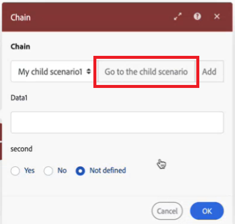

# 將多個案例鏈結在一起

您可以將案例鏈結在一起，讓一個案例觸發另一個案例，然後將第二個案例輸出的資料傳回給第一個案例。 這可讓您建立更多模組化的案例，而不需在多個案例中重複案例區段。

您可以從父情境呼叫多個子情境，也可以從多個父情境呼叫子情境。 您也可以巢狀內嵌子案例，從另一個案例呼叫一個。

當父案例等待子案例傳回資料時，該時間不會計入父案例的逾時。 例如，父案例會呼叫5個子案例，每個案例需要10分鐘執行，總共為50分鐘。 父情境中的模組本身需要15分鐘才能執行。 即使總共已超過65分鐘（超過40分鐘的逾時限制），父情境也不會逾時。

如需Fusion效能護欄（包括逾時）的詳細資訊，請參閱[Fusion效能護欄](/help/workfront-fusion/references/scenarios/fusion-performance-guardrails.md)。

如需設定鏈結模組的說明，請參閱[鏈結模組](/help/workfront-fusion/references/apps-and-modules/tools-and-transformers/chain-modules.md)。

## 父方案和子方案

* **父項**&#x200B;情境呼叫另一個情境，使用&#x200B;**鏈結** > **呼叫子情境**&#x200B;模組。 它會接收子案例的輸出，並可在後續案例模組中處理。
* **子項**&#x200B;情境是由父項情境呼叫。 其觸發模組會接收來自父項案例的資料，並將輸出傳回至父項案例。

父案例需要來自子案例的回應。 目前不支援未傳回資料的子案例。

## 鏈結案例中的資料結構

Workfront Fusion會使用資料結構，將資訊從父案例傳輸到子案例。 資料結構會在子情境中設定。 從父情境選取子情境時，用作子情境輸入的資料結構欄位會出現在父情境中。 您可以將值對應到這些欄位，這些欄位會在子案例觸發時傳遞至子案例。

如需有關要在父子情境中設定的模組的資訊，請參閱[鏈結模組](/help/workfront-fusion/references/apps-and-modules/tools-and-transformers/chain-modules.md)。

如需資料結構的詳細資訊，請參閱[資料結構](/help/workfront-fusion/references/mapping-panel/data-types/data-structures.md)。

## 資料流程

1. 資料會流經父案例。
1. 資料到達「呼叫子情境」模組。 資料會對應至呼叫子案例模組中的欄位，這些欄位符合子案例觸發模組中所使用資料結構的欄位。
1. 「呼叫子項」情境中的資料會傳遞至子項情境。
1. 子案例會處理資料並執行動作。
1. 子案例以傳回至父模組的回應結束。
1. 傳回至父模組的回應輸出會傳遞至父情境。
1. 「呼叫子項」情境的輸出是子項的輸出。 此輸出稍後可在父情境中處理。

## 使用案例

考慮以下鏈結案例的範例使用案例：

* **可重複使用的邏輯**：您可以為跨多個案例使用的重複動作鏈結案例。 例如，如果您有多個封存內容的案例，您可以建立名為「封存內容」的單一子案例，然後作為任何封存內容的工作流程的子案例。

* **錯誤處理**：組織通常會有跨多個案例的相同錯誤處理動作，例如傳送錯誤記錄至資料存放區並建立Slack通知的錯誤處理路由。 您可以使用這些動作建立子情境，並在處理多個情境中的路由時將該情境鏈結。

* **延長時間**：您可以針對執行時間較長的大型批次作業使用鏈結機制，例如匯出和匯入檔案時。 如果檔案很多，這項作業會花一些時間。 由於子案例不會計入父案例的逾時，因此您可以使用多個子案例匯出或匯入檔案來超過執行時間。

* **取代疊代器**&#x200B;將疊代器取代為子案例可以減少記憶體使用量，例如在造成記憶體不足錯誤的疊代中執行複雜作業。 您可以為複雜操作建立個別情境，並將疊代器取代為「呼叫子情境模組」

* **搜尋並建立記錄**：例如，您可以建立搜尋使用者的情境。 如果存在，則架構會將他們新增為核准者，並擁有他們所需的檢閱和核准存取權。 如果變數不存在，情境會建立要求管理員加入新使用者。

## 檢視鏈結案例的執行歷史記錄

您可以檢視鏈結案例的執行歷史記錄，方法是檢視鏈結中包含的每個案例的歷史記錄。 例如，父案例的執行歷史記錄將包含直接在父案例中處理的模組和資料的相關資訊。 若要檢視子案例中處理之模組和資料的執行歷史記錄，請開啟子案例並在那裡檢視執行歷史記錄。

我們建議使用「呼叫子案例」模組中的&#x200B;**移至子案例**&#x200B;按鈕，快速移至子案例，您可在此檢視其執行歷史記錄。 子案例會在另一個瀏覽器視窗中開啟，讓您同時檢視父案例和子案例。

## 錯誤和不完整的執行

### 錯誤處理

如果子案例發生錯誤，這可能會影響將資料傳回給父項。

我們建議在子案例中設定錯誤處理，以確保子案例中發生錯誤時，父案例不會卡在等待子案例的回應。

## 最佳實務

鏈結情境時，請考量下列最佳實務。

### 鏈結情境時避免遞回

遞回發生在案例觸發自身的新執行、觸發新的執行，以及在無限回圈中發生等等。

遞回可能會對擁有遞回案例的組織和其他組織造成效能問題。

鏈結情境時，請遵循下列實務以避免遞回：

* 請確定&#x200B;**子案例無法觸發父案例**。 例如，如果在建立請求時觸發了父案例，請確保子案例不會建立請求。
* 請確定&#x200B;**子案例不會相互呼叫**。 例如，如果子案例A呼叫子案例B，請確定子案例B不會呼叫子案例A。
* 請確定&#x200B;**案例不能呼叫自身**。 例如，建立任務時會觸發情境，而該情境會建立兩個任務。 新建立的任務都會再次觸發情境，這會建立四個新任務。 每次建立任務時，就會觸發情境，而每次情境執行時，任務數量就會增加一倍。 任務數量呈指數增長。

>[!IMPORTANT]
>
>* **當案例導致遞回時，Fusion工程團隊會停用它以防止進一步的效能問題。**
>* 由於遞回是案例設計的結果，因此您必須以確保案例不包含觸發案例的動作的方式來設計案例。

### 使用錯誤處理來確保回應

由於父案例在等待子案例的回應之後才能繼續，因此您必須確保子案例已建置，以便在遇到錯誤時也能提供回應。
