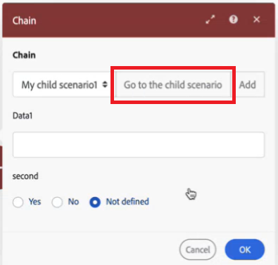

# 將多個情境鏈結在一起

>[!NOTE]
>
>This feature is currently in Beta.

You can chain scenarios together, allowing one scenario to trigger another, and returning the data output by the second scenario to the first. This allows more modular scenario creation, where you do not have to duplicate scenario sections in multiple scenarios.

您可以從父情境呼叫多個子情境，也可以從多個父情境呼叫子情境。 您也可以巢狀內嵌子案例，從另一個案例呼叫一個。

When a parent scenario is waiting for a child scenario to return data, that time does not count against the parent scenario&#39;s timeout. For example, a parent scenario calls 5 child scenarios, each of which takes 10 minutes to run, for a total of 50 minutes. The modules in the parent scenario itself take 15 minutes to run. The parent scenario does not time out, even though a total of 65 minutes has passed, which is over the timeout limit of 40 minutes.

For more information on Fusion&#39;s performance guardrails, including timeouts, see [Fusion performance guardrails](/help/workfront-fusion/references/scenarios/fusion-performance-guardrails.md).

如需設定鏈結模組的說明，請參閱[鏈結模組](/help/workfront-fusion/references/apps-and-modules/tools-and-transformers/chain-modules.md)。

## Parent and child scenarios

* The **parent** scenario calls another scenario, using the **Chain** > **Call a child scenario** module. It receives the output of the child scenario, which it can process in later scenario modules.
* The **child** scenario is called by the parent scenario. Its trigger module receives data from the parent scenario, and returns output to the parent scenario.

The parent scenario requires a response from the child scenario. Child scenarios that do not return data are currently not supported.

## Data structures in chained scenarios

Workfront Fusion uses data structures to transfer information from the parent scenario to the child scenario. The data structure is configured in the child scenario. When the child scenario is selected from the parent scenario, the fields for the data structure used as the child scenario&#39;s input appear in the parent scenario. You can map values to these fields, which are passed to the child scenario when it is triggered.

For information on the modules to configure in the parent and child scenarios, see [Chain modules](/help/workfront-fusion/references/apps-and-modules/tools-and-transformers/chain-modules.md).

For information on data structures, see [Data structures](/help/workfront-fusion/references/mapping-panel/data-types/data-structures.md).

## Data flow

1. Data flows through the parent scenario.
1. Data reaches the Call a child scenario module. Data is mapped to the fields in the Call a child scenario module, which match the fields in the data structure used in the child scenario&#39;s trigger module.
1. Data from the Call a child scenario is passed to the child scenario.
1. The child scenario processes data and performs actions.
1. The child scenario ends with the Return response to parent module.
1. The output of the Return response to parent module is passed to the parent scenario.
1. The output of the Call a child scenario is the output of the child scenario. This output can be processed later in the parent scenario.

## 使用案例

Consider the following example use cases for chaining scenarios:

* **Reusable logic**:  You can chain scenario for repeated actions used across multiple scenarios. For example, if you have multiple scenarios that archive content, you can create a single child scenario called &quot;Archive content&quot; that you can then use as a child scenario for any workflows that archive content.

* **Error handling**: It&#39;s common for organizations to have the same error handling actions across multiple scenarios, such as an error handling route that sends an error log to a data store and creates a slack notification. You can create a child scenario with these actions and chain that scenario in error handling routes in multiple scenarios.

* **Extending time**: You can use chaining for large batch operations with long running actions, such as when you export and import files. This operation takes some time if there are many files. Because child scenarios do not count against the parent scenario&#39;s timeout, you can exceed execution time by using multiple child scenarios to export or import the files.

* **Replacing iterators** Replacing iterators with child scenarios can reduce memory usage, such as in complex operations in an iteration that cause Out of Memory error. You can create a separate scenario for the complex operation and replace the iterator with Call a child scenario module

* **Search for and create a record**:  For example, you could create a scenario that searches for a user. If they exist, the scehario adds them as approver with access they need to review and approve. If they don&#39;t exist, the scenario creates a request for the admin to onboard a new user.

## Viewing execution history for chained scenarios

You can view execution history for chained scenarios by viewing the history of each scenario included in the chain. For example, the parent scenario&#39;s execution history would include information about modules and data processed directly in the parent scenario. To view execution history for modules and data processed in a child scenario, open the child scenario and view the execution history there.

We recommend using the **Go to the child scenario** button in the Call a child scenario module to quickly go to the child scenario, where you can view its execution history. The child scenario opens in another browser window, allowing you to see parent and child scenarios at the same time.

## Errors and incomplete executions

### 錯誤處理

If the child scenario errors out, that may affect getting data back to your parent.

We recommend configuring error handling in the child scenario to ensure that if something goes wrong in the child scenario, the parent scenario is not stuck waiting for the response from the child scenario.

## 最佳實務

Consider the following best practices when chaining a scenario.

### Avoid recursion when chaining scenarios

當一個情境觸發自身的新執行，而該新執行會觸發新執行，如此反復形成無限迴圈的狀況，便是遞迴。

遞迴可能會對擁有遞迴情境的組織和其他組織造成效能問題。

When chaining scenarios, follow these practices to avoid recursion:

* Ensure that **child scenarios cannot trigger the parent scenario**. For example, if a parent scenario is triggered when a request is created, ensure that the child scenarios do not create requests.
* Ensure that **child scenarios do not call each other**. For example, If child scenario A calls child scenario B, ensure that child scenario B does not call child scenario A.
* Ensure that **a scenario cannot call itself**. 例如，建立任務時會觸發一個情境，而該情境建立兩個任務。 新建立的兩個任務皆再次觸發該情境，而該情境會建立四個新任務。 每次建立一個任務，就會觸發該情境，而每次執行該情境時，任務數量就會加倍。 任務數量因此呈指數級增長。

>[!IMPORTANT]
>
>* **當某個情境導致遞迴時，Fusion 工程團隊會停用該情境，以避免出現更多效能問題。**
>* 由於遞迴是情境設計所導致的結果，因此設計情境時必須確保情境不包含會觸發情境本身的動作。
>* You can view a diagram of the relationships between parent and child scenarios.
>   For instructions, see [View chained scenario relationships](/help/workfront-fusion/manage-scenarios/view-chained-scenario-relationships.md).

### Use error handling to ensure a response

Because the parent scenario is waiting for a response from the child scenario before it can continue, you must ensure that the child scenario is built so that it will provide a response even if it encounters an error.
