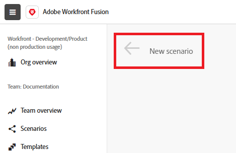

# 建立情境的工作流程

情境的建置符合您組織的需求，包含可處理使用案例的應用程式和模組。 但是，無論使用案例如何，建立案例時都會遵循相同的基本工作流程。 本文會說明建立情境的基本程式。

* [建立情境並為其命名](#create-and-name-the-scenario)
* [新增並設定第一個模組](#configure-the-first-module)
* [建立連線](#create-connections)
* [新增和設定其他模組](#add-and-configure-additional-modules)
* [在模組之間對應資料](#map-data-between-modules)
* [設定路由](#configure-routing)
* [設定錯誤處理](#configure-error-handling)
* [設定案例設定](#onfigure-scenario-settings)
* [測試和修訂](#test-and-revise)
* [啟動情境](#activate-the-scenario)

鍵盤快速鍵

## 建立情境並為其命名

1. 登入您的[!DNL Workfront Fusion]帳戶。
1. 按一下左側面板中的&#x200B;**[!UICONTROL Scenarios]** 。

   >[!NOTE]
   >
   >如果您沒有看到左側導覽面板或其圖示，請按一下功能表圖示。

1. （選擇性）在&#x200B;[!UICONTROL **資料夾**]&#x200B;面板中，按一下&#x200B;**[!UICONTROL Add folder]**&#x200B;圖示，然後為您的第一個資料夾輸入類似於「實務案例」的名稱。

1. （選擇性）開啟資料夾，然後按一下頁面右上角的&#x200B;**[!UICONTROL Create a new scenario]**。

1. 選取左上角的&#x200B;**[!UICONTROL New scenario]**&#x200B;預留位置名稱，然後輸入名稱，例如「Practice scenario 1」。

   

1. 繼續[連線下列第一個模組](#2-connect-the-first-module)。

## 新增並設定第一個模組

情境的第一個模組是觸發模組，會在符合特定條件時啟動情境。

如需將第一個模組新增至案例的指示，請參閱將模組新增至案例一文中的[將第一個模組新增至案例](/help/workfront-fusion/create-scenarios/add-modules/add-a-module-basic.md#add-the-first-module-to-a-scenario)。

如需設定模組的說明，請參閱[設定模組](/help/workfront-fusion/create-scenarios/add-modules/configure-a-modules-settings.md)

## 建立連線

設定模組時，您必須輸入或建立連線。 模組會使用此連線及其包含的許可權，來存取應用程式中的日期。

如需有關如何建立連線的基本指示，請參閱[建立連線 — 基本指示](/help/workfront-fusion/create-scenarios/connect-to-apps/connect-to-fusion-general.md)。

如需涉及Google、Microsoft或沒有專用聯結器的應用程式的特定使用案例，請參閱[連線到應用程式：文章索引](/help/workfront-fusion/create-scenarios/connect-to-apps/connect-to-apps-toc.md)下的其他文章。

## 新增和設定其他模組

繼續新增及設定其他模組。

如需新增模組方式的說明，請參閱[新增模組：文章索引](/help/workfront-fusion/create-scenarios/add-modules/add-modules-toc.md)下列出的文章。

## 在模組之間對應資料

您可以使用先前模組的輸出作為後續模組的輸入。 例如，您可以在一個模組中建立Workfront專案，並在後續模組中上傳檔案至該模組。

如需指示，請參閱[對應資料：文章索引](/help/workfront-fusion/create-scenarios/map-data/map-data-toc.md)下的文章。

## 設定路由

路由可讓案例根據資料值執行不同的動作。

如需指示，請參閱[新增路由器模組並設定路由](/help/workfront-fusion/create-scenarios/add-modules/router-module.md)。

## 設定錯誤處理

錯誤處理可讓案例從錯誤中復原。 您可以選取希望情境在不同的錯誤情境中如何反應。

如需指示，請參閱[新增錯誤處理](/help/workfront-fusion/create-scenarios/config-error-handling/error-handling.md)。

## 設定案例設定

您可以針對整個情境進行設定，例如排程情境、製作附註或決定資料的儲存方式。

如需指示，請參閱[設定案例設定：文章索引](/help/workfront-fusion/create-scenarios/config-scenarios-settings/config-scenario-settings-toc.md)下的文章。

## 測試和修訂

測試情境可讓您判斷情境是否如預期般運作。 然後，您可以根據結果修訂情境，然後重新測試。

1. 按一下案例編輯器左下角的&#x200B;**[!UICONTROL Run once]**。
1. 在案例執行完畢後，按一下每個模組上方的執行檢測器泡泡，以檢視資訊的輸入和該模組的輸出。

   * 如需讀取案例執行資訊的一般資訊，請參閱[案例執行流程](/help/workfront-fusion/references/scenarios/scenario-execution-flow.md)。
   * 如需已處理組合的相關資訊，請參閱[案例執行、週期以及 [!DNL Adobe Workfront Fusion]](/help/workfront-fusion/references/scenarios/scenario-execution-cycles-phases.md)中的階段。

1. 在[!DNL Workfront Fusion]中，按一下左下角附近的&#x200B;**[!UICONTROL Save]** ，以儲存您的情境進度。

   >[!IMPORTANT]
   >
   >隨時儲存並測試情境。

## 啟動情境

此範例案例沒有觸發程式模組。 如果這是您用於真實資料的情境，它會從觸發模組開始，而您的最後一件事是啟動它。 啟用案例後，預設會每15分鐘執行一次。 您可以定義何時以及多久執行一次來變更此專案。

如需啟動案例的詳細資訊，請參閱[啟動或停用案例](/help/workfront-fusion/manage-scenarios/activate-deactivate-scenarios.md)。

如需排程的相關資訊，請參閱[排程情境](/help/workfront-fusion/create-scenarios/config-scenarios-settings/schedule-a-scenario.md)。

## Workfront Fusion案例鍵盤快速鍵

建立或編輯案例時，您可以使用下列鍵盤快速鍵：

<table style="table-layout:auto"> 
 <col data-mc-conditions=""> 
 <col data-mc-conditions=""> 
 <col data-mc-conditions=""> 
 <thead> 
  <tr> 
   <th> 
動作
 </th> 
   <th>[!DNL Windows]</th> 
   <th> 
[!DNL MacOS]
 </th> 
  </tr> 
 </thead> 
 <tbody> 
  <tr> 
   <td role="rowheader">[!UICONTROL Save] </td> 
   <td>Ctrl+Shift+S</td> 
   <td>Cmd+Shift+S </td> 
  </tr> 
  <tr> 
   <td role="rowheader">[!UICONTROL Run Once]</td> 
   <td>Ctrl+Shift+Enter</td> 
   <td>Cmd+Shift+Enter </td> 
  </tr> 
 </tbody> 
</table>

