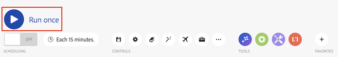
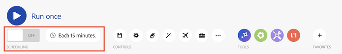
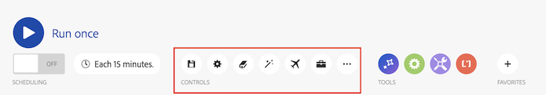
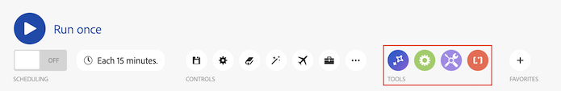
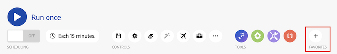

# 案例編輯器

情境編輯器可讓您在視覺介面中建立和編輯情境。

## 存取需求

+++ 展開以檢視本文中功能的存取需求。

您必須具有下列存取權才能使用本文中的功能：

<table style="table-layout:auto">
 <col> 
 <col> 
 <tbody> 
  <tr> 
   <td role="rowheader">Adobe Workfront套件</td> 
   <td> 
任何
 </td> 
  </tr> 
  <tr data-mc-conditions=""> 
   <td role="rowheader">Adobe Workfront授權</td> 
   <td> 
新增：標準

或

目前： [!UICONTROL Work]或更高版本
 </td> 
  </tr> 
  <tr> 
   <td role="rowheader">Adobe Workfront Fusion授權**</td> 
   <td>
   
目前：無Workfront Fusion授權需求。

   
或

   
舊版：任何 

   </td> 
  </tr> 
  <tr> 
   <td role="rowheader">產品</td> 
   <td>
   
新增:
 <ul><li>[!UICONTROL Select]或[!UICONTROL Prime] Workfront計畫：您的組織必須購買Adobe Workfront Fusion。</li><li>[!UICONTROL Ultimate] Workfront計畫：包含Workfront Fusion。</li></ul>
   
或

   
目前：您的組織必須購買Adobe Workfront Fusion。

   </td> 
  </tr>
  <tr data-mc-conditions=""> 
   <td role="rowheader">存取層級設定*</td> 
   <td> 
     
您必須是組織的Workfront Fusion管理員。

     
您必須是團隊的Workfront Fusion管理員。

   </td> 
  </tr> 
   </td> 
  </tr> 
 </tbody> 
</table>

如需此表格中資訊的詳細資訊，請參閱檔案[中的](/help/workfront-fusion/references/licenses-and-roles/access-level-requirements-in-documentation.md)存取需求。

如需Adobe Workfront Fusion授權的相關資訊，請參閱[Adobe Workfront Fusion授權](/help/workfront-fusion/set-up-and-manage-workfront-fusion/licensing-operations-overview/license-automation-vs-integration.md)。

+++

## 開啟案例編輯器並新增模組：

1. 按一下左側面板中的&#x200B;**[!UICONTROL 案例]** 。
1. 按一下問號圖示，然後尋找並按一下您要開始使用的應用程式或服務。 如需設定模組的詳細資訊，請參閱[設定模組](/help/workfront-fusion/create-scenarios/add-modules/configure-a-modules-settings.md)。

## 可用的案例編輯器動作

### 執行您的情境

| 動作 | 詳細資料 |
|----------|----------|
| 測試執行情境 | 在啟用情景之前，請驗證情景是否以您預期的方式執行。 一旦啟用，情境將會根據其排程執行。 如果一切未如預期般執行，請參閱[新增錯誤處理](/help/workfront-fusion/create-scenarios/config-error-handling/error-handling.md)以瞭解如何處理錯誤。 |

### 排程

| 動作 | 詳細資料 |
|----------|----------|
| 排程情境 | 依預設，一個案例每15分鐘執行一次。 您可以定義已啟動案例執行的時間和頻率，以變更此專案。 融合情境可以排程為每5分鐘執行一次。 如需詳細資訊，請參閱[排程情境](/help/workfront-fusion/create-scenarios/config-scenarios-settings/schedule-a-scenario.md)。 |

### 控制項

| 動作 | 詳細資料 |
|----------|----------|
| 儲存 | 儲存您的情境後，三點選單底下將顯示新版本，以備您日後需要存取時使用。 先前儲存的案例版本僅可使用60天。 |
| 案例設定 | 情境設定面板包含情境的進階設定。 如需有關可用設定的詳細資訊，請參閱[設定案例設定](/help/workfront-fusion/create-scenarios/config-scenarios-settings/configure-scenario-settings.md)。 |
| 附註 | 記錄情境。 其他使用者在情境中時可以檢視這些附註。 |
| 自動對齊 | 自動對齊案例中的模組。 |
| 說明流程 | 檢視移動點顯示資料如何流經情境的動畫。 |
| 開發工具 | 使用Devtool，您可以檢查案例的所有手動執行、檢閱所有已執行的操作，並檢視每個已執行API呼叫的詳細資訊。 您可以檢視導致錯誤的模組、操作或單一回應，並運用該知識來調整您的案例。 如需詳細資訊，請參閱[偵錯案例](/help/workfront-fusion/manage-scenarios/debug-a-scenario.md)。 |
| 更多 | 在更多選單中，您可以匯入或匯出Blueprint，並將案例還原回先前的版本。 |

### 工具

| 動作 | 詳細資料 |
|----------|----------|
| 流量控制 | 設定設定以控制資料流經的方式。 如需詳細資訊，[檢視需要的連結]。 |
| 工具 | 工具區段包含數個可增強案例的實用模組。 如需詳細資訊，[檢視需要的連結]。 |
| 文字剖析器 | 使用文字剖析器工具來剖析文字，以用於其他案例模組。 文字剖析器不需要連線。 如需詳細資訊，[檢視需要的連結]。 |

### 我的最愛

您可以使用我的最愛圖示來新增您經常使用的模組。

