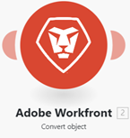
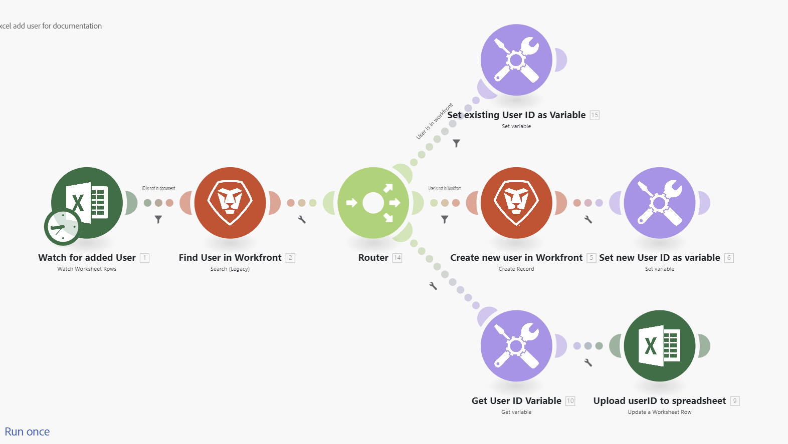

# Adobe Workfront Fusion 字彙表

以下字彙表說明 Adobe Workfront Fusion 中的一些常用詞語。

<table style="table-layout:auto">
 <col> 
 <col> 
 <tbody> 
  <tr> 
   <td role="rowheader"> 
動作
 </td> 
   <td>讓您可以執行動作的模組，例如讀取所選應用程式或服務的資料，或是將資料寫入所選應用程式或服務。</td> 
  </tr> 
  <tr> 
   <td role="rowheader"> 
彙總器
 </td> 
   <td> 
一種模組，可將多個組合包 (多個資料集合) 合併為單一組合包。 

如需詳細資訊，請參閱<a href="/help/workfront-fusion/references/modules/aggregator-module.md" class="MCXref xref">彙總器模組</a>。
 </td> 
  </tr> 
  <tr> 
   <td role="rowheader">API</td> 
   <td>應用程式介面 (API) 是應用程式和服務互相進行通訊的方式。Fusion 使用 API 與您連接的應用程式進行通訊。每個應用程式都有個別的 API。 </td> 
  </tr> 
  <tr> 
   <td role="rowheader">API 金鑰</td> 
   <td>一組獨特的代碼，能識別呼叫軟體 API 的使用者、開發人員或程式，用於進行驗證。由於 Fusion 模組的運作需連接 API，因此有時會需要 API 金鑰。API 金鑰由需要金鑰的應用程式發佈。例如，若您需要 API 金鑰才能將 Fusion 連接至 Adobe Lightroom，則您將透過 Adobe Lightroom 帳戶請求該金鑰。</td> 
  </tr> 
  <tr> 
   <td role="rowheader">應用程式或服務</td> 
   <td> 
軟體應用程式。Fusion 可以連接大部分的應用程式，即使未具有該應用程式的專用連接器。
 
應用程式也可以是操作資料的特殊函式，例如疊代器或彙總器。 
 
服務是一種資料來源，其中可能包含網頁 API、網頁、不同類型的伺服器 (FTP、SMTP、IMAP) 等。 
  </td> 
  </tr> 
  <tr> 
   <td role="rowheader"> 
組合包
 </td> 
   <td> 
組合包是模組傳回或接收資料的基本單位。例如，傳回三筆記錄的搜尋模組會輸出三個資料組合包，即每筆記錄傳回一個組合包。組合包由多個項目組成。
 </td> 
  </tr> 
  <tr>
   <td role="rowheader"> 
連線
 </td> 
   <td> 
連線代表要連線至指定服務的一組認證。 您可以在任何模組內設定連線，然後可以在任何其他模組內使用該連線。每個模組都必須選取連線，Fusion 才能使用這些認證存取模組所需的資訊。 

如需詳細資訊，請參閱<a href="/help/workfront-fusion/get-started-with-fusion/understand-fusion/connection-overview.md" class="MCXref xref">連線概觀</a>。
 </td> 
  </tr> 
  <tr> 
   <td role="rowheader">連接器</td> 
   <td>連接器是適用於特定應用程式的一組模組。Workfront Fusion 為許多常見的工作應用程式例如 Workfront、Salesforce 和 Jira 提供連接器。</td> 
  </tr> 
  <tr> 
   <td role="rowheader"> 
週期
 </td> 
   <td> 
一個週期包含情境執行的兩個階段：作業與認可。情境可能包含一個或多個週期。如需詳細資訊，請參閱<a href="/help/workfront-fusion/references/scenarios/scenario-execution-cycles-phases.md" class="MCXref xref">情境執行、週期和階段</a>。
 </td> 
  </tr> 
  <tr> 
   <td role="rowheader"> 
資料存放庫
 </td> 
   <td> 
資料存放庫會儲存來自情境的資料，或讓您能夠在個別情境或情境執行之間轉移資料。 

如需詳細資訊，請參閱<a href="/help/workfront-fusion/create-scenarios/map-data/data-stores.md" class="MCXref xref">資料存放庫</a>。
 </td> 
  </tr> 
  <tr> 
   <td role="rowheader"> 
篩選器
 </td> 
   <td> 
 您可以在兩個模組之間套用篩選器，且之後可以僅使用符合特定條件的組合包。您可以套用許多不同的篩選器。 

如需詳細資訊，請參閱<a href="/help/workfront-fusion/create-scenarios/add-modules/add-a-filter-to-a-scenario.md" class="MCXref xref">在情境中加入篩選器</a>。
 </td> 
  </tr> 
  <tr> 
   <td role="rowheader"> 
ID 
 </td> 
   <td> 
用作組合包唯一識別的名稱。ID 通常用於區分特定服務中的組合包要進行更新或是刪除。可以從先前模組的輸出對應 ID。
 </td> 
  </tr> 
  <tr> 
   <td role="rowheader"> 
項目
 </td> 
   <td> 
組合包的一部分。組合包可由多個項目組成，而其中有許多不同類型的項目：文字、數字、布林值 (是/否)、日期、時間、緩衝區 (二進位資料)、集合、選取選單、陣列和驗證。

 如需詳細資訊，請參閱<a href="/help/workfront-fusion/references/mapping-panel/data-types/item-data-types.md" class="MCXref xref">項目資料類型</a>。
 </td> 
  </tr>
  <tr> 
   <td role="rowheader"> 
疊代器
 </td> 
   <td> 
一種模組類型，讓您可以取得一個資料組合包 (資料集合)，然後分割成個別的組合包。這些組合包隨後可以由之後的模組個別處理。 

如需詳細資訊，請參閱<a href="/help/workfront-fusion/references/modules/iterator-module.md" class="MCXref xref">[!UICONTROL 疊代器]模組</a>。
 </td> 
  </tr> 
  <tr> 
   <td role="rowheader"> 
模組
 </td> 
   <td> 
在相關的應用程式或服務內，在情境中執行函式 (例如建立記錄) 的單一步驟。
 
每個應用程式或服務都有各種不同的模組，用於定義其回應請求的方式。
  
  
 
如需詳細資訊，請參閱<a href="/help/workfront-fusion/get-started-with-fusion/understand-fusion/module-overview.md" class="MCXref xref">模組概觀</a>。
 </td> 
  </tr> 
  <tr> 
   <td role="rowheader"> 
作業
 </td> 
   <td> 
由模組執行的任務，例如檢索記錄或上傳檔案。

如需詳細資訊，請參閱<a href="/help/workfront-fusion/set-up-and-manage-workfront-fusion/licensing-operations-overview/operations-in-workfront-fusion.md" class="MCXref xref">作業</a>。

  </tr> 
  <tr> 
   <td role="rowheader">公開/私密金鑰</td> 
   <td>我們使用公開和私密金鑰來加密和解密資料。公開金鑰可以分發，任何擁有公開金鑰的人都能加密資料，但只有私密金鑰能夠將資料解密。同樣地，擁有私密金鑰的使用者可以加密資料，而任何擁有公開金鑰者都能將其加密的資料解密。私密金鑰加密能確保資料來自私密金鑰的所有者，也可以驗證資料的來源。</td> 
  </tr> 
  <tr> 
   <td role="rowheader"> 
路由器
 </td> 
   <td>您可以利用路由器來複製資料或將路由新增至情境中，以便重新路由資料及個別處理不同的資料群。

 如需詳細資訊，請參閱<a href="/help/workfront-fusion/create-scenarios/add-modules/router-module.md" class="MCXref xref">[!UICONTROL 路由器]模組</a>。</td> 
  </tr> 
  <tr> 
   <td role="rowheader"> 
情境
 </td> 
   <td> 
使用者建立的一系列自動化步驟，每個步驟都代表一個模組且由一個模組執行。情境的用途是移動及操作資料。
 
  
 
 如需詳細資訊，請參閱<a href="/help/workfront-fusion/get-started-with-fusion/understand-fusion/scenario-overview.md" class="MCXref xref">情境概觀</a>。
 </td> 
  </tr> 
  <tr> 
   <td role="rowheader"> 
情境區段
 </td> 
   <td> 
 情境區段是情境的一個部分，包含全部連接至相同應用程式的一系列模組。情境區段通常代表應用程式中簡短的工作流程。
 </td> 
  </tr> 
  <tr> 
   <td role="rowheader"> 
觸發程序
 </td> 
   <td> 
觸發程序是一種模組，負責監視新的和更新的資料，而且當模組中所設定的某些條件適用時便會啟動情境。觸發程序可設定為依排程 (輪詢)，或每當資料有所變更時 (即時觸發程序或 Webhook) 啟動一個情境。
 
如需詳細資訊，請參閱模組概觀文章中的<a href="/help/workfront-fusion/get-started-with-fusion/understand-fusion/module-overview.md" class="MCXref xref">觸發程序</a>。
 </td> 
  </tr> 
  <tr> 
   <td role="rowheader"> 
Webhook
 </td> 
   <td> 
一種特殊的觸發程序，讓您在新組合包可供使用後立即執行情境。 

如需詳細資訊，請參閱<a href="/help/workfront-fusion/references/modules/webhooks-reference.md" class="MCXref xref">即時觸發程序 (Webhook)</a>。
 </td> 
  </tr> 
 </tbody> 
</table>
