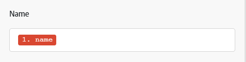
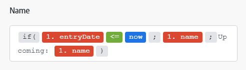
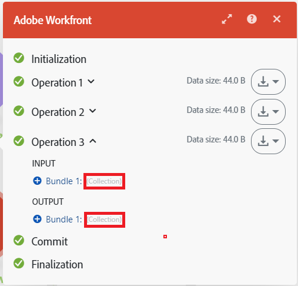

# 對應概觀

對應是將模組的輸出指派給其他模組的輸入欄位的程式。

模組的操作會產生零、一或多個套件組合作為其輸出。 組合包含一或多個專案。

您可以將這些專案對應至後續模組中的欄位。

當您按一下可在其中插入從案例中前一個模組輸出的值的欄位時，對應面板隨即顯示。 在這裡，您可以選取要對應的專案。 對應可包括下列一或多個專案：

* 單一專案
* 多個專案
* 靜態文字
* 函數

>[!BEGINSHADEBOX]

**範例**：

單一專案

包含文字的多個專案

包含多個專案和文字的函式

>[!ENDSHADEBOX]

如需對應說明，請參閱[對應資料：文章索引](/help/workfront-fusion/create-scenarios/map-data/map-data-toc.md)下的文章。

>[!NOTE]
>
>封裝在[!UICONTROL Iterator]和[!UICONTROL Aggregator]之間的模組的輸出無法在[!UICONTROL Aggregator]模組之外存取。

## 對應面板

當您按一下進入可對應資料的欄位時，對應面板隨即開啟。

第一個標籤對應會顯示您可以從其他模組對應的專案。

其他標籤包括可用來建立公式的函式、運運算元和關鍵字。 系統會根據他們處理的資料型別，將之排序為不同的標籤。

如需函式標籤的詳細資訊，請參閱[函式概觀](/help/workfront-fusion/get-started-with-fusion/understand-fusion/function-overview.md)。

如需有關使用函式對應專案的詳細資訊，請參閱[使用函式對應專案](/help/workfront-fusion/create-scenarios/map-data/map-using-functions.md)。

## 集合

專案可包含多種型別的多個值。 這些是集合型別的專案。

集合型別組合在模組輸出中的組合標籤旁顯示`(Collection)`。

在大多數情況下，會對映集合的元素，而非對應代表整個集合的專案。

若要在對映面板中找出集合的元素，請按一下集合旁的箭頭。

如需集合的詳細資訊，請參閱[專案資料型別](/help/workfront-fusion/references/mapping-panel/data-types/item-data-types.md)。

如需對應集合的說明，請參閱文章「對應資訊」中的[將專案](/help/workfront-fusion/create-scenarios/map-data/map-data-from-one-to-another.md#map-an-item)從一個模組對應到另一個模組。

## 陣列

專案可以包含相同型別的多個值。 這些是陣列型別的專案。

陣列型別套件組合在模組輸出中的套件組合標籤旁顯示`(Array)`。

在對映面板中，陣列會以方形括弧顯示。 您可以藉由專案標籤結尾的方括弧來識別陣列型別專案。 若要在對應面板中找出特定的陣列元素，請按一下陣列旁的箭頭。

如需對應陣列與陣列元素的資訊與指示，請參閱[對應陣列與陣列元素](/help/workfront-fusion/create-scenarios/map-data/map-an-array.md)。
