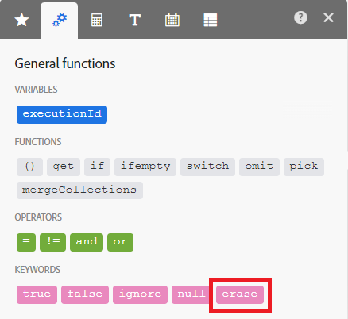
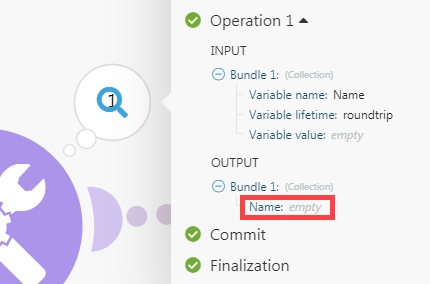

# 模組概覽

Adobe Workfront Fusion會區分五種模組：

* 動作模組
* 搜尋模組
* 觸發模組
* 彙總
* 迭代器

「彙總」和「疊代」適用於進階案例。

## 動作模組

動作模組是最常見的模組型別。 典型動作模組會執行動作並傳回單一套件，然後傳至下一個模組進行處理。

和觸發模組不同，動作模組可以放置在情境的開頭、中間或結尾。

案例可以包含不限數量的動作模組，但大量模組(150+)可能會影響效能。

>[!BEGINSHADEBOX]

**範例：**

* **[!DNL Workfront]>[!UICONTROL Upload a file]**&#x200B;會將檔案傳送至[!DNL Workfront]並傳回其識別碼。
* **[!UICONTROL Image]>[!UICONTROL Resize]**&#x200B;會接收影像、將影像大小調整為指定的尺寸，並將調整大小的影像傳遞到下一個動作。

>[!ENDSHADEBOX]

動作型別有四個子型別：

* 建立
* 讀取
* 更新
* 刪除

「更新」子型別包含下列三個作業：

* **清除欄位**&#x200B;的內容。 當欄位內容評估為`erase`關鍵字（不要與`empty`混淆）時，就會發生此作業。

  

* **保留欄位的內容不變**。 當欄位留空或欄位內容評估為空白（透過JSON中的Null表示）時，會發生此作業。

  

* **取代欄位**&#x200B;的內容。 除了上述兩種情況外，此操作還會發生在其他所有情況中。

>[!NOTE]
>
>* 如果您在對應面板中看不到`erase`關鍵字，表示模組不是更新模組，或模組尚未更新為應用程式的最新規格。
>* `Empty`不會變更欄位內容。 如果必須拭除欄位，您可以使用下列公式：
>
>   
>
>* 目前不支援在內容評估為空白時讓欄位保持不變。

## 搜尋模組

搜尋模組會傳回零、一或多個組合，然後傳至下一個模組進行處理。

您可以將「搜尋」模組放置在情境的開頭、中間或結尾。

案例可以包含不限數量的搜尋模組，儘管大量模組(150+)可能會影響效能。

>[!BEGINSHADEBOX]

**範例：**

**[!DNL Workfront]>[!UICONTROL Read Related Records]**&#x200B;會讀取符合您指定之搜尋查詢（在特定父物件中）的記錄。

>[!ENDSHADEBOX]

## 觸發模組

指定服務發生變更（例如建立或更新記錄）時，觸發器就會產生組合。

觸發器傳回零、一個或多個組合，然後傳至下一個模組進行處理。

因為觸發器會導致案例開始執行，它們只能放在案例的開頭。

每個案例只能包含一個觸發器。

[!DNL Workfront Fusion]使用兩種型別的觸發器：輪詢觸發器和即時觸發器。

### 輪詢觸發程式

輪詢觸發程式會定期輪詢指定的服務，即使在上次案例執行後沒有變更也是如此。 我們建議您排程包含輪詢觸發器的情境，以定期執行。 如果變更符合觸發器的設定，觸發器會傳回包含變更相關資訊的套件組合。 如果沒有符合設定的變更，則觸發器不會輸出任何組合。

如需排程情境的說明，請參閱[排程情境](/help/workfront-fusion/create-scenarios/config-scenarios-settings/schedule-a-scenario.md)。

輪詢觸發器可讓您選取它們應透過面板輸出的第一個套件，該面板會在您儲存觸發器或變更觸發器設定後自動顯示。 此選取範圍僅影響模組的第一次執行。 模組執行一次後，後續執行僅會監視最近一次執行後發生的變更。

如需詳細資訊，請參閱[選擇觸發程式模組開始的位置](/help/workfront-fusion/create-scenarios/add-modules/choose-where-trigger-module-starts.md)。

>[!BEGINSHADEBOX]

**範例：**

* **[!DNL Workfront]>[!UICONTROL Watch records]**&#x200B;傳回上次執行案例後新增的記錄。

* **[!DNL Google Sheets]>[!UICONTROL Watch Rows]**&#x200B;傳回上次執行案例後新增的新資料列。

>[!ENDSHADEBOX]

### 即時觸發程式

即時觸發程式可讓服務在變更發生後立即通知[!DNL Workfront Fusion]變更。 我們建議您排程包含立即觸發器的情境，以便立即執行。

如需指示，請參閱[排程情境](/help/workfront-fusion/create-scenarios/config-scenarios-settings/schedule-a-scenario.md)。

如需即時觸發程式如何處理傳入資料的詳細資訊，請參閱[即時觸發程式(webhook)](/help/workfront-fusion/references/modules/webhooks-reference.md)。

>[!BEGINSHADEBOX]

**範例：**

* 當Workfront中發生特定型別的事件（例如建立任務）時，**[!DNL Workfront]>[!UICONTROL Watch Events]**&#x200B;會傳回資訊。
* 更新儲存格時，**[!DNL Google Sheets]>[!UICONTROL Watch Changes]**&#x200B;會傳回資訊。

>[!ENDSHADEBOX]

## 彙總

彙總模組可將多個套件組合累積至單一套件組合中。

彙總器僅傳回一個組合，然後傳至下一個模組以供進一步處理。

您只能在情境的中間放置彙總。

案例可以包含不限數量的彙總，但大量模組(150+)可能會影響效能。

>[!BEGINSHADEBOX]

**範例：**

* **[!UICONTROL Archive]>[!UICONTROL Create an archive]**&#x200B;會將多個檔案壓縮成zip封存。
* **[!UICONTROL CSV]>[!UICONTROL Aggregate to CSV]**&#x200B;會將CSV檔案中的多個字串合併為單一列。
* **[!UICONTROL Tools]>[!UICONTROL Text aggregator]**&#x200B;將數個字串合併為單一字串。

>[!ENDSHADEBOX]

如需詳細資訊，請參閱[彙總器模組](/help/workfront-fusion/references/modules/aggregator-module.md)。

## 迭代器

疊代器是一種將陣列分割為獨立套裝的模組。

迭代器傳回一或多個組合，接著傳至下一個模組進行處理。

您只能在情境的中間放置疊代器。

雖然大量模組(150+)可能會影響效能，但案例可以包含不限數量的迭代器。

>[!BEGINSHADEBOX]

**範例：**

**[!UICONTROL Email]>[!UICONTROL Retrieve attachments]**&#x200B;將附件陣列分成個別的組合。

>[!ENDSHADEBOX]

如需詳細資訊，請參閱[疊代器模組](/help/workfront-fusion/references/modules/iterator-module.md)和[對應陣列](/help/workfront-fusion/create-scenarios/map-data/map-an-array.md)。
