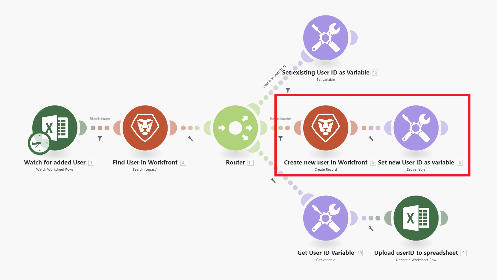

# 案例概述

Adobe Workfront Fusion的角色是自動化您的流程，讓您的使用者不需要花費太多時間在例行工作上。 其運作方式是連結應用程式和服務內外的動作，以建立自動傳輸和轉換資料的情境。 您建立的案例會監視應用程式或服務中的資料，並處理該資料以提供您想要的結果。

案例由一系列模組組成，這些模組會指出應如何在應用程式內轉換資料，或在應用程式和Web服務之間傳輸資料。

## 情境元素概觀

案例是由不同的元素所建置。 瞭解這些元素的術語可讓檔案使用起來更輕鬆。

* [情境](#scenario)
* [觸發](#trigger)
* [模組](#module)
* [路由](#route)
* [案例區段](#scenario-segment)
* [聯結器](#connector)

### 情境

**情境**&#x200B;是使用者建立的自動化步驟系列，用來移動和操作資料。 「案例」一詞指的是整個連線步驟群組。

### 觸發

案例以&#x200B;**觸發器**&#x200B;開頭。 觸發器會監視新的和更新的資料，並在套用模組中設定的某些條件時啟動情境。 觸發器可設定為依排程（輪詢）開始案例，或每當資料變更發生時（即時）。

### 模組

觸發程式後面接著許多&#x200B;**模組**。 模組代表執行特定動作之情境中的單一步驟。 模組會設定並鏈結在一起，以建立情境。

### 路由

情境可分為&#x200B;**路由**。 路由是案例的一部分，不一定用於指定的資料束。 路由是使用路由器模組和篩選器來設定。

### 案例區段

案例區段是案例的一個區段，該案例包含一系列全部連線到相同應用程式的連續模組。 案例區段通常代表應用程式中的簡短工作流程。

### 聯結器

聯結器是指定應用程式的一組模組。 Workfront Fusion提供許多常用工作應用程式的聯結器，例如Workfront、Salesforce和Jira，以及可用於任何Web服務的通用聯結器。

## 範例

展開下列區段以檢視範例情境及其說明。

+++**在Adobe Workfront中自動化處理序**

Workfront Fusion可讓您在Workfront中自動化簡單或複雜的工作流程，節省時間並確保流程一致執行。

在此範例中，當[!DNL Workfront]中的任務或問題中的指定欄位變更時，就會觸發案例。 觸發時，情境會取得相關專案中的資訊，並為專案上特定角色指派的人員建立量身打造的更新。

+++

+++**正在將Workfront連線到其他應用程式或Web服務**

>[!NOTE]
>
>如果您的組織使用舊版授權模式，則貴組織必須擁有Workfront Fusion for Work Automation and Integration授權才能連線至其他應用程式。

Workfront Fusion可連線至其他應用程式和Web服務。 您可以存取、匯入、操作或匯出其他應用程式的資料，並將這些資料與Workfront或彼此整合。

許多應用程式都有專用的[!DNL Workfront Fusion]聯結器。 如果您要存取的應用程式沒有專用聯結器，您可以使用Workfront Fusion的HTTP或SOAP模組，透過其API連線到應用程式。

在此範例中，將使用者新增到[!DNL Excel]試算表時會觸發此案例。 案例會檢查使用者是否在[!DNL Workfront]中。 如果沒有，情境會在[!DNL Workfront]中建立使用者，並將其Workfront使用者ID新增回試算表。

如需專用聯結器的清單，請參閱[Fusion應用程式及其模組參考：文章索引](/help/workfront-fusion/references/apps-and-modules/apps-and-modules-toc.md)。

>[!IMPORTANT]
>
>[!DNL Adobe Workfront Fusion]可以連線到幾乎任何網路服務。 如果您要使用的應用程式沒有專用的[!DNL Workfront Fusion]聯結器，您可使用通用聯結器連線至應用程式或服務。
>
>如需通用聯結器的清單，請參閱[通用聯結器](/help/workfront-fusion/references/apps-and-modules/apps-and-modules-toc.md#universal-connectors)

+++

## 參考

* 如需Workfront Fusion中使用的辭彙表，請參閱[Adobe Workfront Fusion辭彙表](/help/workfront-fusion/get-started-with-fusion/understand-fusion/fusion-glossary.md)。
* 若要開始建立實務案例，請參閱[建立基本案例](/help/workfront-fusion/build-practice-scenarios/create-basic-scenario.md)。
* 如需建立和管理情境的詳細資訊，請參閱下列文章：
   * [建立案例](/help/workfront-fusion/create-scenarios/create-scenarios-toc.md)
   * [管理案例](/help/workfront-fusion/manage-scenarios/manage-scenarios-toc.md)
