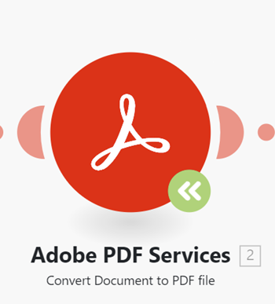

# 將模組更新至新版本

由於Workfront Fusion連線到的應用程式可能會更新或發行新版本，因此Fusion偶爾需要為這些應用程式發行更新的模組。

如果您在案例中的模組中看到綠色的升級模組圖示，表示Workfront Fusion已發行該模組的新版本。

您可以更新模組而不建立新情境。

## 存取需求

+++ 展開以檢視本文中功能的存取需求。

您必須具有下列存取權才能使用本文中的功能：

<table style="table-layout:auto">
 <col> 
 <col> 
 <tbody> 
  <tr> 
   <td role="rowheader">[!DNL Adobe Workfront] 封裝</td> 
   <td> 
任何
 </td> 
  </tr> 
  <tr data-mc-conditions=""> 
   <td role="rowheader">[!DNL Adobe Workfront] 授權</td> 
   <td> 
新增： [!UICONTROL Standard]

或

目前： [!UICONTROL Work]或更高
 </td> 
  </tr> 
  <tr> 
   <td role="rowheader">[!DNL Adobe Workfront Fusion] 授權**</td> 
   <td>
   
目前：無[!DNL Workfront Fusion]授權需求。

   
或

   
舊版：任何 

   </td> 
  </tr> 
  <tr> 
   <td role="rowheader">產品</td> 
   <td>
   
新增：
 <ul><li>[!UICONTROL Select] 或[!UICONTROL Prime] [!DNL Workfront]計畫：您的組織必須購買[!DNL Adobe Workfront Fusion]。</li><li>[!UICONTROL Ultimate] [!DNL Workfront] 計畫： [!DNL Workfront Fusion]已包括在內。</li></ul>
   
或

   
目前：您的組織必須購買[!DNL Adobe Workfront Fusion]。

   </td> 
  </tr>
  <tr data-mc-conditions=""> 
   <td role="rowheader">存取層級設定*</td> 
   <td> 
     
您必須是組織的[!DNL Workfront Fusion]管理員。

     
您必須是團隊的[!DNL Workfront Fusion]管理員。

   </td> 
  </tr> 
   </td> 
  </tr> 
 </tbody> 
</table>

如需此表格中資訊的詳細資訊，請參閱檔案[&#128279;](/help/workfront-fusion/references/licenses-and-roles/access-level-requirements-in-documentation.md)中的存取需求。

如需[!DNL Adobe Workfront Fusion]授權的相關資訊，請參閱[[!DNL Adobe Workfront Fusion] 授權](/help/workfront-fusion/set-up-and-manage-workfront-fusion/licensing-operations-overview/license-automation-vs-integration.md)。

+++

## 將模組更新至新版本

1. 按一下您要升級至新版本的模組上的&#x200B;**升級模組**&#x200B;圖示。
   
1. 按一下&#x200B;**顯示新模組**。
1. 選取符合現有模組的新模組。
1. 以與現有模組相同的設定來設定模組。
1. 將新模組連線到與現有模組相同的情境。
1. 刪除舊模組。
