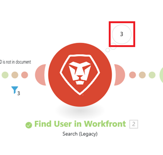

# 檢視特定情境執行

您可以檢視特定案例執行的詳細資訊，包括篩選和搜尋案例事件。

## 存取權要求

+++ 展開以檢視這篇文章中所述功能的存取權要求。

<table style="table-layout:auto">
 <col> 
 <col> 
 <tbody> 
  <tr> 
   <td role="rowheader">Adobe Workfront 封裝</td> 
   <td> 
任何 Adobe Workfront Workflow 封裝及任何 Adobe Workfront Automation and Integration 封裝

Workfront Ultimate

Workfront Prime 和 Select 封裝，以及額外購買的 Workfront Fusion。
 </td> 
  </tr> 
  <tr data-mc-conditions=""> 
   <td role="rowheader">Adobe Workfront 授權</td> 
   <td> 
標準

工作或更高層級
 </td> 
  </tr> 
  <tr> 
   <td role="rowheader">產品</td> 
   <td>
   
如果您的組織擁有 Select 或 Prime Workfront 封裝，但不包括 Workfront Automation and Integration，則您的組織必須購買 Adobe Workfront Fusion。</li></ul>
   </td> 
  </tr>
 </tbody> 
</table>

若要詳細了解此表格中的資訊，請參閱](/help/workfront-fusion/references/licenses-and-roles/access-level-requirements-in-documentation.md)文件中的存取權要求[。

+++

## 檢視特定執行

您可以從情境的情境歷史記錄中檢視執行。

1. 按一下左側面板中的&#x200B;**[!UICONTROL 案例]**&#x200B;索引標籤，然後按一下案例。

   或

   如果您正在案例編輯器中處理案例，請按一下視窗左上角附近的向左箭頭。

1. 按一下情境名稱附近的&#x200B;**歷程記錄**。
   

1. 找到您要檢視的執行專案，然後按一下該執行專案最右邊的&#x200B;**詳細資料**。 [!UICONTROL 詳細資料]連結只有在執行有可用的詳細資料時才可見。

   情境圖表隨即開啟，右側會顯示執行詳細資訊面板。

   為此執行產生輸出的模組會標示綠色標題。

   未執行的模組會變暗。

1. 若要檢視模組的輸出，請按一下模組附近的輸出詳細資訊泡泡。 泡泡圖中的數字代表模組輸出的組合數量。

   

1. 若要檢視通過篩選的組合，請按一下篩選。 篩選器附近的數字代表透過篩選器的組合數量。
1. 若要在執行面板中搜尋特定模組或事件，請在&#x200B;**搜尋執行事件**&#x200B;方塊中輸入搜尋字詞。 當您鍵入時，結果會顯示出來。
1. 若要依「成功」或「警告」等狀態限制執行面板搜尋結果，請按一下&#x200B;**狀態篩選**&#x200B;下拉式清單，然後選取狀態。

>[!NOTE]
>
>若要建立特定模組的連結，請在檢視下列頁面時將`?moduleId=<module-id>`新增至URL：
>
>* 案例編輯頁面（URL結尾為`/edit`）
>* 特定情境執行（URL結尾為`/logs/<log-id>`）
>
>`<module-id>`在檢視案例時參照模組標籤旁的數字。
>
>這在偵錯案例或複製模組設定時可能很有用。
