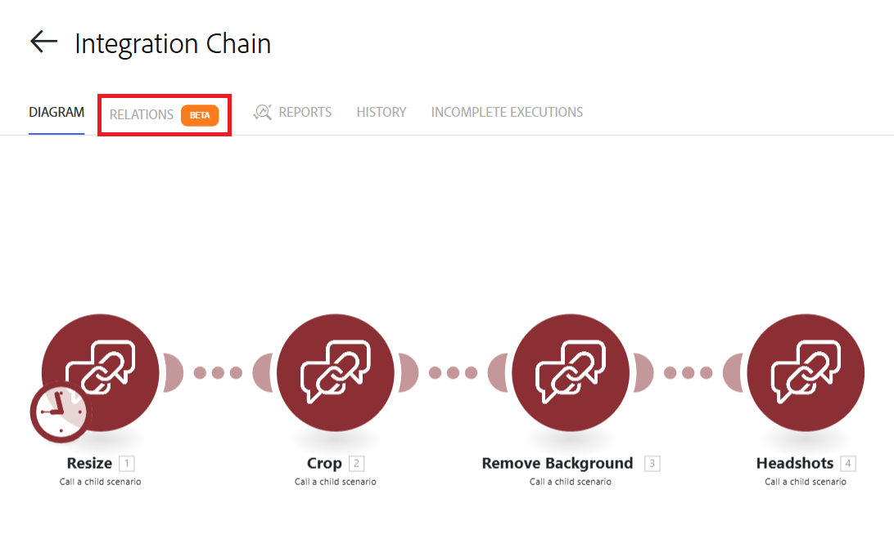

# 檢視和管理鏈結的案例關係

您可以對應父案例與子案例之間的關係。 您也可以使用地圖來跳至鏈中的不同情境。

如需連結案例的詳細資訊，請參閱[將多個案例連結在一起](/help/workfront-fusion/create-scenarios/plan-a-scenario/chain-scenarios.md)。

如需設定鏈結案例的資訊，請參閱[鏈結模組](/help/workfront-fusion/references/apps-and-modules/tools-and-transformers/chain-modules.md)

## 存取權要求

+++ 展開以檢視這篇文章中所述功能的存取權要求。

<table style="table-layout:auto">
 <col> 
 <col> 
 <tbody> 
  <tr> 
   <td role="rowheader">Adobe Workfront 封裝</td> 
   <td> 
任何 Adobe Workfront Workflow 封裝及任何 Adobe Workfront Automation and Integration 封裝

Workfront Ultimate

Workfront Prime 和 Select 封裝，以及額外購買的 Workfront Fusion。
 </td> 
  </tr> 
  <tr data-mc-conditions=""> 
   <td role="rowheader">Adobe Workfront 授權</td> 
   <td> 
標準

工作或更高層級
 </td> 
  </tr> 
  <tr> 
   <td role="rowheader">產品</td> 
   <td>
   
如果您的組織擁有 Select 或 Prime Workfront 封裝，但不包括 Workfront Automation and Integration，則您的組織必須購買 Adobe Workfront Fusion。</li></ul>
   </td> 
  </tr>
 </tbody> 
</table>

若要詳細了解此表格中的資訊，請參閱](/help/workfront-fusion/references/licenses-and-roles/access-level-requirements-in-documentation.md)文件中的存取權要求[。

+++

## 檢視鏈結關係的地圖

您可以檢視目前案例與其父項或子項案例的地圖。 地圖會顯示整個鏈結情境的資料流程圖表。

<!--get a better picture-->

若要檢視鏈結案例的關係對映，請執行下列動作：

1. 按一下左側面板中的&#x200B;**[!UICONTROL 案例]**&#x200B;索引標籤，然後按一下案例。

   或

   如果您正在案例編輯器中處理案例，請按一下視窗左上角附近的向左箭頭。

1. 按一下「**關係**」標籤。

   

1. 如需各個鏈結案例的一般詳細資訊，請檢查標籤。

   每個案例都有一或多個下列標籤：

   * 根：案例是鏈結的開頭，沒有父案例。
   * 父項：案例是父項案例。
   * 子項：案例是子案例。 案例可以既是父項又是子項。
   * 目前：這是使用者目前正在檢視的情境。 換句話說，這是使用者開啟關係對映的情境。

   
1. （選用）若要檢視案例的小型圖表，請將滑鼠游標停留在案例上。
1. （選用）若要從地圖直接前往另一個案例，請按一下案例。

   所點選的情境會在另一個視窗中開啟。
1. （選擇性）若要在地圖水平與垂直檢視之間切換，請按一下[案例詳細資訊]頁面右上角附近的&#x200B;**水準**&#x200B;或&#x200B;**垂直**。
1. （可選）若要檢視地圖的簡化檢視，請核取頁面的右下角。

   如果您的鏈圖較大或複雜，這會很方便。

   * 如果您只檢視地圖的一部分，該部分在簡化地圖上會較暗。
   * 在簡化地圖上，目前案例以藍色標示。
1. 若要檢視鏈結的執行歷史記錄，請按一下檢視頂端附近的「歷史記錄」標籤。

   您可以按一下歷史記錄，以檢視在鏈結情境之間傳遞的特定資料。
