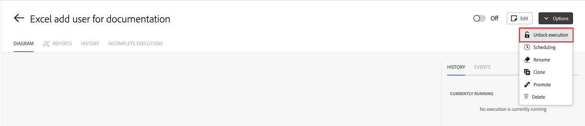

# 管理鎖定的情境

在某些情況下，案例可能會暫時鎖定在Workfront Fusion中。 鎖定的情況將在2-4小時內自動解鎖。 您可以手動解鎖情境，但通常不建議這麼做。

鎖定案例的原因有很多：

* Workfront Fusion不支援平行處理排程情境。 這些案例會在案例執行開始時鎖定，並在完成時解除鎖定。 如果執行中斷，情境可能不會解除鎖定。 當使用者手動強制停止情景或發生系統問題時，可能會發生這種情況。

* Workfront Fusion工程團隊可能會鎖定情境，因為它會導致效能或其他問題。

## 存取權要求

+++ 展開以檢視這篇文章中所述功能的存取權要求。

<table style="table-layout:auto">
 <col> 
 <col> 
 <tbody> 
  <tr> 
   <td role="rowheader">Adobe Workfront 封裝</td> 
   <td> 
任何 Adobe Workfront Workflow 封裝及任何 Adobe Workfront Automation and Integration 封裝

Workfront Ultimate

Workfront Prime 和 Select 封裝，以及額外購買的 Workfront Fusion。
 </td> 
  </tr> 
  <tr data-mc-conditions=""> 
   <td role="rowheader">Adobe Workfront 授權</td> 
   <td> 
標準

工作或更高層級
 </td> 
  </tr> 
  <tr> 
   <td role="rowheader">產品</td> 
   <td>
   
如果您的組織擁有 Select 或 Prime Workfront 封裝，但不包括 Workfront Automation and Integration，則您的組織必須購買 Adobe Workfront Fusion。</li></ul>
   </td> 
  </tr>
 </tbody> 
</table>

若要詳細了解此表格中的資訊，請參閱](/help/workfront-fusion/references/licenses-and-roles/access-level-requirements-in-documentation.md)文件中的存取權要求[。

+++

## 解鎖鎖定的案例

鎖定的情境會從鎖定的時間起2-4小時解鎖。 在排程自動解鎖案例之前，您可以手動解鎖案例。

>[!WARNING]
>
>手動解鎖情境可能會導致情境執行中的錯誤。 我們建議只有在情境因在設計情境時執行和停止執行而鎖定時，才手動解鎖情境。 在其他情況下，我們建議您等待案例自動解除鎖定。

若要手動解除鎖定鎖定的案例：

1. 移至鎖定案例的案例詳細資訊頁面。
1. 按一下熒幕右上角的&#x200B;**[!UICONTROL 選項]**。
1. 選取&#x200B;**[!UICONTROL 解除鎖定執行]**。
1. 按一下&#x200B;**[!UICONTROL 解除鎖定]**。
   
