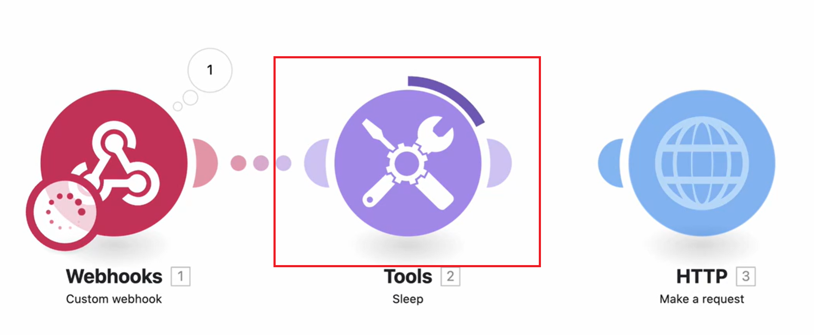
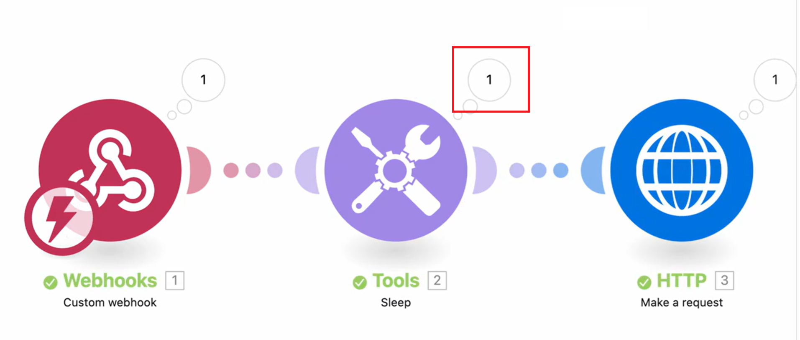
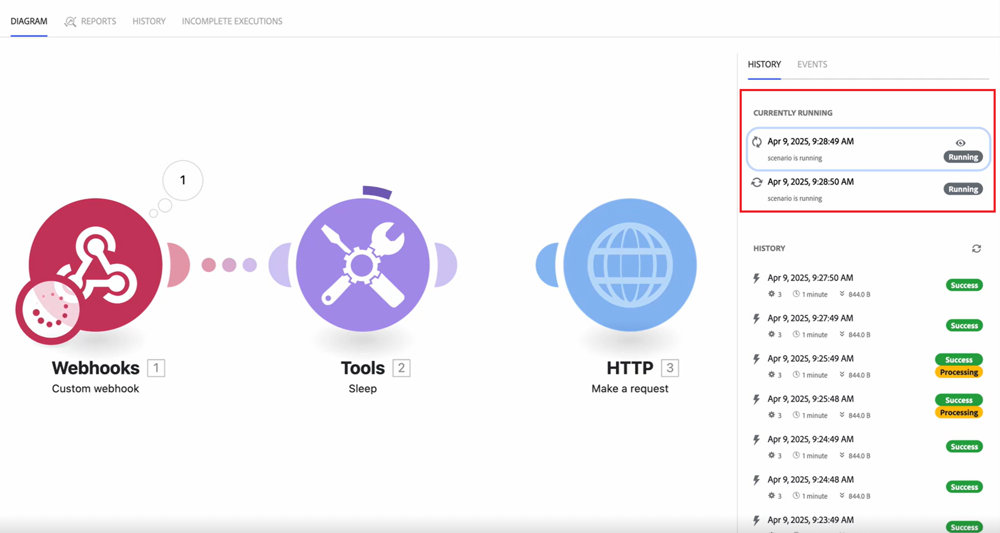

# 檢視執行中案例的資料流程

您可以觀看執行中的情境，以瞭解資料如何流經該情境。

當案例執行時，使用中模組會以模組周圍成長的環來標籤。 鈴聲只會顯示模組正在執行，而不會顯示其進度。 快速執行的模組可能只會顯示環的一小部分。

執行模組後，輸出指示器隨即顯示。

如果模組處理多個組合，則每個已處理的組合都會出現環狀，而輸出指標會將其輸出的每個組合計算在內。

如需案例資料流程的詳細資訊，請參閱[案例執行流程](/help/workfront-fusion/references/scenarios/scenario-execution-flow.md)。

## 存取需求

+++ 展開以檢視本文中功能的存取需求。

<table style="table-layout:auto">
 <col> 
 <col> 
 <tbody> 
  <tr> 
   <td role="rowheader">Adobe Workfront套件</td> 
   <td> 
任何Adobe Workfront Workflow套件和任何Adobe Workfront自動化與整合套件

Workfront Ultimate

Workfront Prime和Select套件，以及額外購買的Workfront Fusion。
 </td> 
  </tr> 
  <tr data-mc-conditions=""> 
   <td role="rowheader">Adobe Workfront授權</td> 
   <td> 
標準

工作或更高
 </td> 
  </tr> 
  <tr> 
   <td role="rowheader">產品</td> 
   <td>
   
如果您的組織有Select或Prime Workfront套件，但不包含Workfront Automation和Integration，則您的組織必須購買Adobe Workfront Fusion。</li></ul>
   </td> 
  </tr>
 </tbody> 
</table>

如需此表格中資訊的詳細資訊，請參閱檔案[中的](/help/workfront-fusion/references/licenses-and-roles/access-level-requirements-in-documentation.md)存取需求。

+++

## 檢視執行中案例的資料流程

1. 按一下左側面板中的&#x200B;**[!UICONTROL 案例]**&#x200B;索引標籤。
1. 選取您要檢視資料流程的案例。
1. 如果案例未執行，請啟動它或按一下&#x200B;**執行一次**&#x200B;以開始案例執行。
1. 選取您要在執行歷史記錄面板的「目前執行中」段落中檢視的執行。

