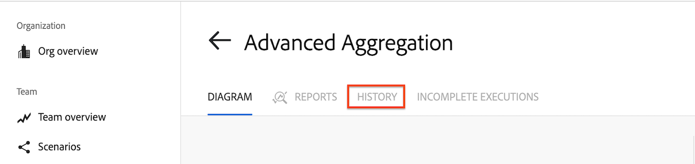

# 檢視情境的執行歷史記錄

您可以顯示情境的事件或執行相關資訊，也可以搜尋情境的所有執行以尋找特定資料。

案例執行代表案例的單一執行。

案例事件是對案例的修改，例如編輯、啟用或停用。

>[!NOTE]
>
>情境歷史記錄會顯示情境過去30天的所有執行。

## 存取權要求

+++ 展開以檢視這篇文章中所述功能的存取權要求。

<table style="table-layout:auto">
 <col> 
 <col> 
 <tbody> 
  <tr> 
   <td role="rowheader">Adobe Workfront 封裝</td> 
   <td> 
任何 Adobe Workfront Workflow 封裝及任何 Adobe Workfront Automation and Integration 封裝

Workfront Ultimate

Workfront Prime 和 Select 封裝，以及額外購買的 Workfront Fusion。
 </td> 
  </tr> 
  <tr data-mc-conditions=""> 
   <td role="rowheader">Adobe Workfront 授權</td> 
   <td> 
標準

工作或更高層級
 </td> 
  </tr> 
  <tr> 
   <td role="rowheader">產品</td> 
   <td>
   
如果您的組織擁有 Select 或 Prime Workfront 封裝，但不包括 Workfront Automation and Integration，則您的組織必須購買 Adobe Workfront Fusion。</li></ul>
   </td> 
  </tr>
 </tbody> 
</table>

若要詳細了解此表格中的資訊，請參閱[&#128279;](/help/workfront-fusion/references/licenses-and-roles/access-level-requirements-in-documentation.md)文件中的存取權要求。

+++

## 檢視案例歷史記錄

### 在「歷史記錄」標籤上檢視案例歷史記錄

[!UICONTROL 歷程記錄]索引標籤顯示的詳細資訊比[!UICONTROL 案例詳細資料]頁面上提供的還多。 您也可以在[!UICONTROL 歷程記錄]索引標籤上篩選及排序執行。

>[!NOTE]
>
>如果您在案例執行時檢視案例歷史記錄，Fusion會顯示一個附註，通知您資料仍在處理中，而且在處理完成之前，只會顯示部分案例歷史記錄。

1. 按一下左側面板中的&#x200B;**[!UICONTROL 案例]**&#x200B;索引標籤，然後按一下案例。

   或

   如果您正在案例編輯器中處理案例，請按一下視窗左上角附近的向左箭頭。

1. 按一下情境名稱附近的&#x200B;**歷程記錄**。
   

   以下是此情境每次執行的詳細資料：

   * 執行開始於&#x200B;**[!UICONTROL 的日期]**
   * 執行ID
   * **[!UICONTROL 狀態]** （成功或失敗）
   * 執行&#x200B;**[!UICONTROL 持續時間]**
   * **[!UICONTROL 作業數目]**
   * **[!UICONTROL 資料傳輸]**&#x200B;的大小

   >[!NOTE]
   >
   >案例歷史記錄會在最近執行的案例旁邊顯示&#x200B;**處理**&#x200B;徽章，而執行詳細資訊會寫入儲存體。 處理會在案例執行後立即發生。 和不應超過幾分鐘。 處理執行時，可能無法看到案例執行的詳細資訊。

1. 若要檢視特定案例執行的詳細資料，請按一下最右邊的&#x200B;**詳細資料**。 [!UICONTROL 詳細資料]連結只有在執行有可用的詳細資料時才可見。

   如需檢視案例執行詳細資訊的詳細資訊，請參閱[檢視特定案例執行](/help/workfront-fusion/manage-scenarios/view-a-specific-scenario-execution.md)。
1. 若要檢視事件，請將&#x200B;**顯示事件**&#x200B;切換為開啟。

### 在「案例詳細資訊」頁面上檢視案例歷史記錄

1. 按一下左側面板中的&#x200B;**[!UICONTROL 案例]**&#x200B;索引標籤，然後按一下案例。

   或

   如果您正在案例編輯器中處理案例，請按一下視窗左上角附近的向左箭頭。

1. 按一下右側面板中的&#x200B;**[!UICONTROL 歷程記錄]**&#x200B;索引標籤。
1. （選用）如需所選取案例執行的詳細資訊，請按一下右側面板中的執行。

   如需處理套裝的詳細資訊，請參閱[案例執行流程](/help/workfront-fusion/references/scenarios/scenario-execution-flow.md)

   >[!NOTE]
   >
   >* 案例歷史記錄會在最近執行的案例旁邊顯示&#x200B;**處理歷史記錄**&#x200B;徽章，而執行詳細資訊會寫入儲存體。 處理會在案例執行後立即發生。 和不應超過幾分鐘。 處理執行時，可能無法看到案例執行的詳細資訊。

1. 若要檢視事件，請按一下&#x200B;**事件**&#x200B;標籤。

## 篩選案例執行歷史記錄

您可以篩選執行歷史記錄，以僅檢視具有指定值的執行。

1. 開啟情境的全頁記錄，如本文中[歷程記錄[!UICONTROL 索引標籤]上的](#view-scenario-history-on-the-history-tab)檢視情境執行歷程記錄中所述。
1. 按一下您要作為篩選依據之欄標題中的[!UICONTROL 篩選器]圖示。
1. 在[!UICONTROL 篩選器]對話方塊中，輸入您要作為篩選依據的值。
1. 按一下「**[!UICONTROL 儲存]**」。

含有作用中篩選器的欄中的篩選圖示為橘色。

<!-- don't see how to do this
## Sort the scenario execution history

You can sort the scenario execution history.

1. Open the full-page history for a scenario as described in [View scenario execution history on the [!UICONTROL History] tab](#view-scenario-execution-history-on-the-history-tab) in this article.
1. Click the [!UICONTROL Sort] icon in the header of the column you want to filter by.
1. Optional: To reverse the order of the sort, click the [!UICONTROL Sort] icon again.
-->

## 搜尋情境的所有執行

1. 開啟情境的全頁記錄，如本文中[歷程記錄[!UICONTROL 索引標籤]上的](#view-scenario-history-on-the-history-tab)檢視情境執行歷程記錄中所述。
1. 按一下執行清單頂端的&#x200B;**[!UICONTROL 全文檢索搜尋]**。

   或

   輸入&#x200B;**Ctrl+Shift+F** (Windows)或&#x200B;**Cmd+Shift+F** (Mac)
會開啟[!UICONTROL 搜尋歷史記錄]視窗。

1. （選擇性）若要搜尋包含特定文字的執行，請在&#x200B;**[!UICONTROL 在歷程記錄]**&#x200B;視窗中搜尋的搜尋列中輸入文字。

   若要搜尋精確文字，請以雙引號（「範例」）括住文字。

   >[!INFO]
   >
   >**範例：**&#x200B;如果您想要尋找建立特定專案的執行，請在[!UICONTROL 全文檢索搜尋]列中輸入專案識別碼。
   >
   >「625ef2ef0006036bd1794b6e52d737c5」

1. （選擇性）若要依日期範圍限制搜尋，請在[!UICONTROL 依日期範圍]區域選取所要搜尋的開始和結束日期。

   >[!NOTE]
   >
   >* 執行只適用於之前的30天。
   >
   >* Workfront Fusion 會儲存 Webhook 承載長達 30 天。存取webhook裝載時，若在裝載建立超過30天後進行，會導致&#39;&#39;[!UICONTROL 無法從儲存空間讀取檔案。]&#39;&#39;

1. （選擇性）若要依狀態限制搜尋，請在&#x200B;**[!UICONTROL 依狀態]**&#x200B;下拉式清單中選取所需的狀態。

   可用的狀態包括：

   * [!UICONTROL 全部]

   * [!UICONTROL 錯誤]

   * [!UICONTROL Warning]

   * [!UICONTROL 成功]

1. （選擇性）變更結果在&#x200B;**[!UICONTROL 依日期排序]**&#x200B;下拉式清單中的顯示順序。

1. （選擇性）若要複製案例執行ID，請按一下&#x200B;**[!UICONTROL 複製執行ID]**&#x200B;圖示 所需執行列中的。

1. （選擇性）按一下[!UICONTROL 全文檢索搜尋]的結果，以檢查包含資訊的案例模組輸出組合。
