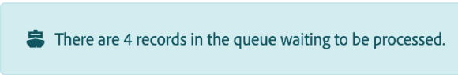
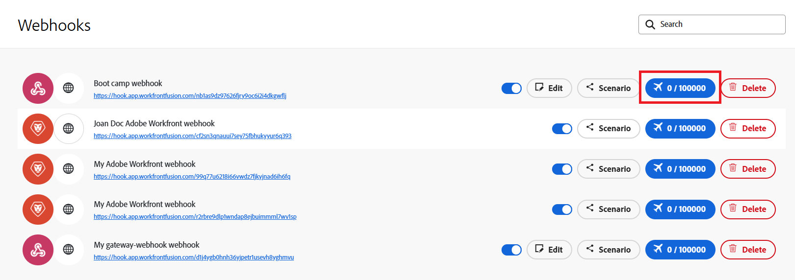

# 檢視webhook的佇列

許多服務都會提供Webhook，以便在服務發生特定變更時傳送即時通知。 即時觸發器（也稱為Webhook）可以使用這些事件開始案例。 事件在等待處理時進入webhook的佇列，例如當案例已經在執行時。 您可以檢視webhook的佇列。

無論您在案例設定面板中如何設定「資料是機密的」選項，傳入的webhook資料一律會儲存在佇列中。 在情境中處理資料後，資料會從佇列中永久刪除。

如需Webhook的詳細資訊，請參閱[即時觸發程式(Webhook)](/help/workfront-fusion/references/modules/webhooks-reference.md)。

## 存取需求

+++ 展開以檢視本文中功能的存取需求。

<table style="table-layout:auto">
 <col> 
 <col> 
 <tbody> 
  <tr> 
   <td role="rowheader">Adobe Workfront套件</td> 
   <td> 
任何Adobe Workfront Workflow套件和任何Adobe Workfront自動化與整合套件

Workfront Ultimate

Workfront Prime和Select套件，以及額外購買的Workfront Fusion。
 </td> 
  </tr> 
  <tr data-mc-conditions=""> 
   <td role="rowheader">Adobe Workfront授權</td> 
   <td> 
標準

工作或更高
 </td> 
  </tr> 
  <tr> 
   <td role="rowheader">產品</td> 
   <td>
   
如果您的組織有Select或Prime Workfront套件，但不包含Workfront Automation和Integration，則您的組織必須購買Adobe Workfront Fusion。</li></ul>
   </td> 
  </tr>
 </tbody> 
</table>

如需此表格中資訊的詳細資訊，請參閱檔案[中的](/help/workfront-fusion/references/licenses-and-roles/access-level-requirements-in-documentation.md)存取需求。

+++

## 檢視webhook的佇列

所有來自傳入webhook的訊息都會儲存在webhook的佇列中。

如果情境目前有佇列，則該情境中會顯示橫幅：

若要檢視webhook的佇列：

1. 按一下左側功能表中的&#x200B;**[!UICONTROL Webhooks]**。
1. 找到您要檢視其佇列的Webhook。
1. 在「已接收事件」按鈕中找出事件數。

   

1. 按一下按鈕，即可檢視佇列中事件的詳細資訊。
