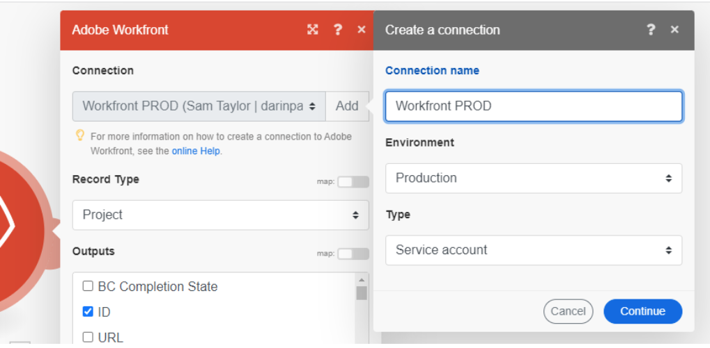

# 連線中繼資料

Fusion使用中繼資料來識別連線的重要屬性。

建立新連線時，可以設定連線中繼資料。 這些屬性位於用來設定連線的同一個對話方塊中：

Fusion使用者可以從「連線」區域檢視及編輯連線。

## 環境型別

生產和非生產系統都可以使用Fusion連線。 您可以標示連線所連線的環境型別，以協助保護生產環境。

環境型別（如同其他連線中繼資料）僅供參考之用。 使用者應負責精確設定此屬性，並在情境中使用具有正確環境的連線。

## 驗證類型

Fusion連線可用於服務帳戶和個人帳戶。 當案例自動做為Fusion時，會使用服務帳戶進行驗證。 個人帳戶是根據特定人員的驗證。 使用的驗證型別取決於情境的需求。 個人帳戶應該用於自動使用者動作。 例如，如果Fusion案例自動進行特定人員的核准，則驗證型別應為該人員。 否則，Fusion將充當Fusion，型別應為服務帳戶。

驗證型別（如同其他連線中繼資料）僅供參考之用。 使用者應負責正確設定此屬性，並在情境中使用正確的連線型別。

如需驗證型別的詳細資訊，請參閱Adobe驗證指南中的[驗證](https://developer.adobe.com/developer-console/docs/guides/authentication/)。

## 資源

* 如需管理連線中繼資料的指示，請參閱[管理連線](/help/workfront-fusion/create-scenarios/connect-to-apps/manage-connections.md)。
