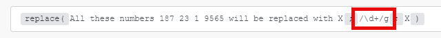
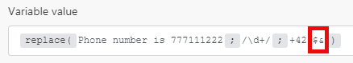
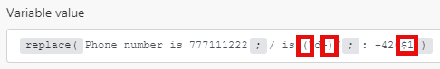

# 字串函式

## [!UICONTROL length (text or buffer)]

傳回文字字串長度（字元數）或二進位緩衝區（緩衝區大小，以位元組為單位）。

>[!BEGINSHADEBOX]

**範例：**

`length( hello )`

傳回： 5

>[!ENDSHADEBOX]

## [!UICONTROL lower (text)]

將文字字串中的所有字母字元轉換為小寫。

>[!BEGINSHADEBOX]

**範例：**

`lower( Hello )`

傳回： hello

>[!ENDSHADEBOX]

## [!UICONTROL capitalize (text)]

將文字字串中的第一個字元轉換為大寫。

>[!BEGINSHADEBOX]

**範例：**

`capitalize( workfront )`

傳回： [!DNL Workfront]

>[!ENDSHADEBOX]

## [!UICONTROL startcase (text)]

每個字的第一個字母使用大寫，其他字母則使用小寫。

>[!BEGINSHADEBOX]

**範例：**
`startcase( hello WORLD )`

傳回： [!UICONTROL Hello World]

>[!ENDSHADEBOX]

## [!UICONTROL ascii (text; [remove diacritics])]

移除文字字串中的所有非ascii字元。

>[!BEGINSHADEBOX]

**範例：**

* `ascii(` `Wěošrčkřfžrýoáníté` `)`

傳回： [!DNL Workfront]

* `ascii(` `ěščřž` `;` `true` `)`

傳回： [!UICONTROL escrz]

>[!ENDSHADEBOX]

## [!UICONTROL replace (text;search string; replacement string)]

以新字串取代搜尋字串。

>[!BEGINSHADEBOX]

**範例：**

`replace( Hello World ; Hello ; Hi )`

傳回： [!UICONTROL Hi World]

>[!ENDSHADEBOX]

規則運算式（以`/.../`括住）可以做為搜尋字串，並附加標幟（例如`g`、`i`、`m`）的組合：

>[!BEGINSHADEBOX]

**範例：**

所有這些數字X X X X X都會以X取代

>[!ENDSHADEBOX]

取代字串可包括下列特殊取代模式：

* `$&`插入相符的子字串。
* `$n`其中n是小於100的正整數，插入第n個以括弧括住的子符合字串。 這是1索引。

>[!BEGINSHADEBOX]

**範例：**

傳回：電話號碼`+420777111222`

傳回：電話號碼： `+420777111222`

>[!CAUTION]
>
>請勿在取代字串引數中使用已命名的擷取群組，例如`/ is (?<number>\d+)/`。 這樣做會導致錯誤。

>[!ENDSHADEBOX]

如需規則運算式的詳細資訊，請參閱[文字剖析器](/help/workfront-fusion/references/apps-and-modules/tools-and-transformers/text-parser.md)。

## [!UICONTROL trim (text)]

移除文字開頭或結尾的空格字元。

## [!UICONTROL upper (text)]

將文字字串中的所有字母字元轉換為大寫。

>[!BEGINSHADEBOX]

**範例：**

`upper( Hello )`

傳回： [!UICONTROL HELLO]

>[!ENDSHADEBOX]

## [!UICONTROL substring (text; start;end)]

傳回「開始」位置和「結束」位置之間的文字字串部分。

>[!BEGINSHADEBOX]

**範例：**

* `substring( Hello ; 0 ; 3)`

  傳回：高度

* `substring( Hello ; 1 ; 3 )`

  傳回： el

>[!ENDSHADEBOX]

## [!DNL indexOf (string; value; [start])]

傳回指定值在字串中第一次出現的位置。 如果搜尋的值不存在，此方法會傳回&#39;-1&#39;。 起始值代表字串中開始搜尋的位置。

>[!BEGINSHADEBOX]

**範例：**

* `indexOf( Workfront ; o )`

  傳回： 1

* `indexOf( Workfront ; x )`

  傳回： -1

* `indexOf( Workfront ; o ; 3 )`

  傳回： 6

>[!ENDSHADEBOX]

## [!UICONTROL toBinary (value)]

將任何值轉換為二進位資料。

您也可以指定編碼作為第二個引數，以將十六進位或base64的二進位轉換套用至二進位資料。

>[!BEGINSHADEBOX]

**範例：**

* `toBinary( Workfront )`

  傳回： 57 6f 72 6b 66 72 6f 6e 74

* `toBinary( V29ya2Zyb250 ; base64 )`

  傳回： 57 6f 72 6b 66 72 6f 6e 74

>[!ENDSHADEBOX]

## [!UICONTROL toString (value)]

將任何值轉換為字串。

## [!UICONTROL encodeURL (text)]

將部分文字中的特殊字元編碼為有效的URL位址。

## [!UICONTROL decodeURL (text)]

將URL中的特殊字元解碼為文字。

>[!BEGINSHADEBOX]

**範例：**
`decodeURL( Automate%20your%20workflow )`

傳回： [!UICONTROL Automate your workflow]

>[!ENDSHADEBOX]

## [!UICONTROL escapeHTML (text)]

逸出文字中的所有HTML標籤。

>[!BEGINSHADEBOX]

**範例：**

`escapeHTML( <b>Hello</b> )`

傳回： `&lt;b&gt;Hello&lt;/b&gt;`

>[!ENDSHADEBOX]

## [!UICONTROL escapeMarkdown(text)]

逸出文字中的所有Markdown標籤。

>[!BEGINSHADEBOX]

**範例：**

`escapeMarkdown( # Header )`

傳回： `&#35; Header`

>[!ENDSHADEBOX]

## [!UICONTROL stripHTML (text)]

從文字中移除所有HTML標籤。

>[!BEGINSHADEBOX]

**範例：**

`stripHTML( <b>Hello</b> )`

傳回： Hello

>[!ENDSHADEBOX]

## 包含（文字；搜尋字串）

驗證文字是否包含搜尋字串。

>[!BEGINSHADEBOX]

**範例：**

* `contains( Hello World ; Hello )`

  傳回： [!UICONTROL true]

* `contains( Hello World ; Bye )`

  傳回： [!UICONTROL false]

>[!ENDSHADEBOX]

## [!UICONTROL split (text; separator)]

將字串分割為子字串，將字串分割為字串陣列。

>[!BEGINSHADEBOX]

**範例：**

`split( John, George, Paul ; , )`

>[!ENDSHADEBOX]

## [!UICONTROL md5 (text)]

計算字串的md5雜湊。

>[!BEGINSHADEBOX]

**範例：**

`md5( Workfront )`

傳回： `1448bbbeaa7a9b8091d426999f1f666b`

>[!ENDSHADEBOX]

## [!UICONTROL sha1 (text; [encoding]; [key])]

計算字串的sha1雜湊。 如果指定機碼引數，則會傳回sha1 HMAC雜湊。 支援的編碼：「十六進位」（預設）、「base64」或「latin1」。

>[!BEGINSHADEBOX]

**範例：**

`sha1( workfront )`

傳回： b2b30b8ae1f9e5b40fbb0696eaabdbfd8d0c087f

>[!ENDSHADEBOX]

## [!UICONTROL sha256 (text; [encoding]; [key])]

計算字串的sha256雜湊。 如果指定機碼引數，則會傳回sha256 HMAC雜湊。 支援的編碼：「十六進位」（預設）、「base64」或「latin1」。>

>[!BEGINSHADEBOX]

**範例：**

`sha256( workfront )`

傳回： ed3d7397eec7b94453035b67ba4468c883ee3bedeb57137f7371f2e0cf5e2bbc

>[!ENDSHADEBOX]

## [!UICONTROL sha512 (text; [output encoding]; [key]; [key encoding])]

計算字串的sha512雜湊。 如果指定機碼引數，則會傳回sha512 HMAC雜湊。

支援的編碼：

* &quot;[!UICONTROL hex]&quot; （預設）
* &quot;[!UICONTROL base64]&quot;
* &quot;[!UICONTROL latin1]&quot;

支援的關鍵編碼：

* &quot;[!UICONTROL text]&quot; （預設）
* &quot;[!UICONTROL hex]&quot;
* &quot;[!UICONTROL base64]&quot;或&quot;[!UICONTROL binary]&quot;

使用&quot;[!UICONTROL binary]&quot;金鑰編碼時，金鑰必須是緩衝區，而非字串。

>[!BEGINSHADEBOX]

**範例：**

`sha512(workfront)`

傳回： 789ae41b9456357e4f27c6a09956a767abbb8d80b206003ffdd1e94dbc687cd119b85e1e19db58bb44b234493af35fd431639c0345aadf2cf7ec26e9f4a7fb19

>[!ENDSHADEBOX]

## [!UICONTROL base64 (text)]

將文字轉換為base64。

>[!BEGINSHADEBOX]

**範例：**

`base64( workfront )`

傳回： d29ya2Zyb250==

>[!ENDSHADEBOX]
