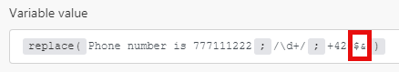
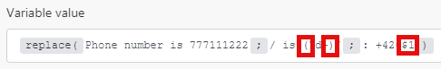

# 字串函式

## [!UICONTROL 長度（文字或緩衝區）]

傳回文字字串長度（字元數）或二進位緩衝區（緩衝區大小，以位元組為單位）。

>[!BEGINSHADEBOX]

**範例：**

`length( hello )`

傳回： 5

>[!ENDSHADEBOX]

## [!UICONTROL 小寫（文字）]

將文字字串中的所有字母字元轉換為小寫。

>[!BEGINSHADEBOX]

**範例：**

`lower( Hello )`

傳回： hello

>[!ENDSHADEBOX]

## [!UICONTROL 大寫（文字）]

將文字字串中的第一個字元轉換為大寫。

>[!BEGINSHADEBOX]

**範例：**

`capitalize( workfront )`

傳回： Workfront

>[!ENDSHADEBOX]

## [!UICONTROL startcase （文字）]

每個字的第一個字母使用大寫，其他字母則使用小寫。

>[!BEGINSHADEBOX]

**範例：**
`startcase( hello WORLD )`

傳回： [!UICONTROL Hello World]

>[!ENDSHADEBOX]

## [!UICONTROL ascii （文字；[移除變音符號]）]

移除文字字串中的所有非ascii字元。

>[!BEGINSHADEBOX]

**範例：**

* `ascii(` `Wěošrčkřfžrýoáníté` `)`

傳回： Workfront

* `ascii(` `ěščřž` `;` `true` `)`

傳回： [!UICONTROL escrz]

>[!ENDSHADEBOX]

## [!UICONTROL 取代（文字；搜尋字串；取代字串）]

以新字串取代搜尋字串。

>[!BEGINSHADEBOX]

**範例：**

`replace( Hello World ; Hello ; Hi )`

傳回： [!UICONTROL Hi World]

>[!ENDSHADEBOX]

規則運算式（以`/.../`括住）可以做為搜尋字串，並附加標幟（例如`g`、`i`、`m`）的組合：

>[!BEGINSHADEBOX]

**範例：**

所有這些數字X X X X X都會以X取代

>[!ENDSHADEBOX]

取代字串可包括下列特殊取代模式：

* `$&`插入相符的子字串。
* `$n`其中n是小於100的正整數，插入第n個以括弧括住的子符合字串。 這是1索引。

>[!BEGINSHADEBOX]

**範例：**

傳回：電話號碼`+420777111222`

傳回：電話號碼： `+420777111222`

>[!CAUTION]
>
>請勿在取代字串引數中使用已命名的擷取群組，例如`/ is (?<number>\d+)/`。 這樣做會導致錯誤。

>[!ENDSHADEBOX]

如需規則運算式的詳細資訊，請參閱[文字剖析器](/help/workfront-fusion/references/apps-and-modules/tools-and-transformers/text-parser.md)。

## [!UICONTROL 修剪（文字）]

移除文字開頭或結尾的空格字元。

## [!UICONTROL upper （文字）]

將文字字串中的所有字母字元轉換為大寫。

>[!BEGINSHADEBOX]

**範例：**

`upper( Hello )`

傳回： [!UICONTROL HELLO]

>[!ENDSHADEBOX]

## [!UICONTROL 子字串（文字；開始；結束）]

傳回「開始」位置和「結束」位置之間的文字字串部分。

>[!BEGINSHADEBOX]

**範例：**

* `substring( Hello ; 0 ; 3)`

  傳回：高度

* `substring( Hello ; 1 ; 3 )`

  傳回： el

>[!ENDSHADEBOX]

## [!DNL indexOf (string; value; [start])]

傳回指定值在字串中第一次出現的位置。 如果搜尋的值不存在，此方法會傳回&#39;-1&#39;。 起始值代表字串中開始搜尋的位置。

>[!BEGINSHADEBOX]

**範例：**

* `indexOf( Workfront ; o )`

  傳回： 1

* `indexOf( Workfront ; x )`

  傳回： -1

* `indexOf( Workfront ; o ; 3 )`

  傳回： 6

>[!ENDSHADEBOX]

## [!UICONTROL toBinary （值）]

將任何值轉換為二進位資料。

您也可以指定編碼作為第二個引數，以將十六進位或base64的二進位轉換套用至二進位資料。

>[!BEGINSHADEBOX]

**範例：**

* `toBinary( Workfront )`

  傳回： 57 6f 72 6b 66 72 6f 6e 74

* `toBinary( V29ya2Zyb250 ; base64 )`

  傳回： 57 6f 72 6b 66 72 6f 6e 74

>[!ENDSHADEBOX]

## [!UICONTROL toString （值）]

將任何值轉換為字串。

## [!UICONTROL encodeURL （文字）]

將部分文字中的特殊字元編碼為有效的URL位址。

## [!UICONTROL decodeURL （文字）]

將URL中的特殊字元解碼為文字。

>[!BEGINSHADEBOX]

**範例：**
`decodeURL( Automate%20your%20workflow )`

傳回： [!UICONTROL 自動化您的工作流程]

>[!ENDSHADEBOX]

## [!UICONTROL escapeHTML （文字）]

逸出文字中的所有HTML標籤。

>[!BEGINSHADEBOX]

**範例：**

`escapeHTML( <b>Hello</b> )`

傳回：`&lt;b&gt;Hello&lt;/b&gt;`

>[!ENDSHADEBOX]

## [!UICONTROL escapeMarkdown（文字）]

逸出文字中的所有Markdown標籤。

>[!BEGINSHADEBOX]

**範例：**

`escapeMarkdown( # Header )`

傳回：`&#35; Header`

>[!ENDSHADEBOX]

## [!UICONTROL stripHTML （文字）]

從文字中移除所有HTML標籤。

>[!BEGINSHADEBOX]

**範例：**

`stripHTML( <b>Hello</b> )`

傳回： Hello

>[!ENDSHADEBOX]

## 包含（文字；搜尋字串）

驗證文字是否包含搜尋字串。

>[!BEGINSHADEBOX]

**範例：**

* `contains( Hello World ; Hello )`

  傳回： [!UICONTROL true]

* `contains( Hello World ; Bye )`

  傳回： [!UICONTROL false]

>[!ENDSHADEBOX]

## [!UICONTROL 分割（文字；分隔符號）]

將字串分割為子字串，將字串分割為字串陣列。

>[!BEGINSHADEBOX]

**範例：**

`split( John, George, Paul ; , )`

>[!ENDSHADEBOX]

## [!UICONTROL md5 （文字）]

計算字串的md5雜湊。

>[!BEGINSHADEBOX]

**範例：**

`md5( Workfront )`

傳回：`1448bbbeaa7a9b8091d426999f1f666b`

>[!ENDSHADEBOX]

## [!UICONTROL sha1 （文字；[編碼]；[金鑰]）]

計算字串的sha1雜湊。 如果指定機碼引數，則會傳回sha1 HMAC雜湊。 支援的編碼：「十六進位」（預設）、「base64」或「latin1」。

>[!BEGINSHADEBOX]

**範例：**

`sha1( workfront )`

傳回： b2b30b8ae1f9e5b40fbb0696eaabdbfd8d0c087f

>[!ENDSHADEBOX]

## [!UICONTROL sha256 （文字；[編碼]；[金鑰]）]

計算字串的sha256雜湊。 如果指定機碼引數，則會傳回sha256 HMAC雜湊。 支援的編碼：「十六進位」（預設）、「base64」或「latin1」。>

>[!BEGINSHADEBOX]

**範例：**

`sha256( workfront )`

傳回： ed3d7397eec7b94453035b67ba4468c883ee3bedeb57137f7371f2e0cf5e2bbc

>[!ENDSHADEBOX]

## [!UICONTROL sha512 （文字；[輸出編碼]；[金鑰]；[金鑰編碼]）]

計算字串的sha512雜湊。 如果指定機碼引數，則會傳回sha512 HMAC雜湊。

支援的編碼：

* &quot;[!UICONTROL 十六進位]&quot; （預設）
* [!UICONTROL base64]
* [!UICONTROL latin1]

支援的關鍵編碼：

* &quot;[!UICONTROL 文字]&quot; （預設）
* [!UICONTROL 十六進位]
* [!UICONTROL base64]」或[!UICONTROL 二進位]

使用&quot;[!UICONTROL 二進位]&quot;金鑰編碼時，金鑰必須是緩衝區，而非字串。

>[!BEGINSHADEBOX]

**範例：**

`sha512(workfront)`

傳回： 789ae41b9456357e4f27c6a09956a767abbb8d80b206003ffdd1e94dbc687cd119b85e1e19db58bb44b234493af35fd431639c0345aadf2cf7ec26e9f4a7fb19

>[!ENDSHADEBOX]

## [!UICONTROL base64 （文字）]

將文字轉換為base64。

>[!BEGINSHADEBOX]

**範例：**

`base64( workfront )`

傳回： d29ya2Zyb250==

>[!ENDSHADEBOX]

### [!UICONTROL concat（string1；分隔符號；string2； ...）]

[!BADGE 新增！]{type=Informative}

串連字串，每個字串之間有分隔符號。

>[!BEGINSHADEBOX]

**範例：**

* `concat(; Hello ; World)`

  傳回Hello World
* `concat(-; a ; b; c)`

  傳回a-b-c

>[!ENDSHADEBOX]

### [!UICONTROL left(string； length)]

[!BADGE 新增！]{type=Informative}

傳回字串左側的指定字元數。

>[!BEGINSHADEBOX]

**範例：**

* `left("Hello"; 3)`

  傳回Hel

>[!ENDSHADEBOX]

### [!UICONTROL right(string； length)]

[!BADGE 新增！]{type=Informative}

從字串右側傳回指定的字元數。

>[!BEGINSHADEBOX]

**範例：**

* `right("Hello"; 3)`

  傳回llo

>[!ENDSHADEBOX]

### [!UICONTROL removeAccents(string)]

[!BADGE 新增！]{type=Informative}

從重音字元中移除變音符號（重音符號）。

>[!BEGINSHADEBOX]

**範例：**

* `removeAccents("Héllo wörld")`

  傳回Hello世界

>[!ENDSHADEBOX]

### [!UICONTROL replacePattern(string； pattern； replacement)]

[!BADGE 新增！]{type=Informative}

將規則運算式模式的所有相符專案取代為

>[!BEGINSHADEBOX]

**範例：**

* `replacePattern("foo123bar"; "\\d+"; "\_")`

  傳回foo\_bar

>[!ENDSHADEBOX]

### [!UICONTROL sortAscString(string1； string2； ...)]

[!BADGE 新增！]{type=Informative}

傳回提供的字串，這些字串會以遞增（字母順序）順序排序。

>[!BEGINSHADEBOX]

**範例：**

* `sortAscString("banana"; "apple"; "cherry")`

  傳回\[&quot;apple&quot;、&quot;banana&quot;、&quot;cherry&quot;]

>[!ENDSHADEBOX]

### [!UICONTROL sortDescString(string1； string2； ...)]

[!BADGE 新增！]{type=Informative}

傳回提供的字串，這些字串會以遞減（反向字母順序）順序排序。

**語法:** `sortDescString(string1; string2; ...)`

>[!BEGINSHADEBOX]

**範例：**

* `sortDescString("banana"; "apple"; "cherry")`

  傳回\[&quot;cherry&quot;、&quot;banana&quot;、&quot;apple&quot;]

>[!ENDSHADEBOX]

### [!UICONTROL pascal（字串）]

[!BADGE 新增！]{type=Informative}

將字串轉換為PascalCase，方法是將每個字的第一個字母轉換為大寫，並移除空格。

**語法:** `pascal(string)`

>[!BEGINSHADEBOX]

**範例：**

* `pascal("hello world")`

  傳回HelloWorld
* `pascal("foo bar baz")`

  傳回FooBarBaz

>[!ENDSHADEBOX]

