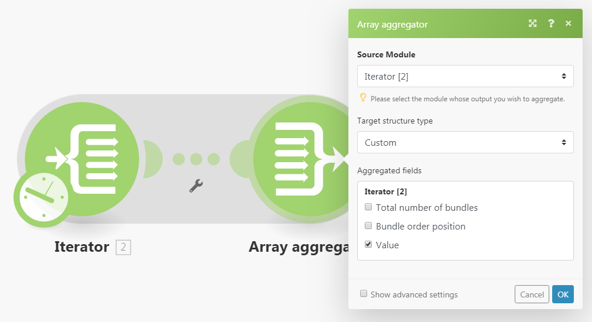
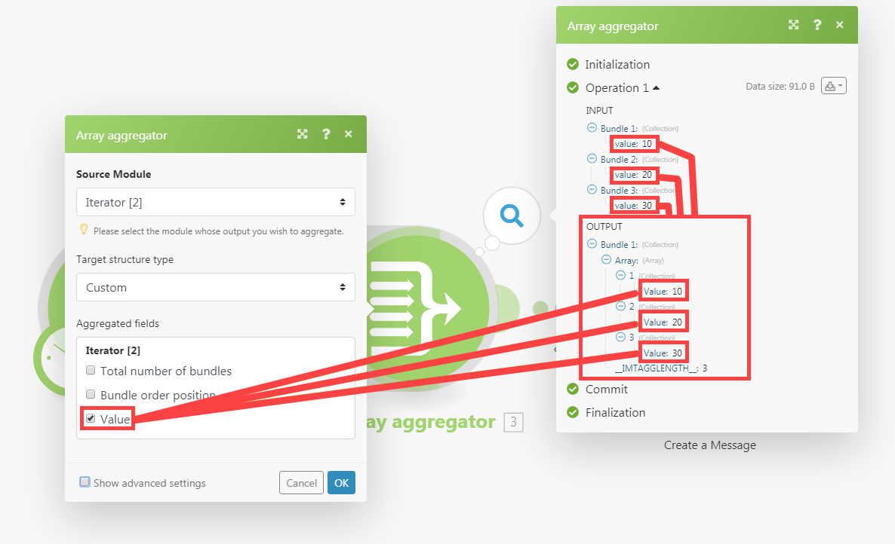
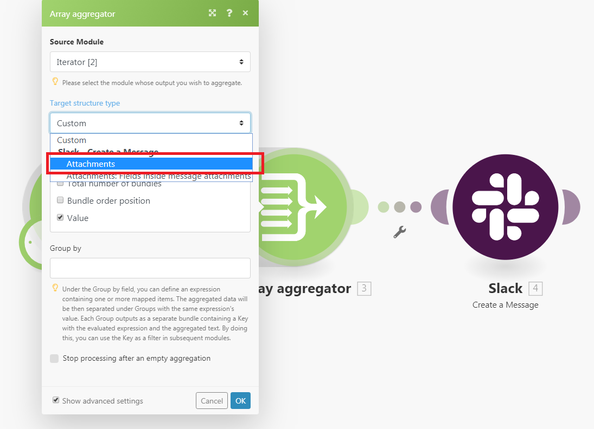
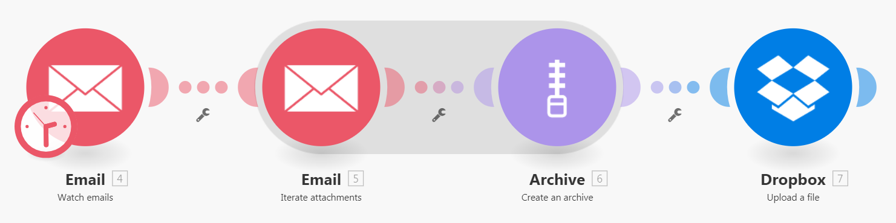
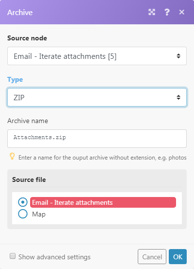

# [!UICONTROL 彙總]模組

彙總器模組是將數個資料套件合併至單一套件的模組。

## 存取需求

+++ 展開以檢視本文中功能的存取需求。

您必須具有下列存取權才能使用本文中的功能：

<table style="table-layout:auto">
 <col> 
 <col> 
 <tbody> 
  <tr> 
    <td role="rowheader">Adobe Workfront套件</td> 
   <td> 
任何
 </td> 
  </tr> 
  <tr data-mc-conditions=""> 
   <td role="rowheader">Adobe Workfront授權</td> 
   <td> 新增：標準
或

目前：工作或以上
 </td> 
  </tr> 
  <tr> 
   <td role="rowheader">[!UICONTROL Adobe Workfront Fusion]授權</td> 
   <td>
   
目前：無Workfront Fusion授權需求。

   
或

   
舊版：任何 

   </td> 
  </tr> 
  <tr> 
   <td role="rowheader">產品</td> 
   <td>
   
新增:
 <ul><li>[!UICONTROL Select]或[!UICONTROL Prime] Workfront計畫：您的組織必須購買Adobe Workfront Fusion。</li><li>[!UICONTROL Ultimate] Workfront計畫：包含Workfront Fusion。</li></ul>
   
或

   
目前：您的組織必須購買Adobe Workfront Fusion。

   </td> 
  </tr>
 </tbody> 
</table>

若要瞭解您擁有的計畫、授權型別或存取權，請聯絡您的Workfront管理員。

如需Adobe Workfront Fusion授權的相關資訊，請參閱[Adobe Workfront Fusion授權](/help/workfront-fusion/set-up-and-manage-workfront-fusion/licensing-operations-overview/license-automation-vs-integration.md)。

+++

## [!UICONTROL 彙總]模組總覽

執行[!UICONTROL 彙總]模組時，它會執行下列動作：

* 從單一來源模組的作業累積所有組合。
* 輸出單一組合，其陣列包含每個累積組合一個專案。 陣列專案的內容取決於特定的[!UICONTROL 彙總]模組及其設定。

下圖顯示[!UICONTROL 彙總]模組的典型設定：

<table style="table-layout:auto">
 <col> 
 <col> 
 <tbody> 
  <tr> 
   <td> 
[!UICONTROL Source模組]
 </td> 
   <td> 
套件組合彙總開始的模組。 來源模組通常是輸出一系列組合的疊代器或搜尋模組。

當您設定彙總器的來源模組（並關閉彙總器的設定）時，來源模組與彙總器模組之間的路由會以灰色區域包圍，以便您可以清楚看到彙總的開始與結束。 
   
 
如需迭代器的詳細資訊，請參閱<a href="/help/workfront-fusion/references/modules/iterator-module.md" class="MCXref xref">[!UICONTROL Iterator]模組</a>。
 
   
如需搜尋模組的詳細資訊，請參閱模組概觀中的<a href="/help/workfront-fusion/get-started-with-fusion/understand-fusion/module-overview.md#search-modules" class="MCXref xref">搜尋模組</a>。
 </td> 
  </tr> 
  <tr> 
   <td> 
[!UICONTROL 目標結構型別]

（僅適用於[!UICONTROL 陣列彙總]模組。）
 </td> 
   <td> 
 彙總資料的目標結構。 預設選項[!UICONTROL 自訂]可讓您選擇應彙總至[!UICONTROL 陣列彙總]之輸出套件組合的<code>Array </code>專案的專案：
 
  
 
在[!UICONTROL 陣列彙總]模組之後連線更多模組，並返回彙總模組的設定後，[!UICONTROL 目標]結構型別下拉式功能表將包含下列所有模組及其欄位：「集合陣列」型別。 
在此範例中，[!DNL Slack] &gt;[!UICONTROL 建立訊息]模組的[!UICONTROL 附件]欄位會出現在「陣列彙總&gt;目標結構型別」欄位中。 
 
  
 </td> 
  </tr> 
  <tr> 
   <td>[!UICONTROL 彙總欄位]</td> 
   <td>您要包含在彙總模組輸出中的欄位。</td> 
  </tr> 
  <tr> 
   <td> 
[!UICONTROL Group by]
 </td> 
   <td> 
使用「分組依據」欄位，您可以定義包含一或多個對應專案的運算式。 接著，彙總的資料會依運算式的值分隔為「群組」。 每個群組都會輸出為個別的組合，包含索引鍵和資料陣列。 透過將結果分組，您可以在後續模組中使用該索引鍵作為篩選器。

   
每個組合都包含兩個專案：
 
    <ul> 
     <li><code>Key</code>：您分組依據的值。</li> 
     <li><code>Array</code>：來自公式評估為<code>Key</code>值的套裝的彙總資料。</li> 
    </ul> </td> 
  </tr> 
  <tr> 
   <td> 
在空白彙總後停止處理
 </td> 
   <td> 
根據預設，即使沒有套件組合達到[!UICONTROL 彙總]模組（例如，因為它們已從包含彙總的路徑中篩選掉），[!UICONTROL 彙總]模組也會輸出彙總的結果。 如果選項[!UICONTROL Stop processing after an empty aggregation]已啟用，[!UICONTROL Aggregator]模組就不會在沒有輸入套件組合時產生任何輸出套件。 相反地，流程會停止。
 </td> 
  </tr> 
 </tbody> 
</table>

>[!NOTE]
>
>[!UICONTROL 彙總]模組不會輸出來源模組與[!UICONTROL 彙總]模組之間模組產生的組合。 在[!UICONTROL 彙總]之後，流程中的模組無法存取這些組合。 如果您需要來源模組與[!UICONTROL 彙總程式]模組之間的模組所輸出的任何套件組合資料，請務必在[!UICONTROL 彙總程式]模組的設定（例如[!UICONTROL 陣列彙總程式]模組設定中的[!UICONTROL 彙總欄位]欄位）中包含指定專案。

## 彙總如何運作的範例案例

此範例案例顯示如何壓縮所有電子郵件附件，以及將ZIP上傳至[!DNL Dropbox]。

下列案例顯示如何：

* 第一個模組會監視信箱是否有傳入電子郵件。 [!UICONTROL 電子郵件] >[!UICONTROL 觀看電子郵件]觸發器會輸出含有專案`Attachments[]`的組合，該專案是包含所有電子郵件附件的陣列。

* 第二個模型會逐一迭代電子郵件的附件： [!UICONTROL 電子郵件] >[!UICONTROL 迭代附件]迭代器會逐一從`Attachments[]`陣列中取得專案，然後以個別的套件組合進一步傳送它們。

* 第三個模組是彙總。 它會彙總[!UICONTROL 電子郵件] >[!UICONTROL 重複附件]模組輸出的組合。 [!UICONTROL 封存] >[!UICONTROL 建立封存彙總]會累積它收到的所有組合，並輸出包含ZIP檔案的單一組合。

* 最後一個模組會將產生的ZIP檔案上傳至[!DNL Dropbox]。  [!DNL Dropbox] > [!UICONTROL 上傳檔案]從[!UICONTROL 封存] > [!UICONTROL 建立封存]模組並上傳到[!DNL Dropbox]取得ZIP檔案。

以下是[!UICONTROL 封存] > [!UICONTROL 建立封存]彙總的範例設定：

