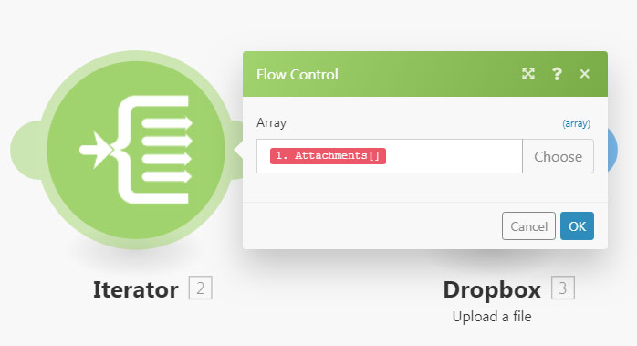
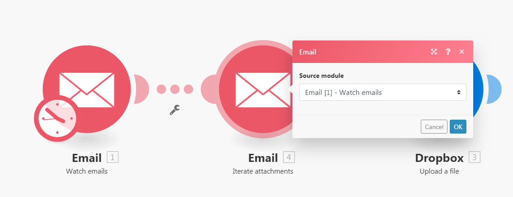
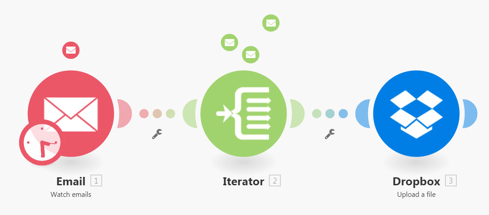
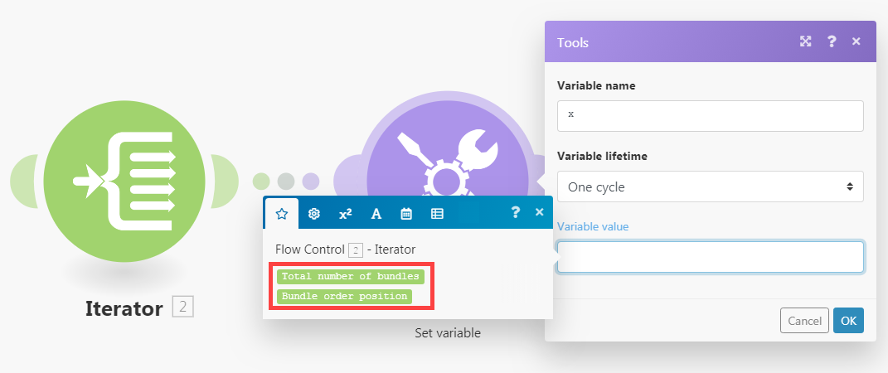
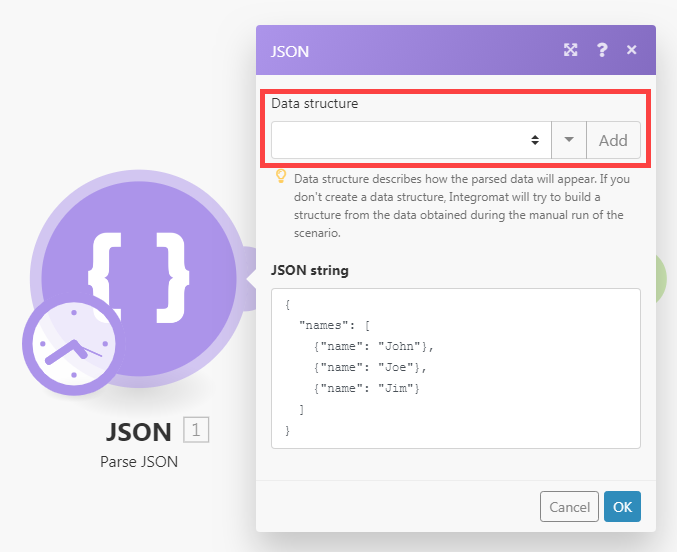
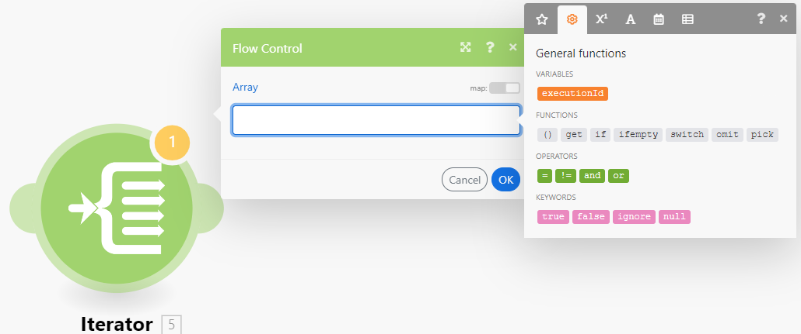
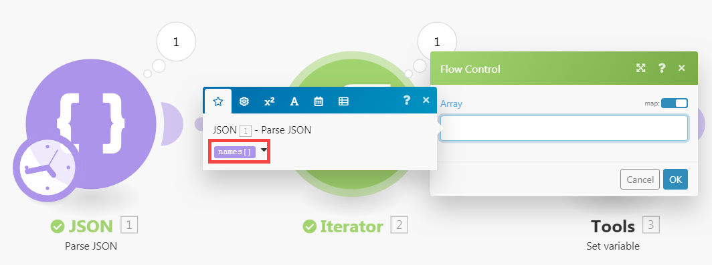
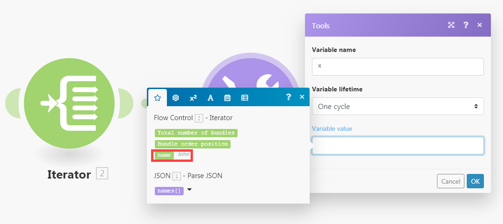

# [!UICONTROL 迭代器]模組

[!UICONTROL 疊代器]是一種將陣列轉換為一系列束的模組。 每個陣列專案都會以個別的套件組合輸出。

## 存取權要求

+++ 展開以檢視這篇文章中所述功能的存取權要求。

<table style="table-layout:auto">
 <col> 
 <col> 
 <tbody> 
  <tr> 
   <td role="rowheader">Adobe Workfront 封裝</td> 
   <td> 
任何 Adobe Workfront Workflow 封裝及任何 Adobe Workfront Automation and Integration 封裝

Workfront Ultimate

Workfront Prime 和 Select 封裝，以及額外購買的 Workfront Fusion。
 </td> 
  </tr> 
  <tr data-mc-conditions=""> 
   <td role="rowheader">Adobe Workfront 授權</td> 
   <td> 
標準

工作或更高層級
 </td> 
  </tr> 
  <tr> 
   <td role="rowheader">產品</td> 
   <td>
   
如果您的組織擁有 Select 或 Prime Workfront 封裝，但不包括 Workfront Automation and Integration，則您的組織必須購買 Adobe Workfront Fusion。</li></ul>
   </td> 
  </tr>
 </tbody> 
</table>

若要詳細了解此表格中的資訊，請參閱](/help/workfront-fusion/references/licenses-and-roles/access-level-requirements-in-documentation.md)文件中的存取權要求[。

+++

## [!UICONTROL 迭代器]模組組態

一般疊代器模組有一個欄位，[!UICONTROL 陣列]欄位。 此欄位包含要轉換或分割為個別套裝的陣列。

其他聯結器可能包含該迭代器特定的迭代器模組。 這些內含Source模組欄位，可讓您選取輸出您要疊代之陣列的模組。

如需詳細資訊，請參閱[設定模組](/help/workfront-fusion/create-scenarios/add-modules/configure-a-modules-settings.md)。

>[!BEGINSHADEBOX]

**範例：**

* 以下案例顯示如何擷取含有附件的電子郵件，並將附件儲存為所選[!DNL Dropbox]資料夾中的單一檔案。

  電子郵件可以包含一系列附件。 第一個模組之後的[!UICONTROL 疊代器]模組可讓案例分別處理每個附件。 [!UICONTROL 迭代器]模組將附件陣列分割成單一組合。 然後，會將每個附有一個附件的套件一次儲存在選取的[!DNL Dropbox]資料夾中。 疊代器模組中的[!UICONTROL 陣列]欄位應該包含`Attachments`陣列。

  

>[!ENDSHADEBOX]

## 疑難排解

### 問題：對應面板未在[!UICONTROL 迭代器]模組下顯示可對應專案

當[!UICONTROL 疊代器]模組沒有陣列專案的結構資訊時，[!UICONTROL 疊代器]模組之後的模組中的對應面板在[!UICONTROL 疊代器]模組下只顯示兩個專案： `Total number of bundles`和`Bundle order position`。

這是因為每個模組都負責提供其輸出專案的相關資訊，以便這些專案能在後續模組的對應面板中正確顯示。 不過，在某些情況下，數個模組可能無法提供此資訊。 例如，[!UICONTROL JSON] > [!UICONTROL 剖析JSON]或[!UICONTROL Webhook] > [!UICONTROL 自訂Webhook]模組缺少資料結構將無法提供資訊。

#### 解決方案

解決方案是手動執行情境。 這會強制模組建立輸出。 然後，Fusion可以將此輸出的格式套用至情境中稍後的模組。

例如，案例包含不具資料結構的[!UICONTROL JSON] > [!UICONTROL 剖析JSON]模組。

連線到此JSON模組的[!UICONTROL 疊代器]模組無法將模組的輸出對應到[!UICONTROL 疊代器]模組之設定面板中的Array欄位。

若要解決此問題：

在案例編輯器中手動啟動案例。

>[!NOTE]
>
>若要防止整個案例執行，您可以：
>
>* 在[!UICONTROL JSON] > [!UICONTROL 剖析JSON]模組之後取消連結模組，以防止流程繼續進行。
>   或
>* 以滑鼠右鍵按一下[!UICONTROL JSON] > [!UICONTROL 剖析JSON]模組，然後從內容功能表中選擇&#x200B;**[!UICONTROL 僅執行此模組]**，以僅執行[!UICONTROL JSON] > [!UICONTROL 剖析JSON]模組。

執行[!UICONTROL JSON] > [!UICONTROL 剖析JSON]之後，它就可以將其輸出的相關資訊提供給所有後續模組，包括疊代器模組。 接著迭代器設定中的對應面板會顯示專案：

此外，在[!UICONTROL 疊代器]模組之後連線的模組中的對應面板會顯示陣列中包含的專案：

中的專案
