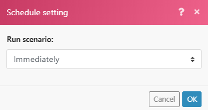

# 即時觸發器(webhook)

許多服務都會提供Webhook，以便在服務發生特定變更（事件）時立即傳送通知。 若要處理這些事件，建議您使用立即觸發程式。 即時觸發程式會在指定聯結器的模組清單中顯示`Instant`標籤。

>[!TIP]
>
>您可以檢查聯結器中的模組清單，以檢視它是否有立即觸發程式，或者您可以檢查[Fusion應用程式及其模組參考](/help/workfront-fusion/references/apps-and-modules/apps-and-modules-toc.md)下的聯結器檔案。
>
>如需Adobe Workfront即時觸發程式檔案，請參閱Workfront模組一文中的[觸發器](/help/workfront-fusion/references/apps-and-modules/adobe-connectors/workfront-modules.md#triggers)。

如果聯結器不包含webhook，您可以執行下列任一項作業：

* 使用Webhook模組建立自訂Webhook。
如需詳細資訊，請參閱[Webhooks](/help/workfront-fusion/references/apps-and-modules/universal-connectors/webhooks-updated.md)。
* 使用輪詢觸發程式定期輪詢服務。
如需詳細資訊，請參閱[排程情境](/help/workfront-fusion/create-scenarios/config-scenarios-settings/schedule-a-scenario.md)

如需Workfront Fusion中Webhook的影片簡介，請參閱：

* [Webhook簡介](https://video.tv.adobe.com/v/3427025/){target=_blank}
* [中繼Webhook](https://video.tv.adobe.com/v/3427030/){target=_blank}

## 排程即時觸發程式

當您設定立即觸發程式時，系統會提示您選取它何時執行。

選取`Immediately`，以便在[!DNL Workfront Fusion]收到來自服務的新事件時立即執行案例。 這些事件會立即傳送到佇列中，然後在案例中一次處理一個，順序與接收資料的順序相同。

當案例執行時，系統會計算佇列中等待的擱置事件總數，而案例執行的週期與擱置事件的數量相同，每個週期會處理一個事件。

如需有關週期的詳細資訊，請參閱[案例執行、週期和階段](/help/workfront-fusion/references/scenarios/scenario-execution-cycles-phases.md)。

>[!NOTE]
>
>* 週期與案例執行不同。 一個案例執行中可以有多個週期。
>* 當您使用排定執行`Immediately`的立即觸發程式執行案例時，將會套用下列例外：
>
>     * 根據定價計畫，兩次執行之間的間隔不受最小間隔的限制。
>
>       例如，一旦案例完成執行，就會再次檢查webhook的佇列。 如果有任何擱置中的Webhook，情境會立即再次執行，並再次處理所有擱置中的Webhook。
>   
>     * 「最大週期數」情境設定會忽略並設為100，這表示在單一情境執行期間不會處理超過100個擱置中的Webhook （每個週期為1個事件）。
>

如果您使用[!UICONTROL Immediately]以外的任何其他排程設定，情境會以您指定的間隔執行。 由於間隔期間可在佇列中收集到數個webhook，因此建議將[!UICONTROL Maximum number of cycles]選項設定為高於預設值1的值，以便在一個案例執行中處理更多webhook：

1. 按一下案例底部的[!UICONTROL Scenario settings]圖示。
1. 在出現的&#x200B;**[!UICONTROL Scenario settings]**&#x200B;面板中，在&#x200B;**[!UICONTROL Max number of cycles]**&#x200B;欄位中輸入數字，以表示每次執行案例時要從佇列中執行的事件數。

佇列中剩餘的事件將在下次執行案例時處理，最多可達在「最大週期數」欄位中設定的數量。

## Webhook 護欄

為確保良好的效能，Workfront Fusion為Webhook設定了下列護欄。

### 速率限制

目前的速率限製為每秒5個Webhook。 如果超過限制，則會傳回`429`狀態代碼。

### 非作用中Webhook的到期

已超過120小時未指派給任何情境的webhook會被移除。

### Webhook裝載

[!DNL Workfront Fusion]儲存webhook裝載30天。 在建立webhook裝載超過30天後存取該裝載會導致錯誤[!UICONTROL `Failed to read file from storage.`]

### 錯誤處理

當您的案例中出現具有立即觸發器的錯誤時，案例：

* 當案例設定為執行[!UICONTROL Immediately]時立即停止。
* 當案例設定為依排程執行時，在3次不成功嘗試（3個錯誤）後停止。

如果案例執行期間發生錯誤，事件會在立即觸發器的復原階段重新放入佇列。 在這種情況下，您可以修正情景並再次執行。

如需詳細資訊，請參閱案例執行、週期和階段一文中的[回覆](/help/workfront-fusion/references/scenarios/scenario-execution-cycles-phases.md#rollback)。

如果您的案例中存在Webhook回應模組，則會將錯誤傳送至Webhook回應。 Webhook回應模組一律在最後執行（當Scenario設定中的[!UICONTROL Auto commit]選項未啟用時）。

如需詳細資訊，請參閱文章Webhooks中的[回應Webhooks](/help/workfront-fusion/references/apps-and-modules/universal-connectors/webhooks-updated.md#responding-to-webhooks)。

### Webhook停用

如果符合下列任一條件，Webhook就會自動停用：

* webhook已超過5天未連線至任何案例。
* webhook僅用於非使用中情況，這些情況已非使用中超過30天。

如果停用的Webhook未連線至任何案例，且已停用狀態超過30天，則會自動刪除及取消註冊。

## 自訂Webhook

您可以建立自己的Webhook。 如需詳細資訊，請參閱[Webhooks](/help/workfront-fusion/references/apps-and-modules/universal-connectors/webhooks-updated.md)。

## 資源

如需有關週期的詳細資訊，請參閱[案例執行、週期和階段](/help/workfront-fusion/references/scenarios/scenario-execution-cycles-phases.md)。
