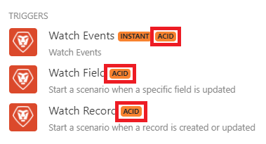

# 案例執行、週期和階段

每個案例執行都從初始化階段開始，接著至少包含一個由作業和認可/復原階段組成的週期，然後結束最終化階段

* 初始化
* 循環#1
   * 作業（讀取或寫入）
   * 認可或回覆
* 循環#2
   * 作業（讀取或寫入）
   * 認可或回覆
* ...
* 循環#n
   * 作業（讀取或寫入）
   * 認可或回覆
* 最終處理

在較小規模中，每個模組也會遵循這些階段。 有關模組階段的資訊可在已處理的套件資訊中找到，可在案例執行後每個模組右上角的編號泡泡中找到。 如需尋找已處理套裝資訊的詳細資訊，請參閱案例執行流程文章中有關已處理套裝的資訊。

較大的案例階段相關資訊可在執行詳細資訊中找到。

## 案例執行階段

### 初始化

在初始化階段中，會建立並檢查所有必要的連線（連線至資料庫、電子郵件服務等），以確保模組能夠執行預期的作業。

### 週期

每個週期代表一個不可分割的工作單位，由一系列作業組成，每個作業都有認可或回覆。

您可以在[!UICONTROL scenario settings]面板中設定循環數上限。 預設數字為1。

* [營運](#operation)
* [認可](#commit)
* [復原](#rollback)

#### 營運

在作業階段期間，會執行讀取或寫入作業：

* 讀取作業包含從服務取得資料，然後由其他模組根據預先定義的案例來處理。 例如，[!UICONTROL Workfront] >[!UICONTROL Watch records]模組會傳回自上次案例執行以來建立的新組合（記錄）。
* 寫入作業包含傳送資料至指定服務以供進一步處理。 例如，[!DNL Workfront] >[!UICONTROL Upload Document]模組會將檔案上傳至Workfront。

#### 認可

如果作業階段成功，則認可階段會開始，在此期間模組執行的所有作業都會被認可。 這表示[!DNL Workfront Fusion]會傳送其成功相關資訊給所有參與作業階段的服務。

### 復原

如果任何模組的作業或認可階段發生錯誤，該階段會中止，而倒回階段會啟動，使指定週期中的所有作業失效。

>[!IMPORTANT]
>
>所有支援回覆（也稱為異動）的[!DNL Workfront Fusion]模組都會標示ACID標籤。
>
>
>
>當其他模組發生錯誤時，未標示此標籤的模組無法回覆為初始狀態。 非ACID模組的典型範例是[!UICONTROL Email] >[!UICONTROL Send an Email]動作。 傳送電子郵件後，您無法復原傳送。

### 最終處理

在最終確定階段，會關閉開啟的連線（例如FTP連線、資料庫連線等），並完成情境。

## 資源

如需詳細資訊，請參閱[設定案例設定](/help/workfront-fusion/create-scenarios/config-scenarios-settings/configure-scenario-settings.md)。
