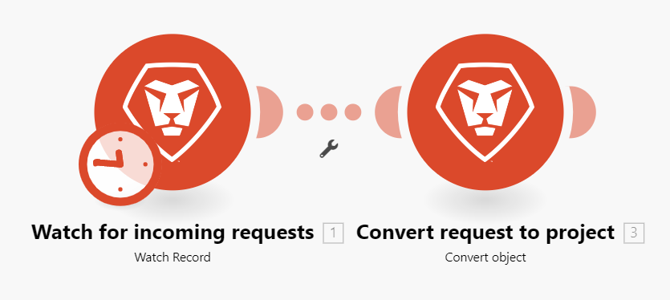
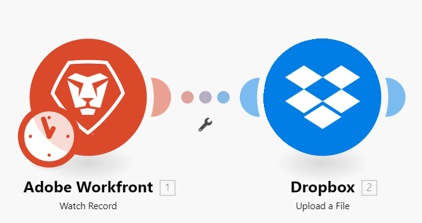
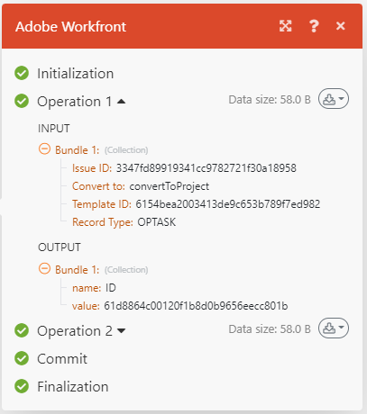

# 案例執行流程

本文說明案例如何執行、資料如何流經案例，以及如何檢視每個模組處理的資料。

## 案例執行流程

正確設定並啟動情境後，情境會根據其定義的排程執行。

當案例開始時，第一個模組會回應已設定為要監視的事件。 傳回資料時，該資料會封裝成套件組合。 此案例會為每個事件傳回一個組合。 例如，如果模組設為留意問題，則會針對其找到的每個問題傳回一組資料。

如果觸發模組傳回任何資料組合，這些組合會傳遞至下一個模組，而案例會繼續，將組合傳遞至每個後續模組，一次傳遞一個。

如果套件組合正確處理所有模組，情境會在情境詳細資訊頁面中標示為成功。

### 範例： [!UICONTROL [!DNL Workfront Fusion] for Work Automation]

>[!BEGINSHADEBOX]

**範例：**&#x200B;在此案例中，在[!DNL Workfront]中監視傳入的請求，然後將其轉換為[!DNL Workfront]專案，資料將依照以下方式流動：

此情境的第一個步驟由第一個模組執行，是觀察請求。 找到的每個請求都視為一個組合。 如果模組執行時未發現任何組合，則案例會在第一個模組後結束。

如果第一個模組傳回束，則束會通過案例的其餘部分。 在此範例中，該套件組合會移至第二個模組，此模組會將請求轉換為專案。

>[!ENDSHADEBOX]

### 範例： [!UICONTROL [!DNL Workfront Fusion] for Work Automation and Integration]

>[!BEGINSHADEBOX]

**範例：**&#x200B;在此案例中，從[!DNL Adobe Workfront]下載檔案並將它們傳送到[!DNL Dropbox]中的資料夾，資料將依照以下方式流動：

此情境的第一個步驟由第一個模組執行，就是在Workfront中監視檔案。 找到的每個檔案都會視為一個組合。 如果模組執行時未發現任何組合，則案例會在第一個模組後結束。

如果傳回束，則束會通過場景的其餘部分。 在此範例中，此案例的其餘部分包含secondmodule，它會上傳套件組合至[!DNL Dropbox]資料夾。

如果第一個模組傳回多個組合，則在上傳第二個組合之前，會將第一個組合上傳至[!DNL Dropbox]。 然後上傳第二個套件，再上傳第三個套件，依此類推。

>[!ENDSHADEBOX]

## 已處理套裝的相關資訊

對於每個模組，此套件組合會先進行4步驟的流程，然後再繼續進行下一個模組或到達其最終目的地。

* 初始化
* 營運
* 認可/回覆
* 最終處理

>[!NOTE]
>
>大型案例也會經過此程式。 如需此程式在案例層級的資訊，請參閱[案例執行、週期和階段](/help/workfront-fusion/references/scenarios/scenario-execution-cycles-phases.md)。

案例執行完成後，每個模組都會顯示一個圖示，顯示已執行的運算元。 您可以按一下此圖示，以顯示流程中每個步驟之已處理套裝的詳細資訊。 您可以檢視已使用哪些模組設定，以及每個模組傳回哪些組合。

在此範例中，模組收到如下所示的輸入資訊：

* 發現的問題的ID
* 問題將轉換為的物件（專案）
* 用來建立專案的範本ID
* 找到之物件的記錄型別（OPTASK，這是一個問題）

處理之後，模組傳回以下輸出資訊：

* 新建立專案的ID。

如果模組找到多個問題，則會分別擷取每個套件的資訊。 「操作2」區域會包含輸入和輸出區段，用以描述第二個束，依此類推。

## 執行案例時發生錯誤

在案例執行期間可能會發生錯誤。 例如，如果您刪除了模組將用來建立新專案的範本，則案例會以錯誤訊息結束。 如需有關如何處理錯誤的詳細資訊，請參閱[錯誤型別](/help/workfront-fusion/references/errors/error-processing.md)。

## 資源

* 如需設定案例的詳細資訊，請參閱[案例編輯器](/help/workfront-fusion/get-started-with-fusion/navigate-fusion/scenario-editor.md)。
* 如需案例詳細資訊頁面的詳細資訊，請參閱[案例詳細資料](/help/workfront-fusion/get-started-with-fusion/navigate-fusion/scenario-details.md)。
* 如需啟用案例的詳細資訊，請參閱[啟用或停用案例](/help/workfront-fusion/manage-scenarios/activate-deactivate-scenarios.md)。
* 如需排程案例的詳細資訊，請參閱[排程案例](/help/workfront-fusion/create-scenarios/config-scenarios-settings/schedule-a-scenario.md)。
* 如需模組的詳細資訊，請參閱[模組概觀](/help/workfront-fusion/get-started-with-fusion/understand-fusion/module-overview.md)。
