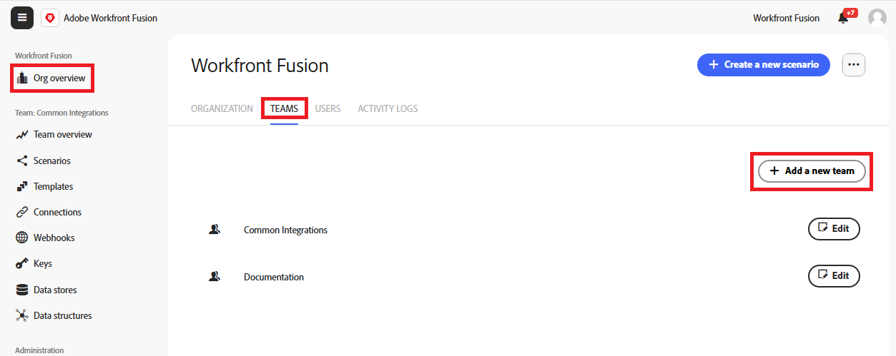

# 建立團隊

專案團隊是組織內的小型群組，可共用Fusion資源，例如情境、連線和範本。 您可以建立任意數目的團隊。

組織可以擁有任意所需數量的團隊，使用者可以屬於一個或多個團隊。

>[!NOTE]
>
>由於專案團隊會共用資源，因此有時專案團隊僅有一個成員會很有用。 例如，訓練中的使用者可以建立與其個別[!DNL Workfront]帳戶的連線。 任何團隊成員也可以連線至個別[!DNL Workfront]帳戶。 在此情況下，我們建議使用者成為培訓團隊的唯一成員。

## 存取需求

+++ 展開以檢視本文中功能的存取需求。

您必須具有下列存取權才能使用本文中的功能：

<table style="table-layout:auto">
 <col> 
 <col> 
 <tbody> 
  <tr> 
   <td role="rowheader">[!DNL Adobe Workfront] 封裝</td> 
   <td> 
任何
 </td> 
  </tr> 
  <tr data-mc-conditions=""> 
   <td role="rowheader">[!DNL Adobe Workfront] 授權</td> 
   <td> 
新增： [!UICONTROL Standard]

或

目前： [!UICONTROL Work]或更高
 </td> 
  </tr> 
  <tr> 
   <td role="rowheader">[!DNL Adobe Workfront Fusion] 授權**</td> 
   <td>
   
目前：無[!DNL Workfront Fusion]授權需求。

   
或

   
舊版：任何 

   </td> 
  </tr> 
  <tr> 
   <td role="rowheader">產品</td> 
   <td>
   
新增：
 <ul><li>[!UICONTROL Select] 或[!UICONTROL Prime] [!DNL Workfront]計畫：您的組織必須購買[!DNL Adobe Workfront Fusion]。</li><li>[!UICONTROL Ultimate] [!DNL Workfront] 計畫： [!DNL Workfront Fusion]已包括在內。</li></ul>
   
或

   
目前：您的組織必須購買[!DNL Adobe Workfront Fusion]。

   </td> 
  </tr>
  <tr data-mc-conditions=""> 
   <td role="rowheader">存取層級設定*</td> 
   <td> 
     
您必須是組織的[!DNL Workfront Fusion]管理員。

     
您必須是團隊的[!DNL Workfront Fusion]管理員。

   </td> 
  </tr> 
   </td> 
  </tr> 
 </tbody> 
</table>

如需此表格中資訊的詳細資訊，請參閱檔案[&#128279;](/help/workfront-fusion/references/licenses-and-roles/access-level-requirements-in-documentation.md)中的存取需求。

如需[!DNL Adobe Workfront Fusion]授權的相關資訊，請參閱[[!DNL Adobe Workfront Fusion] 授權](/help/workfront-fusion/set-up-and-manage-workfront-fusion/licensing-operations-overview/license-automation-vs-integration.md)。

+++

## 建立團隊

組織擁有者和管理員能夠建立團隊。 團隊的建立方式是將新團隊加入組織。

若要建立專案團隊：

1. 在左側導覽面板中，按一下&#x200B;**[!UICONTROL Org overview]**
1. 選取&#x200B;**[!UICONTROL Teams]**&#x200B;標籤。
1. 按一下&#x200B;**[!UICONTROL Add a new team]**。
   
1. 輸入新團隊的名稱，然後按一下&#x200B;**新增**。
